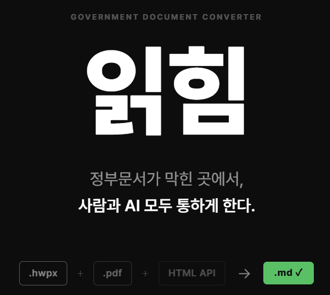
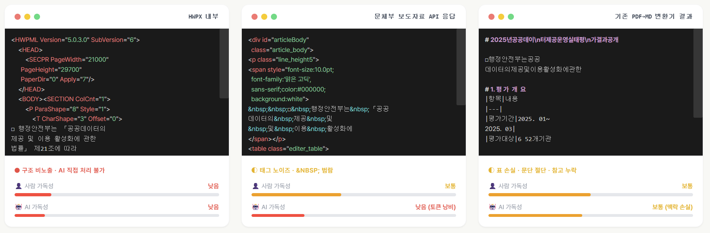
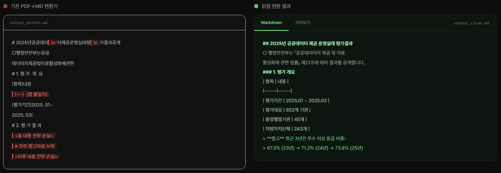

# 읽힘

정부문서가 막힌 곳에서, 사람과 AI 모두 통하게 한다.

- 서비스 주소: `https://wavelen-jw.github.io/GovPress_PDF_MD`

## 정부문서 포맷의 현실

형식은 달라도 결과는 같지 않습니다.  
정부 문서를 그대로 다루면, 사람도 읽기 어렵고 AI에 넣어도 맥락이 쉽게 무너집니다.

- `HWPX`는 내부 구조가 복잡해서 바로 다루기 어렵습니다.
- 제공기관 `HTML API`는 태그와 공백 노이즈가 많아 입력이 지저분해지기 쉽습니다.
- 기존 PDF 변환 결과는 표, 문단, 참고자료가 중간에 손실될 수 있습니다.

## 읽힘이면 다르다

같은 문서라도, 읽히는 구조로 바꾸면 결과가 달라집니다.

읽힘은 문서를 단순 텍스트로만 바꾸지 않고, 사람이 다시 읽고 수정할 수 있으며 AI에도 바로 넣기 쉬운 Markdown으로 정리합니다.

- 제목, 문단, 목록 흐름을 유지합니다.
- 표와 참고 블록을 읽을 수 있는 형태로 복원합니다.
- 사람이 보는 화면과 AI 입력 모두를 고려해 정리합니다.

## 핵심 흐름

`HWPX / PDF / HTML API` → `Markdown`

## 할 수 있는 일

- PDF/HWPX 보도자료를 Markdown으로 변환
- Markdown을 다시 열어 수정하고 미리보기로 확인
- 정책브리핑 보도자료 목록을 불러와 바로 열기
- Markdown 파일로 저장, 복사, 공유

## 사용하는 방법

1. 서비스에 접속합니다.
2. `파일 열기`로 PDF, HWPX, Markdown 파일을 엽니다.
3. 또는 `정책브리핑` 목록에서 보도자료를 불러옵니다.
4. 변환 결과를 확인하고 필요한 부분을 수정합니다.
5. Markdown 파일로 저장하거나 복사합니다.

## 참고

- 변환 결과는 초안입니다. 공개 전에는 제목, 표, 목록, 숫자, 링크를 한 번 더 확인하는 것이 좋습니다.
- 정책브리핑 목록 기능은 공공데이터포털(`data.go.kr`)의 `pressReleaseService` Open API를 사용합니다.
- PDF 변환 과정에서는 [OpenDataLoader PDF](https://github.com/opendataloader-project/opendataloader-pdf)를 PDF → JSON 추출에 활용합니다.
- 이 서비스의 개발과 개선 과정에는 생성형 AI가 활용되었습니다.

## 라이선스

이 저장소는 [MIT License](LICENSE)를 따릅니다.
