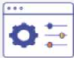
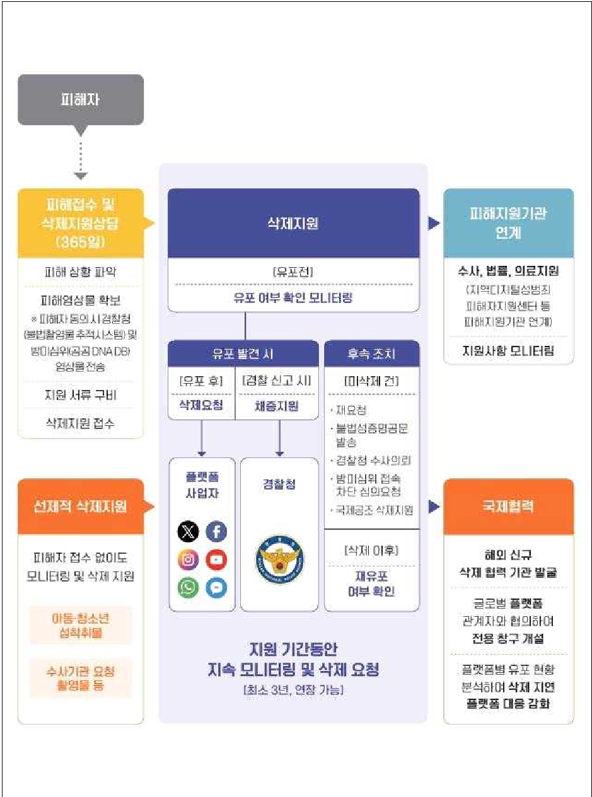
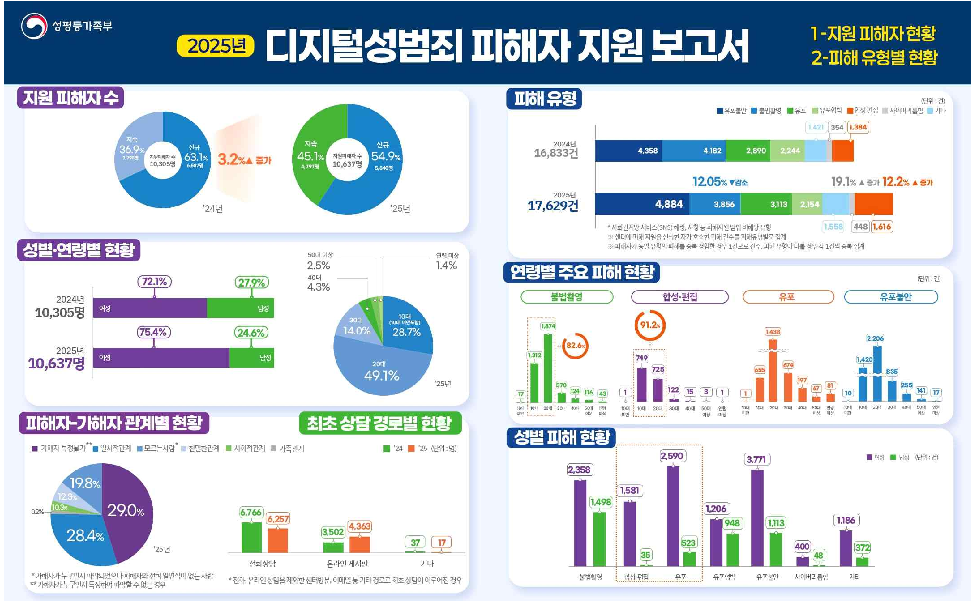
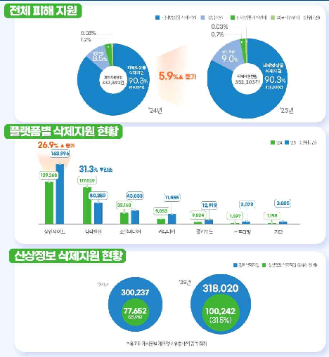
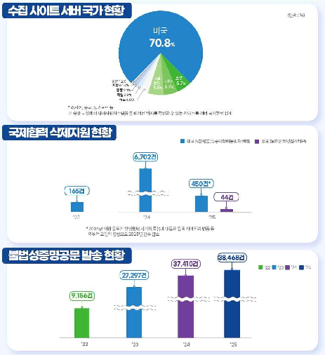

# 보도자료

보도시점 2026. 4. 16.(목) 12:00 배포 2026. 4. 16.(목) 07:00

# 지난해 디지털성범죄 피해자 1만 637명에게 35만여 건 원스톱 지원

-전체 지원 피해자 중 10·20대가 77.6% , 합성·편집 피해의 경우 10대·20대가 91.2%

유포 불안이 가장 높아 … AI 기술 확산 등으로 유포 에 대한 잠재적 위험 인식 높아져

 불법  유해  사이트 삭제지원 건수는 전년 대비 26.9%  증가 …

□ 중앙디지털성범죄피해자지원센터 * (이하 '중앙 디성센터')가 지난해 디지털 성범죄 피해자 1만 637명을 지원한 것으로 집계됐다.

*「성폭력방지법」제7조의4에  근거하여  디지털성범죄 피해자에 대한 상담, 피해 영상물 삭제 지원, 수사 ․ 법률 ․ 의료지원연계 등 종합지원서비스를 제공하는 기관('18.4.30.~)

ㅇ  성평등가족부(장관 원민경)와 한국여성인권진흥원(원장 신보라)은 17일(금) 지난해 중앙 디성센터에서 지원한 디지털성범죄 피해자 지원 현황을 분석 하여「2025 디지털성범죄 피해자 지원 보고서」를 발간하였다.

□  중앙  디성센터는 전년 대비 3.2% 증가한 1만 637명의 피해자에게 상담, 삭제지원, 수사·법률·의료지원 연계 등 총 35만 2천여 건의 서비스를 지원하였다.

- ㅇ  피해영상물  삭제지원이  90.3%로  가장  큰  비중을  차지하였으며,  전년 대비 5.9% 증가하였다.
- ㅇ  특히,  1만  637명의  피해자  중  신규  피해자는  전년  대비  10.3%  감소하고 지속 지원 피해자는 26.3% 증가하였는데, 이는 추가 유포가 반복되는 디지털 성범죄의 특성이 반영된 것으로, 장기간의 지속적 지원이 필요함을 시사한다.

# <피해 지원 현황>

| |지원| |지원 건수 (건)| | | | |
|---|---|---|---|---|---|---|---|
| |피해자수(명)| |합계|피해영상물 삭제지원|상담지원|수사·법률 지원연계|의료 지원연계|
| |10,305| |332,341|300,237|28,173|3,826|105|
| |신규|지속|(100.0%)|(90.3%)|(8.5%)|(1.2%)|(0.03%)|
| |6,507|3,798| | | | | |
|2025년|10,637| |352,103 (100.0%)|318,020|31,591|2,387|105|
| |신규|지속| |(90.3%)|(9.0%)|(0.7%)|(0.03%)|
| |5,840|4,797| | | | | |

# 지원 피해자 현황

□  2025년  중앙  디성센터에서  지원한  피해자  총  1만  637명  중  여성은 8,019명(75.4%), 남성은 2,618명(24.6%)인 것으로 나타났다.

- ㅇ  연령대별로 살펴보면 10대와 20대가 전체의 77.6%(8,258명)를 차지해, 디지털 플랫폼 이용 빈도가 높은 연령대에서 피해가 집중되며, 온라인상의 상호작용이 활발할수록 디지털성범죄에 노출될 가능성도 함께 증가함을 보여준다.
- ㅇ  이에  정부는  'AI  기반  아동·청소년  온라인  성착취  선제적  대응  시스템'을 신규 구축하여 아동·청소년 성착취물 및 성착취 유인정보에 대해 신고·삭제 지원하고,  전문  상담원이  상담을  제공하는  등  범죄  피해  발생  전  선제적 개입을 강화하고 있다.

# <피해자 성별 연령별 현황>

(단위: 명)

|구분| |합계|10대미만|10대|20대|30대|40대|50대이상|연령미상|
|---|---|---|---|---|---|---|---|---|---|
|2024|여성|7,428 (72.1%)|10 (0.1%)|2,468 (23.9%)|3,326 (32.3%)|1,048 (10.2%)|326 (3.2%)|115 (1.1%)|135 (1.3%)|
| |남성|2,877 (27.9%)|1 (0.03%)|395 (3.9%)|1,916 (18.6%)|283 (2.7%)|128 (1.2%)|146 (1.4%)|8 (0.1%)|
| |소계|10,305 (100.0%)|11 (0.1%)|2,863 (27.8%)|5,242 (50.9%)|1,331 (12.9%)|454 (4.4%)|261 (2.5%)|143 (1.4%)|
|2025|여성|8,019 (75.4%)|20 (0.2%)|2,592 (24.4%)|3,577 (33.6%)|1,225 (11.5%)|333 (3.1%)|134 (1.3%)|138 (1.3%)|
| |남성|2,618 (24.6%)|0 (0.0%)|440|1,649|264|119 (1.1%)|135|11|
| | | | |(4.1%)|(15.5%)|(2.5%)| |(1.3%)|(0.1%)|
| |소계|10,637 (100.0%)|20 (0.2%)|3,032|5,226|1,489|452 (4.2%)|269|149 (1.4%)|
| | | | |(28.5%)|(49.1%)|(14.0%)| |(2.6%)| |
| | | | | | | | | | |
| | | | | | | | | | |
| | | | | | | | | | |
| | | | | | | | | | |
| | | | | | | | | | |
| | | | | | | | | | |

※ 최초 인입한 연도를 초과하여 지원이 지속된 경우 중복 집계함

ㅇ  가해자와의 관계별로 살펴보면, 가해자 특정 불가가 29.0%로 가장 높았으며, 일시적 관계(28.4%) 〉모르는 사람(19.8%) > 친밀한 관계(12.3%) 〉 사회적 관계(10.3%) 〉가족관계(0.2%) 순으로 나타났다.

 가해자  특정 불가는 전년 대비 21.1% 증가하였는데, 이는 불특정 다수에 의해 재가공·재유포가 용이한 디지털성범죄의 구조적 특성과 AI 기반 합성·편집 기술의 확산 등이 복합적으로 작용한 결과로 해석된다.

# <피해자-가해자 관계>

(단위: 명)

|연도|합계|일시적 관계|모르는 사람 *|친밀한 관계|사회적 관계|가족 관계|가해자 특정 불가 **|
|---|---|---|---|---|---|---|---|
|2024년|10,305 (100.0%)|2,977 (28.9%)|2,727 (26.5%)|1,002 (9.7%)|1,032 (10.0%)|18 (0.2%)|2,549 (24.7%)|
|2025년|10,637 (100.0%)|3,022 (28.4%)|2,108 (19.8%)|1,301 (12.3%)|1,094 (10.3%)|24 (0.2%)|3,088 (29.0%)|

 가해자가 누구인지 파악되었으나 피해자와 전혀 일면식이 없는 사람

**  가해자가 누구인지 특정하여 파악할 수 없는 경우

ㅇ  최초  상담  경로별로  살펴보면,  전화  상담은  6,257명(58.8%),  온라인 상담은 4,363명(41.0%)으로, 온라인 비중이 전년보다 7%p 증가했다.

# <최초 상담 경로>

(단위: 명)

|기간|합계|전화 상담|온라인 상담|기타*|
|---|---|---|---|---|
|2024년|10,305 (100.0%)|6,766|3,502|37|
| | |(65.6%)|(34.0%)|(0.4%)|
|2025년|10,637 (100.0%)|6,257 (58.8%)|4,363 (41.0%)|17 (0.2%)|

*  전화, 온라인 상담을 제외한 센터방문, 이메일 등 기타 경로로 최초 상담이 이루어진 경우

# 피해 유형별 현황

□ 피해 유형별 현황을 살펴보면, 유포불안이 27.7%로 가장 높고, 불법촬영 (21.9%),  유포(17.7%),  유포협박(12.2%), 합성 ․ 편집(9.2%)이 뒤를 이었으며, 1인당 평균 약 1.7건의 중복피해를 경험한 것으로 나타났다.

ㅇ  불법촬영 피해는 전년 대비 7.8% 감소한 반면, 합성·편집 피해는 16.8%, 사이버 괴롭힘 피해는 26.6%  증가하여,  디지털성범죄가 전통적 촬영 중심에서 기술 기반 범죄로 다변화되고 있음을 시사한다.

# <피해 유형별 현황>

(단위: 건)

|연도|합계|불법촬영|합성 ․ 편집|유포|유포협박|유포불안|사이버 괴롭힘|기타*|
|---|---|---|---|---|---|---|---|---|
|2024년|16,833|4,182 (24.9%)|1,384 (8.2%)|2,890 (17.2%)|2,244 (13.3%)|4,358 (25.9%)|354 (2.1%)|1,421 (8.4%)|
| |(100.0%)| | | | |4,884| | |
|2025년|17,629 (100.0%)|3,856 (21.9%)|1,616 (9.2%)|3,113 (17.7%)|2,154 (12.2%)|(27.7%)|448 (2.5%)|1,558 (8.8%)|

 사회관계망 서비스(SNS) 해킹, 사칭 등 피해지원 범위 비해당 유형

- ※ 센터에 피해 지원을 신청한 자가 호소한 피해 건수를 피해유형별로 집계
- ※ 피해자가 동일 유형의 피해를 중복 경험한 경우 1건으로 간주, 피해 유형이 다를 경우 각 1건씩 중복 집계

ㅇ  연령대별 피해유형을 살펴보면, 10대 미만과 연령 미상을 제외한 대부분의 연령대에서 유포 불안 피해가 가장 높게 나타났다.

 이는  실제  유포가  발생하지  않았더라도  AI  합성·편집  기술의  확산과 협박·그루밍 같은 사전 단계 범죄의 증가로 유포 가능성에 대한 잠재적 위험 인식이 높아진 영향으로 분석된다.

 또한  합성·편집  피해의  경우,  10대와  20대가  91.2%를  차지해,  다른 연령대에 비해 압도적으로 높은 비율을 차지했다.

 한편,  50대  이상에서는 실제 유포 피해보다 유포 협박 피해가 높았으며, 이는 가해자가 피해영상물의 실제 유포보다는 금전 요구 등 다른 목적으로 접근하여 피해가 발생하는 특징이 반영된 것으로 보인다.

# <주요 피해 연령별 현황('25)>

(단위: 건)

|연령|피해자 (명)|피해 유형(건)| | | | | | | |
|---|---|---|---|---|---|---|---|---|---|
| | |합계| |불법촬영합성·편집|유포|유포협박|유포불안|사이버 괴롭힘|기타|
|10대 미만|20|35 (0.2%)|17 (0.5%)|1 (0.1%)|1 (0.0%)|6 (0.3%)|10 (0.2%)|0 (0.0%)|0 (0.0%)|
|10대|3,032|5,226 (29.6%)|1,312 (34.0%)|749 (46.3%)|655 (21.0%)|642 (29.8%)|1,420 (29.1%)|149 (33.2%)|299 (19.2%)|
|20대|5,226|8,287 (47.0%)|1,874 (48.6%)|725 (44.9%)|1,438 (46.2%)|944 (43.8%)|2,206 (45.2%)|227 (50.7%)|873 (56.0%)|
|30대|1,489|2,556 (14.5%)|370 (9.6%)|122 (7.5%)|674 (21.7%)|299 (13.9%)|835 (17.1%)|47 (10.5%)|209 (13.4%)|
|40대|452|826 (4.7%)|124 (3.2%)|15 (0.9%)|197 (6.3%)|130 (6.0%)|255 (5.2%)|17 (3.8%)|88 (5.7%)|
|50대 이상|269|509 (2.9%)|116 (3.0%)|3 (0.2%)|67 (2.2%)|108 (5.0%)|141 (2.9%)|5 (1.1%)|69 (4.4%)|
|연령 미상|149|190 (1.1%)|43 (1.1%)|1 (0.1%)|81 (2.6%)|25 (1.2%)|17 (0.3%)|3 (0.7%)|20 (1.3%)|
|합계|10,637|17,629 (100.0%)|3,856 (100.0%)|1,616 (100.0%)|3,113 (100.0%)|2,154 (100.0%)|4,884 (100.0%)|448 (100.0%)|1,558 (100.0%)|

ㅇ  성별로  피해 현황을 살펴보면, 여성은 유포불안(3,771건), 남성은 불법 촬영(1,498건)이 가장 많은 것으로 나타났다.

 특히  합성·편집  피해의  경우  여성(1,581건)이  남성(35건)보다  약 45배, 유포 피해의 경우 여성(2,590건)이 남성(523건)보다 약 5배 많아, 딥페이크 등  불법  합성·편집물이  여성의 얼굴과 신체를 주요 대상으로 제작되어 소비·유통되고 있음을 시사한다.

# <성별 피해 유형('25)>

(단위: 건)

|성별|합계|불법촬영|합성 ․ 편집|유포|유포협박|유포불안|사이버 괴롭힘|기타|
|---|---|---|---|---|---|---|---|---|
|여성|13,092 2,358 (74.3%) (61.2%)|1,581 (97.8%)|2,590 (83.2%)| |1,206 (56.0%)|3,771 (77.2%)|400 (89.3%)|1,186 (76.1%)|
|남성|4,537 (25.7%)|1,498 (38.8%)|35 (2.2%)|523 (16.8%)|948 (44.0%)|1,113 (22.8%)|48 (10.7%)|372 (23.9%)|
|계|17,629 (100.0%)|3,856 (100.0%)|1,616 (100.0%)|3,113 (100.0%)|2,154 (100.0%)|4,884 (100.0%)|448 (100.0%)|1,558 (100.0%)|

# 피해 지원 현황

□ 2025년 전체 지원 건수는 전년 대비 5.9% 증가한 352,103건으로, 피해영상물 삭제지원이 318,020건(90.3%)으로 대부분을 차지했고, 상담지원(9.0%) > 수사 ‧ 법률지원 연계(0.7%) > 의료지원 연계(0.03%) 순으로 나타나 삭제지원에 대한 수요가 높음을 알 수 있다.

# <전체 피해 지원 현황>

(단위: 건)

|연도|합계|피해영상물 삭제지원|상담지원|수사·법률지원 연계|의료 지원연계|
|---|---|---|---|---|---|
|2024년|332,341 (100.0%)|300,237 (90.3%)|28,173 (8.5%)|3,826 (1.2%)|105 (0.03%)|
|2025년|352,103 (100.0%)|318,020 (90.3%)|31,591 (9.0%)|2,387 (0.7%)|105 (0.03%)|

# ◈ 디지털성범죄 피해자 지원 사례 ('25년 보고서 요약)

【  중앙-지역 협업으로 범죄 입증에 기여해 가해자 양형 강화 】

A지역 디성센터는 한 가해자가 다수 피해자를 대상으로 장기간 불법촬영 및 대량 유포를 자행한 사건에 대해 법률지원을 수행 하고  있었습니다.  재판  과정에서  피해  규모를  보다 객관적으로 입증하는 것이 무엇보다 중요했으나, 피해 사실 입증에 어려움을 겪고 있어 중앙 디성센터로 협조를 요청했습니다.

중앙 디성센터는 2019년부터 축적된 삭제지원 데이터를 확인하고 동일 가해자와 연관된 자료를 재분석 하였습니다. 그 결과, 초반에 5명 이하로 확인되었던 피해자는 총 10여 명으로 확대되었 으며,  삭제지원 건수도 1,000여  건에서 12,000여  건으로  확대 되었습니다. 이를 재판부에 제출 한 뒤 최종 양형은 검사 구형보다 높은 징역 7년 및 취업제한 7년으로 선고 되었습니다.

본 사례는 중앙 디성센터의 삭제지원 데이터가 형사 사법 절차에서 피해 규모를 입증하는 객관적 자료로 활용될 수 있으며, 삭제지원이 피해자의 일상 회복 지원을 넘어 가해자의 책임 및 처벌 강화로까지 연결될 수 있음을 보여준 사례 입니다. 향후에도 축적된 삭제지 원  데이터를  체계적으로  관리하고  지역  디성센터와  유기적으로  협업하여  피해자  보호와 사법적 대응의 실효성을 함께 강화해 나가고자 합니다

□ 피해영상물 삭제지원을 세부적으로 살펴보면, 피해자등 요청에 의한 삭제지원 * 은 80.9%(257,257건), 선제적 삭제지원 ** 은 19.1%(60,763건)로 나타났다.

 피해자등(피해당사자,  그  배우자,  직계친족,  형제자매  또는  피해당사자가  지정하는  대리인)의 요청으로 삭제지원( ｢ 성폭력방지법 ｣ 제7조의3제1항 및 제2항)

**  수 사 기 관 의  삭 제 지 원 요청이 있는 불법촬영물등 및 신상정보 또는 아동ㆍ청소년 성착취물 및 신상정보에 대하여 피해자등의 요청 없이 선제적으로 삭제지원( ｢ 성폭력방지법 ｣ 제7조의3제3항)

# <삭제지원 현황>

(단위: 건)

| | | |선제적 삭제지원| | |
|---|---|---|---|---|---|
|연도|합계|피해자 등 요청|소계|수사기관 요청|아동 ․ 청소년 성착취물|
|2024년|300,237 (100.0%)|244,457 (81.4%)|55,780 (18.6%)|18,131 (6.0%)|37,649 (12.6%)|
|2025년|318,020 (100.0%)|257,257 (80.9%)|60,763 (19.1%)|19,907 (6.3%)|40,856 (12.8%)|

ㅇ  삭제지원이  이뤄진  플랫폼별로  현황을  살펴보면,  불법  유해  사이트가 51.6%로 가장 많았고, 검색엔진(25.3%) > 소셜미디어(13.5%) > 클라 우드(4.0%) > 커뮤니티(3.6%) > 스트리밍(1.0%) 순으로 나타났다.

 불법  유해  사이트에서의  삭제지원  건수는  전년  대비  26.9%  증가하여 국내법상 행정제재 회피를 위해 국외 서버 기반으로 불법 사이트 중심의 유포 행태가 점차 심화되고 있음을 보여준다. 이는 지원기관의 삭제요청에 대한 불응으로 이어져 피해자의 고통이 지속될 가능성이 높음을 의미한다. *  전 년  比  불 법  유 해  사 이 트  삭 제 지 원  비 중 (43.0% → 51.6% ) 및  삭 제 불 응 률 (24.7%  →  28.5% ) 증 가

 검색엔진의 경우 전년 대비 31.3% 감소하여, 플랫폼의 자체 필터링 및 차단 조치 강화와 더불어, 검색 결과에 직접 노출되지 않는 은닉·폐쇄형 웹사이트의 증가가 영향을 미친 것으로 분석된다.

# <플랫폼별 삭제지원 건수>

(단위: 건)

|연도|합계|불법 유해 사이트|검색엔진|소셜 미디어|커뮤니티|클라우드|스트리밍|기타*|
|---|---|---|---|---|---|---|---|---|
|2024년|300,237|129,268 (43.0%)|117,029 (39.0%)|32,168 (10.7%)|9,053|9,824 (3.3%)|1,697|1,198|
| |(100.0%)| | | |(3.0%)| |(0.6%)|(0.4%)|
|2025년|318,020 (100%)|163,996 (51.6%)|80,359 (25.3%)|43,033 (13.5%)|11,555 (3.6%)|12,919 (4.0%)|3,073 (1.0%)|3,085 (1.0%)|

 개인 간 공유(P2P), 웹하드, 블로그, 자료 보관소(아카이브) 등

□ 지난해 시행된 개정 ｢ 성폭력방지법 ｣ 으로 신상정보가 영상물과 동반 유포된 경우뿐만 아니라 단독 유포된 경우도 지원할 수 있게 되어 신상정보 삭제 지원(100,242건)이 전년(77,652건) 대비 29.1% 증가했다.

- ㅇ  신상정보는 전체 삭제지원의 31.5%로, 삭제지원 3건 중 1건이 피해영상물과 신상정보가 동반 유포되었거나, 신상정보만 단독으로 유포되었음을 의미한다.
- ㅇ  삭제지원 된 신상정보 중 성명이 38.3%(49,130개)로 가장 많았고, 기타(27.2%) > 연령(10.4%) > 용모(8.8%) > 소속(8.4%) > 주소(4.4%) 등의 순으로 나타났다.
- ㅇ  또한,  신규  항목으로  '용모',  '사진',  '기타'를  추가하여  삭제지원  가능한 신상정보 범위를 확대하였고, 특히 '기타' 항목에 피해영상물 자체를 지목 하는 '유포 키워드(예: 00녀, 00커플)'를 포함하여 실효성을 강화하였다.

# <신상정보 삭제지원 현황>

(단위: 건, 개)

|연도|전체 삭제지원|신상정보 삭제지원|신상정보 유형 (개)| | | | | | | | |
|---|---|---|---|---|---|---|---|---|---|---|---|
| | | |합계*|성명|연령|소속|주소|연락처|용모|사진|기타|
|2024|300,237|77,652|98,101|54,888|28,521|10,083|4,292|317|-|-|-|
| |(100.0%)|(25.9%)|( 10 0. 0%)|(55.9%)|(29.1%)|(10.3%)|(4.4%)|(0.3%)| | | |
|2025|318,020|100,242 (31.5%)|128,311 ( 1 00 .0 %)|49,130|13,314|10,789|5,593|51|11,265|3,264|34,905 (27.2%)|
| |(100.0%)| | |(38.3%)|(10.4%)|(8.4%)|(4.4%)|(0.04%)|(8.8%)|(2.5%)| |

 유포된 게시물별 개인정보 유출 내역 중복 집계

# ◈ 디지털성범죄 피해자 지원 사례 ('25년 보고서 요약)

# 【  법 개정에 따른 신속한 신상정보 삭제지원 기준 마련 및 시행 】

2025년 4월, 개정 「성폭력방지법」의 시행 으로 불법촬영물등의 유포 피해자에 대해 신상 정보까지 삭제 지원할 수 있는 법적 근거가 마련 되었습니다. 이에 따라 중앙 디성센터는 피해영상물에 동반 유포되던 경우만 삭제지원 할 수 있었던 신상정보 를 단독 유포된 경우도 별도로 삭제 요청 할 수 있게 되었습니다.

중앙 디성센터는 법 시행에 앞서 신상정보의 삭제지원 범위와 기준을 구체화 하고 전국 지역 디성센터에 확산 하여 일관된 대응체계를 신속하게 구축하였습니다. 특히, 그동안의 피해지원 과정에서 축적된 신상정보 유형을 재분류하여, 삭제지원 가능한 신규 항목(용모, 사진, 기타)을 추가 해 피해지원의 실효성을 높였습니다.

그 결과 2025년 신상정보 삭제지원 건수 는 100,242건으로 전년(77,652건) 대비 29.1%  증가 하였으며, 이를 통해 실제 삭제지원 한 신상정보 는 128,311개로 전년(98,101개) 보다 30.8% 증가 했습니다. 향후에도 촘촘한 지원을 위해 실무 기준을 지속 점검하고 보완하겠습니다.

# 국외 사이트 대응 현황

□  피해영상물  삭제지원  과정에서  수집된  26,658개  사이트의  서버  위치 분석  결과,  미국이  70.8%로  가장  많았으며,  호주(5.7%)  >  네덜란드 (5.6%)  등의 순으로 나타났다.

<서버 국가별 수집 사이트(도메인) 수 현황('25)>

(단위: 건)

|구분|합계|미국|호주|네덜 란드|한국|독일|홍콩|프랑스|일본|기타*|
|---|---|---|---|---|---|---|---|---|---|---|
|사이트 수|26,658|18,875|1,531|1,500|1,226|763|559|377|317|1,510|
|(비율)|(100.0%)|(70.8%)|(5.7%)|(5.6%)|(4.6%)|(2.9%)|(2.1%)|(1.4%)|(1.2%)|(5.7%)|

 러시아, 중국, 싱가포르 등

※ 중앙 디성센터 삭제지원시스템을 통해 서버 위치를 확인할 수 있는 사이트를 서버 국가별로 집계

□  유포 사이트의 95.6%가 해외 소재인 만큼 국외 서버 사이트에 대한 대응을 강화하기 위해 국제협력을 확대하여, 서버 소재지와 관계없이 국경을 넘어선 삭제지원이 가능해졌다.

- ㅇ  2023년부터 협력했던 미국 실종학대아동방지센터(NCMEC) * 와는 2024년 업무협약을 체결하였으며, 최근에는 중앙 디성센터 삭제지원시스템과 NCMEC의 신고시스템(CyberTipline) 간 API 연계를 통해 신속한 삭제 협력 체제를 마련하였다.
- ㅇ 또한 영국, 네덜란드, 러시아 등 미국 외 국가 서버에 대한 대응이 가능한 영국 인터넷감시재단(IWF) ** 과의 삭제 협력을 새롭게 개시하였다.

 The  National  C enter  for  M issing and  Exploited Children : 아 동 ·청 소 년  성 착 취  근 절  및  실 종 · 학대 방지를 위해 설립된 미국의 비영리단체로, 연방법에 의한 신고시스템(CyberTipline) 운영

**  Internet  Watch  Foundation  :  영국의  아동·청소년  성착취물  삭제  지원기관이자 국제인터넷핫라인협회(INHOPE) 핫라인 기관

# <국제협력을 통한 삭제지원 건수>

(단위: 건)

|구분|합계|2023|2024|2025|
|---|---|---|---|---|
|미국 NCMEC|7,317|165|6,702|450 *|
|영국 IWF|44|-|-|44|
|합계|7,361|165|6,702|494|

 2024년  대량  유포가  발생했던  시기적  특성과 대규모 유포 사이트의 변동 등 외부적 요인의 영향 으로 2025년 건수 감소

□ 아울러, 불응 해외 사이트 운영자 및 호스팅 사업자 등에게 해당 게시물이 피해영상물임을  증명하는  불법성증명공문을  총  38,468건  발송하여  해외 사업자의 삭제 불응에 대한 대응을 강화하였다.

 근거법, URL, 사건번호 및 관할 수사기관(수사 개시 사례) 등을 기재하여 운영자에게 발송

# <불법성증명공문 발송 건수>

(단위: 건)

|구분|합계|2022|2023|2024|2025|
|---|---|---|---|---|---|
|건수|112,331|9,156|27,297|37,410|38,468|

# ◈ 디지털성범죄 피해자 지원 사례 ('25년 보고서 요약)

# 【  초국가적 네트워크 강화로 완전한 삭제 기반 마련 】

디지털성범죄물은 주로 해외 서버 플랫폼을 통해 유포되어, 한 국가의 대응만으로는 차단 하기 어려운 구조적 한계 가 있습니다. 이에 중앙 디성센터는 해외 유관기관·국제기구·각국 대사관과의 협력을 확대 하며 완전한 삭제를 위해 노력하고 있습니다.

특히, 지난 5월에는 미국 국무부 국제방문자리더십프로그램(IVLP)의 일환으로 실종학대아동 방지센터(NCMEC)에  직접  방문 하여  신고시스템(CyberTipline)을  현장  시찰하였습니다.  이를 계기로 美신고시스템(Cybertipline)과 중앙디성센터의 시스템간 API 연계를 통해 대량  삭제요청이 가능해졌습니다. 또한, 영국 노미넷(Nominet UK)과의 연구 자문회의를 계기로 12월에 영국 인터넷감시재단(IWF)과 신규 삭제 협력을 시작하였고 ,  이를 통해 아동·청소년 성착취물 삭제 를 위한 전용 국제 핫라인 체계가 완성 되었습니다.

이는 국제협력 이 정보 교류를 넘어 ,  해외 서버에 유포된 피해영상물에 대해, 보다 신속하게 삭제를 요청할 수 있는 체계까지 이어졌다는 점에서 큰 의미가 있습니다. 앞으로도 피해자 보호가 국경을 넘어 작동할 수 있도록 글로벌 공조 체계를 계속해서 확장해 나가겠습니다.

□  성평등가족부는  개정 ｢ 성폭력방지법 ｣ *   시행  이후  지난  1년  동안  중앙 및  지역  디성센터를  중심으로  디지털성범죄  피해자  보호·지원  체계를 구축하고, 전국 단위 대응 기반을 마련해 왔다.

 중 앙 ·지 역  디 성 센 터 의  설 치 ·운 영  및  신 상 정 보  삭 제 지 원  근 거  등  신 설 (`24.1.16.개 정 , `25.4.17.시 행 )

- ㅇ  디지털성범죄  피해  원스톱  지원을  위해  상담  전화번호(1366)와  온라인 창구(디지털성범죄 STOP, d4u.stop.or.kr)를 일원화해 접근성을 높이고,
- ㅇ  중앙  디성센터  시스템을  고도화해  삭제요청을  자동화하고  아동·청소년 온라인 성착취에 선제 대응할 수 있는 AI 시스템을 구축하는 등 효율· 선제적 대응 기반을 마련하였다.

- ㅇ 또한 지역 디성센터 지원 강화를 위해 국비 지원기관(15→16개소)과 전문 인력(2명→3명)을 확대하고, 중앙-지역센터 간 협업 게시판을 신설하여 실시간 사례 연계를 가능하게 하였다.
- ㅇ 최근에는 방송미디어통신위원회와 안전한 디지털 사회 실현을 위한 업무협약을 체결(`26.1월)하여, 디지털 성범죄를 근절하고 피해자 중심의 원스톱 지원 체계 구축을 위해 공동 대응하기로 뜻을 모은 바 있다.

# □ 향후에는 삭제 불응․반복 게재 웹사이트에 대한 제재 강화, 신속한 유통 차단 등 강력 대응을 위해, 오는 5월 관계기관 합동 ‘디지털성범죄 피해 통합 지원단’을 출범할 예정이다.

ㅇ 또한 국제사회와의 협력 확대를 위해 9월 중 디지털성범죄 대응 국제

# 콘퍼런스와 해외 삭제기술 전문가 초청연수를 개최하고,

- ㅇ 지역 디성센터의 대응 역량 강화를 위해 중앙의 삭제시스템을 공동 활용 할 수 있도록 기술을 개발·보급하는 한편, 급변하는 디지털성범죄 동향을 신속히 공유하기 위해 분기별 인포레터를 제작·배포할 계획이다.
- ㅇ 아울러 딥페이크 성범죄 등 신종 디지털성범죄에서 10대 피해가 증가 하는 점을 고려해, 올해도 아동·청소년의 눈높이에 맞는 참여형·상호 작용형 디지털성범죄 예방교육 콘텐츠(5종)을 제작·배포*할 예정이다.

* 디지털성범죄 예방 교육 플랫폼 “디클(Dicle, https://dicle.kigepe.or.kr)”에 탑재 및 시·도 교육청, 학교, 유튜브 등에 공유·확산

# □ 원민경 성평등가족부 장관은 “국내법상 행정제재를 회피하기 위한 해외 서버 기반 미등록사이트 중심의 불법촬영물 확산, 생성형 AI를 악용한 딥페이크 성범죄 피해 증가 등 디지털성범죄 위험이 더욱 커지고 있음을 이번 보고서를 통해 확인했다”라며,

# ㅇ “디지털성범죄 피해자의 일상 회복을 앞당길 수 있도록 방미통위, 경찰청 등 관계기관과의 협력을 강화하고, 삭제 불응․반복 게재 행위에 대해 보다 적극적으로 대응하겠다”라고 밝혔다.

- 10 -

□  신보라  한국여성인권진흥원 원장은 '작년 4월 중앙디지털성범죄피해자 지원센터 출범 이후 전국 피해지원기관 간 연계 체계를 강화하고, 신상 정보 등 삭제 지원 영역을 확장하였다' 라고 밝히며, '앞으로도 지속적 인 기술 개발 및 고도화와 국내외 협력 확대를 통해 피해자 지원에 최 선을 다하겠다'라고 밝혔다.

성폭력 ‧ 디지털성범죄 ‧ 가정폭력 ‧ 교제폭력 ‧ 스토킹 등으로 전문가의 도움이 필요한 경우 여성긴급 전화1366(국번없이 ☎1366) 에 전화하면 365일 24시간 상담 및 긴급보호를 받을 수 있습니다.

【붙임】1. 중앙디지털성범죄피해자지원센터 개요

 2018~2025년  통계자료

 2025년  디지털성범죄  피해자  지원  보고서 인포그래픽

【별첨】2025년 디지털성범죄 피해자 지원 보고서

|담당 부서|성평등가족부|책임자|과 장|노현서|(02-2100-6381)|
|---|---|---|---|---|---|
| |안전인권정책관 디지털성범죄방지과|담당자|사무관 주무관|오현승 민 솔|(02-2100-6575) (02-2100-6165)|
| |한국여성인권진흥원|책임자|팀 장|김효정|(02-6363-9311)|
| |중앙디지털성범죄피해자지원센터|담당자|팀 원|김윤희|(02-6363-9315)|

# 붙임1

# 중앙디지털성범죄피해자지원센터 개요

□ 목적 : 디지털성범죄 피해자 보호 및 대응체계 강화

※ (법적근거) 성폭력방지법 제7조의4(중앙디지털성범죄피해자지원센터등의 설치·운영)

- □ 수행기관 : 한국여성인권진흥원 중앙디지털성범죄피해자지원센터 ※ '18년 4월 디성센터 설립 → <성폭력방지법> 제7조의4에 따라 '25년 4월 '중앙 디성센터'로 확대 출범
- □ 기능 : 디지털성범죄 피해자 보호 ‧ 지원을 위한 365일 상담 및 수사 ‧ 법률 ‧ 의료 지원 연계, 삭제지원을 통한 맞춤형 서비스 제공, 지역

디지털성범죄피해자지원센터 지원 및 국내외 협력체계 구축 등

# □ 피해지원 및 협력체계도

423

4129

224595

015444

# 붙임2

# 2018~2025년 통계 자료

# (1) 지원 피해자 현황

# 가. 인입 시기별 지원 피해자 현황

(단위: 명)

|구분|계|신규|지속|
|---|---|---|---|
|2018년|1,315 (100.0%)|1,315 (100.0%)|- (-)|
|2019년|2,087 (100.0%)|1,567 (75.1%)|520 (24.9%)|
|2020년|4,973 (100.0%)|4,577 (92.0%)|396 (8.0%)|
|2021년|6,952 (100.0%)|5,202 (74.8%)|1,750 (25.2%)|
|2022년|7,979 (100.0%)|5,101 (63.9%)|2,878 (36.1%)|
|2023년|8,983 (100.0%)|5,707 (63.5%)|3,276 (36.5%)|
|2024년|10,305 (100.0%)|6,507 (63.1%)|3,798 (36.9%)|
|2025년|10,637 (100.0%)|5,840 (54.9%)|4,797 (45.1%)|

# 나. 최초 상담 경로별 지원 피해자 현황

(단위: 명)

|구분|합계|전화상담|온라인 상담|기타*|
|---|---|---|---|---|
|2018년|1,315 (100.0%)|868 (66.0%)|437 (33.2%)|10 (0.8%)|
|2019년|2,087 (100.0%)|1,400 (67.1%)|675 (32.3%)|12 (0.6%)|
|2020년|4,973 (100.0%)|3,555 (71.5%)|1,405 (28.3%)|13 (0.3%)|
|2021년|6,952 (100.0%)|5,467 (78.6%)|1,441 (20.7%)|44 (0.6%)|
|2022년|7,979 (100.0%)|6,436 (80.7%)|1,491 (18.7%)|52 (0.6%)|
|2023년|8,983 (100.0%)|6,710 (74.7%)|2,226 (24.8%)|47 (0.5%)|
|2024년|10,305 (100.0%)|6,766 (65.6%)|3,502 (34.0%)|37 (0.4%)|
|2025년|10,637 (100.0%)|6,257 (58.8%)|4,363 (41.0%)|17 (0.2%)|

*전화, 온라인 상담을 제외한 센터 방문, 이메일 등 기타 경로로 최초 상담이 이루어진 경우

# 다. 성별 ‧ 연령별 지원 피해자 현황

(단위: 명)

|기간|구분|합계|10대 (10대미 만포함)|20대|30대|40대|50대 이상|연령 미상*|
|---|---|---|---|---|---|---|---|---|
|2018년|여성|1,106 (84.1%)|95 (7.2%)|218 (16.6%)|98 (7.5%)|18 (1.4%)|20 (1.5%)|657 (50.0%)|
| |남성|209 (15.9%)|16 (1.2%)|33 (2.5%)|11 (0.8%)|16 (1.2%)|5 (0.4%)|128 (9.7%)|
| |소계|1,315 (100.0%)|111 (8.4%)|251 (19.1%)|109 (8.3%)|34 (2.6%)|25 (1.9%)|785 (59.7%)|
|2019년|여성|1,832 (87.8%)|288 (13.8%)|463 (22.2%)|148 (7.1%)|33 (1.6%)|22 (1.1%)|878 (42.1%)|
| |남성|255 (12.2%)|33 (1.6%)|41 (2.0%)|19 (0.9%)|17 (0.8%)|10 (0.5%)|135 (6.5%)|
| |소계|2,087 (100.0%)|321 (15.4%)|504 (24.1%)|167 (8.0%)|50 (2.4%)|32 (1.5%)|1,013 (48.5%)|
|2020년|여성|4,047 (81.4%)|1,007 (20.2%)|863 (17.4%)|267 (5.4%)|77 (1.5%)|36 (0.7%)|1,797 (36.1%)|
| |남성|926 (18.6%)|197 (4.0%)|189 (3.8%)|65 (1.3%)|57 (1.1%)|51 (1.0%)|367 (7.4%)|
| |소계|4,973 (100.0%)|1,204 (24.2%)|1,052 (21.2%)|332 (6.7%)|134 (2.7%)|87 (1.7%)|2,164 (43.5%)|
|2021년|여성|5,109 (73.5%)|1,194 (17.2%)|1,090 (15.7%)|367 (5.3%)|91 (1.3%)|42 (0.6%)|2,325 (33.4%)|
| |남성|1,843 (26.5%)|287 (4.1%)|371 (5.3%)|104 (1.5%)|81 (1.2%)|96 (1.4%)|904 (13.0%)|
| |소계|6,952 (100.0%)|1,481 (21.3%)|1,461 (21.0%)|471 (6.8%)|172 (2.5%)|138 (2.0%)|3,229 (46.4%)|
|2022년|여성|6,007 (75.3%)|1,211 (15.2%)|1,093 (13.7%)|430 (5.4%)|131 (1.7%)|51 (0.6%)|3,091 (38.7%)|
| |남성|1,972 (24.7%)|212 (2.6%)|357 (4.5%)|104 (1.3%)|65 (0.8%)|71 (0.9%)|1,163 (14.6%)|
| |소계|7,979 (100.0%)|1,423 (17.8%)|1,450 (18.2%)|534 (6.7%)|196 (2.5%)|122 (1.5%)|4,254 (53.3%)|
|2023년|여성|6,663 (74.2%)|1,848 (20.6%)|3,128 (34.8%)|788 (8.8%)|235 (2.6%)|89 (1.0%)|575 (6.4%)|
| |남성|2,320 (25.8%)|361 (4.0%)|1,389 (15.5%)|280 (3.1%)|131 (1.4%)|135 (1.5%)|24 (0.3%)|
| |소계|8,983 (100.0%)|2,209 (24.6%)|4,517 (50.3%)|1,068 (11.9%)|366 (4.0%)|224 (2.5%)|599 (6.7%)|
|2024년|여성|7,428 (72.1%)|2,478 (24.0%)|3,326 (32.3%)|1,048 (10.2%)|326 (3.2%)|115 (1.1%)|135 (1.3%)|
| |남성|2,877 (27.9%)|396 (3.9%)|1,916 (18.6%)|283 (2.7%)|128 (1.2%)|146 (1.4%)|8 (0.1%)|
| |소계|10,305 (100.0%)|2,874 (27.9%)|5,242 (50.9%)|1,331 (12.9%)|454 (4.4%)|261 (2.5%)|143 (1.4%)|
|2025년|여성|8,019 (75.4%)|2,612 (24.6%)|3,577 (33.6%)|1,225 (11.5%)|333 (3.1%)|134 (1.3%)|138 (1.3%)|
| |남성|2,618 (24.6%)|440 (4.1%)|1,649 (15.5%)|264 (2.5%)|119 (1.1%)|135 (1.3%)|11 (0.1%)|
| |소계|10,637 (100.0%)|3,052 (28.7%)|5,226 (49.1%)|1,489 (14.0%)|452 (4.2%)|269 (2.6%)|149 (1.4%)|

* 연령대를 특정할 수 없는 경우 ※ 최초 인입한 연도를 초과하여 지원이 지속된 경우 중복 집계함

# 라. 피해영상물 확보 여부에 따른 지원유형별 지원 피해자 현황

→ 중앙디지털성범죄피해자지원센터에서 삭제지원 가능한 영상물의 확보 및 유포 여부를 기준으로 지원 유형을 분류하여 각 유형별 지원을 받은 피해자 수를 집계

(단위: 명)

|구분|전체 지원 피해자 수|피해영상물 확보| | |피해영상물 미확보|
|---|---|---|---|---|---|
| | |소계|유포현황 모니터링 지원|피해영상물 삭제지원|상담 및 연계 지원|
|2018년|1,315 (100.0%)|241 (18.3%)|- (0.0%)|241 (18.3%)|1,074 (81.7%)|
|2019년|2,087 (100.0%)|525 (25.2%)|66 (3.2%)|459 (22.0%)|1,562 (74.9%)|
|2020년|4,973 (100.0%)|1,808 (36.4%)|967 (19.5%)|841 (16.9%)|3,165 (63.6%)|
|2021년|6,952 (100.0%)|2,789 (40.1%)|1,761 (25.3%)|1,028 (14.8%)|4,163 (59.9%)|
|2022년|7,979 (100.0%)|3,910 (49.0%)|2,646 (33.2%)|1,264 (15.8%)|4,069 (51.0%)|
|2023년|8,983 (100.0%)|4,780 (53.2%)|3,178 (35.4%)|1,602 (17.8%)|4,203 (46.8%)|
|2024년|10,305 (100.0%)|6,086 (59.1%)|4,365 (42.4%)|1,721 (16.7%)|4,219 (40.9%)|
|2025년|10,637 (100.0%)|6,115 (57.5%)|4,124 (38.8%)|1,991* (18.7%)|4,522 (42.5%)|

인입 단계 유포 확인: 1,508명(75.7%), 유포현황 모니터링 지원 후 유포 확인: 483명(24.3%)

o 유포현황 모니터링 지원

피해영상물 원본이 확보되어 유포 여부 파악을 위한 사전 모니터링 진행을 통해 유포가 확인되지 않은 인원 수로 집계

o 피해영상물 삭제지원

확보된 피해영상물 원본·URL의 유포가 확인되어 삭제지원을 제공받은 인원 수로 집계

o 상담 및 연계 지원

피해영상물 원본·URL이 확보되지 않아 상담 또는 수사·법률·의료지원 연계를 단독으로 지원받은 인원 수로 집계

# 마. 피해 인지 경로별 지원 피해자 현황

(단위: 명)

|구분|합계|직접인지|타인인지|인지 경로 미상*|
|---|---|---|---|---|
|2018년|241 (100.0%)|74 (30.7%)|103 (42.7%)|64 (26.6%)|
|2019년|525 (100.0%)|200 (38.1%)|187 (35.6%)|138 (26.3%)|
|2020년|1,808 (100.0%)|477 (26.4%)|817 (45.2%)|514 (28.4%)|
|2021년|2,789 (100.0%)|964 (34.6%)|560 (20.1%)|1,265 (45.4%)|
|2022년|3,910 (100.0%)|1,322 (33.8%)|767 (19.6%)|1,821 (46.6%)|
|2023년|4,780 (100.0%)|1,975 (41.3%)|1,633 (34.2%)|1,172 (24.5%)|
|2024년|6,086 (100.0%)|2,079 (34.1%)|3,059 (50.3%)|948 (15.6%)|
|2025년|6,115 (100.0%)|1,862 (30.4%)|2,904 (47.5%)|1,349 (22.1%)|

※ 유포현황 모니터링 및 피해영상물 삭제지원을 받은 피해자가 피해영상물 및 피해를 인지하게 된 경로별 집계 * 피해자가 피해 인지 경로를 밝히지 않은 경우 등

# 바. 피해자-가해자 관계별 지원 피해자 현황

(단위: 명)

|구분|합계|일시적 관계|모르는 사람|친밀한 관계|사회적 관계|가족 관계|관계 미파악|
|---|---|---|---|---|---|---|---|
|2018년|1,315 (100.0%)|198 (15.1%)|169 (12.9%)|309 (23.5%)|136 (10.3%)|5 (0.4%)|498 (37.9%)|
|2019년|2,087 (100.0%)|331 (15.9%)|373 (17.9%)|500 (24.0%)|227 (10.9%)|5 (0.2%)|651 (31.2%)|
|2020년|4,973 (100.0%)|1,239 (24.9%)|280 (5.6%)|429 (8.6%)|227 (4.6%)|15 (0.3%)|2,783 (56.0%)|
|2021년|6,952 (100.0%)|1,963 (28.2%)|548 (7.9%)|539 (7.8%)|290 (4.2%)|17 (0.2%)|3,595 (51.7%)|
|2022년|7,979 (100.0%)|2,295 (28.8%)|730 (9.1%)|603 (7.6%)|481 (6.0%)|17 (0.2%)|3,853 (48.3%)|
|2023년|8,983 (100.0%)|3,391 (37.8%)|1,868 (20.8%)|870 (9.7%)|766 (8.5%)|29 (0.3%)|2,059 (22.9%)|
|2024년|10,305 (100.0%)|2,977 (28.9%)|2,727 (26.5%)|1,002 (9.7%)|1,032 (10.0%)|18 (0.2%)|2,549 (24.7%)|
|2025년|10,637 (100.0%)|3,022 (28.4%)|2,108 (19.8%)|1,301 (12.3%)|1,094 (10.3%)|24 (0.2%)|3,088 (29.0%)|

# (2) 피해유형별 피해 발생 현황

(단위: 건)

|구분|합계|불법 촬영|합성·편집|유포|유포 협박|유포 불안|사 이 버 괴 롭 힘|기타*|
|---|---|---|---|---|---|---|---|---|
|2018년|2,289 (100.0%)|656 (28.7%)|69 (3.0%)|758 (33.1%)|208 (9.1%)|216 (9.4%)|108 (4.7%)|274 (12.0%)|
|2019년|4,114 (100.0%)|1,043 (25.4%)|144 (3.5%)|1,213 (29.5%)|354 (8.6%)|557 (13.5%)|273 (6.6%)|530 (12.9%)|
|2020년|6,983 (100.0%)|2,239 (32.1%)|349 (5.0%)|1,586 (22.7%)|967 (13.8%)|1,050 (15.0%)|306 (4.4%)|486 (7.0%)|
|2021년|10,353 (100.0%)|2,228 (21.5%)|176 (1.7%)|2,103 (20.3%)|1,939 (18.7%)|2,660 (25.7%)|533 (5.1%)|714 (6.9%)|
|2022년|12,727 (100.0%)|2,684 (21.1%)|212 (1.7%)|2,481 (19.5%)|2,284 (18.0%)|3,836 (30.1%)|534 (4.2%)|696 (5.4%)|
|2023년|14,565 (100.0%)|2,927 (20.1%)|423 (2.9%)|2,717 (18.7%)|2,664 (18.3%)|4,566 (31.3%)|500 (3.4%)|768 (5.3%)|
|2024년|16,833 (100.0%)|4,182 (24.9%)|1,384 (8.2%)|2,890 (17.2%)|2,244 (13.3%)|4,358 (25.9%)|354 (2.1%)|1,421 (8.4%)|
|2025년|17,629 (100.0%)|3,856 (21.9%)|1,616 (9.2%)|3,113 (17.7%)|2,154 (12.2%)|4,884 (27.7%)|448 (2.5%)|1,558 (8.8%)|

사회관계망 서비스(SNS) 해킹, 사칭 등 피해지원 범위 비해당 유형

- ※ 센터에 피해 지원을 신청한 자가 호소한 피해 건수를 피해유형별로 집계
- ※ 피해자가 동일 유형의 피해를 중복 경험한 경우 1건으로 간주, 피해 유형이 다를 경우 각 1건씩 중복 집계

# (3) 지원 현황

# 가. 피해 지원 실적 총괄 현황

(단위: 명, 건)

|구분|지원 피해 자수(명 )|지원 건수 (건)| | | | |
|---|---|---|---|---|---|---|
| | |합계|피해영상물 삭제지원|상담지원|수사·법률지 원연계|의료 지원연계|
|2018년|1,315|33,921 (100.0%)|28,879 (85.1%)|4,787 (14.1%)|203 (0.6%)|52 (0.2%)|
|2019년|2,087|101,378 (100.0%)|95,083 (93.8%)|5,735 (5.7%)|500 (0.5%)|60 (0.1%)|
|2020년|4,973|170,697 (100.0%)|158,760 (93.0%)|11,452 (6.7%)|445 (0.3%)|40 (0.02%)|
|2021년|6,952|188,083 (100.0%)|169,820 (90.3%)|17,456 (9.3%)|708 (0.4%)|99 (0.1%)|
|2022년|7,979|234,560 (100.0%)|213,602 (91.1%)|19,259 (8.2%)|1,525 (0.6%)|174 (0.1%)|
|2023년|8,983|275,520 (100.0%)|245,416 (89.1%)|28,082 (10.2%)|1,819 (0.6%)|203 (0.1%)|
|2024년|10,305|332,341 (100.0%)|300,237 (90.3%)|28,173 (8.5%)|3,826 (1.2%)|105 (0.03%)|
|2025년|10,637|352,103 (100.0%)|318,020 (90.3%)|31,591 (9.0%)|2,387 (0.7%)|105 (0.03%)|

# 나. 플랫폼별 삭제지원 현황

(단위: 건)

|구분|합계|성인 사이트|검색엔진|소셜 미디어|커뮤니티|클라우드|스트리밍|기타*|
|---|---|---|---|---|---|---|---|---|
|2018년|28,879 (100.0%)|8,239 (28.5%)|6,705 (23.2%)|10,312 (35.7%)|848 (2.9%)|-|-|2,775 (9.7%)|
|2019년|95,083 (100.0%)|26,170 (27.5%)|31,369 (33.0%)|4,337 (4.6%)|2,042 (2.1%)|424 (0.4%)|442 (0.5%)|30,299 (31.9%)|
|2020년|158,760 (100.0%)|38,332 (24.1%)|25,383 (16.0%)|65,894 (41.5%)|14,550 (9.2%)|796 (0.5%)|1,522 (1.0%)|12,283 (7.7%)|
|2021년|169,820 (100.0%)|59,113 (34.8%)|30,372 (17.9%)|31,980 (18.8%)|29,608 (17.4%)|3,717 (2.2%)|1,301 (0.8%)|13,729 (8.1%)|
|2022년|213,602 (100.0%)|95,485 (44.7%)|37,025 (17.3%)|31,053 (14.5%)|28,111 (13.2%)|6,427 (3.0%)|2,519 (1.2%)|12,982 (6.1%)|
|2023년|245,416 (100.0%)|114,672 (46.7%)|73,245 (29.9%)|35,599 (14.5%)|12,601 (5.1%)|5,070 (2.1%)|2,045 (0.8%)|2,184 (0.9%)|
|2024년|300,237 (100.0%)|129,268 (43.0%)|117,029 (39.0%)|32,168 (10.7%)|9,053 (3.0%)|9,824 (3.3%)|1,697 (0.6%)|1,198 (0.4%)|
|2025년|318,020 (100%)|163,996 (51.6%)|80,359 (25.3%)|43,033 (13.5%)|11,555 (3.6%)|12,919 (4.0%)|3,073 (1.0%)|3,085 (1.0%)|

*P2P, 웹하드, 블로그, 아카이브 등

# 다. 지원근거별 삭제지원 현황

(단위: 건)

| | |피해자 등 요청 (성폭력방지법 제7조의3|선제적 삭제지원| |
|---|---|---|---|---|
|구분|합계|제1항, 제2항)|수사기관 요청 (제3항 제1호))|아동·청소년 성착취물 (제3항 제2호)|
|2021년|169,820 (100.0%)|123,138 (72.5%)|13,245 (7.8%)|33,437 (19.7%)|
|2022년|213,602 (100.0%)|164,883 (77.2%)|13,859 (6.5%)|34,860 (16.3%)|
|2023년|245,416 (100.0%)|192,424 (78.4%)|17,267 (7.0%)|35,725 (14.6%)|
|2024년|300,237 (100.0%)|244,457 (81.4%)|18,131 (6.0%)|37,649 (12.6%)|
|2025년|318,020 (100.0%)|257,257 (80.9%)|19,907 (6.3%)|40,866 (12.8%)|

# 라. 신상정보 삭제지원 현황

(단위: 건, 개)

|구분|전체 삭제 지원|신상정보 삭제지원|신상정보 유형(개)| | | | | | | | |
|---|---|---|---|---|---|---|---|---|---|---|---|
| | | |합계*|성명|연령|소속|주소|연락처|용모|사진|기타|
|2018년|28,879 (100.0%)|5,935 (20.6%)|6,700 ( 100.0%)|4,793 (71.5%)|546 (8.1%)|533 (8.0%)|622 (9.3%)|206 (3.1%)|- -|- -|- -|
|2019년|95,083 (100.0%)|17,427 (18.3%)|22,437 ( 100.0%)|16,595 (74.0%)|2,203 (9.8%)|2,773 (12.4%)|820 (3.7%)|46 (0.2%)|- -|- -|- -|
|2020년|158,760 (100.0%)|24,962 (15.7%)|37,800 ( 100.0%)|20,873 (55.2%)|8,991 (23.8%)|2,525 (6.7%)|5,237 (13.9%)|174 (0.5%)|- -|- -|- -|
|2021년|169,820 (100.0%)|25,432 (15.0%)|27,047 ( 100.0%)|12,803 (47.3%)|7,058 (26.1%)|4,794 (17.7%)|2,375 (8.8%)|17 (0.1%)|- -|- -|- -|
|2022년|213,602 (100.0%)|39,298 (18.4%)|48,926 ( 100.0%)|19,322 (39.5%)|24,445 (50.0%)|4,213 (8.6%)|895 (1.8%)|51 (0.1%)|- -|- -|- -|
|2023년|245,416 (100.0%)|57,082 (23.3%)|73,949 ( 100.0%)|30,458 (41.2%)|29,341 (39.7%)|10,611 (14.3%)|3,517 (4.8%)|22 (0.03%)|- -|- -|- -|
|2024년|300,237 (100.0%)|77,652 (25.9%)|98,101 ( 100.0%)|54,888 (55.9%)|28,521 (29.1%)|10,083 (10.3%)|4,292 (4.4%)|317 (0.3%)|- -|- -|- -|
|2025년|318,020 (100.0%)|100,242 (31.5%)|12 8,3 11 (1 0 0 .0% )|49,130 (38 .3%)|13,314 (10 .4%)|10,789 (8.4% )|5,593 (4.4% )|51 (0.04% )|11,265 (8.8% )|3,264 (2.5% )|34,905 (27 .2%)|

* 삭제지원한 게시물별 신상정보 유출 내역 중복 집계

# 마. 피해영상물 유형 현황

(단위: 개)

|구분|합계|동영상|사진|
|---|---|---|---|
|2018년|3,849 (100.0%)|808 (21.0%)|3,041 (79.0%)|
|2019년|13,004 (100.0%)|1,699 (13.1%)|11,305 (86.9%)|
|2020년|48,958 (100.0%)|5,234 (10.7%)|43,724 (89.3%)|
|2021년|41,830 (100.0%)|6,524 (15.6%)|35,306 (84.4%)|
|2022년|35,467 (100.0%)|10,281 (29.0%)|25,186 (71.0%)|
|2023년|45,107 (100.0%)|11,407 (25.3%)|33,700 (74.7%)|
|2024년|59,549 (100.0%)|11,300 (19.0%)|48,249 (81.0%)|
|2025년|54,944 (100.0%)|14,766 (26.9%)|40,178 (73.1%)|

# (4)  국외 사이트 대응 현황

# 가.  서버 국가별 수집 사이트(도메인) 수 현황

(단위: 개)

|국가|합계|미국|호주|네덜 란드|한국|독일|홍콩|프랑스|일본|기타*|
|---|---|---|---|---|---|---|---|---|---|---|
|2024년|26,318|18,535|1,548|1,496|1,223|766|554|373|309|1,514|
| |(100.0% )|(70.4%)|(5.9%)|(5.7%)|(4.6%)|(2.9%)|(2.1%)|(1.4%)|(1.2%)|(5.8%)|
|2025년|26,658|18,875|1,531|1,500|1,226|763|559|377|317|1,510|
| |(100.0% )|(70.8%)|(5.7%)|(5.6%)|(4.6%)|(2.9%)|(2.1%)|(1.4%)|(1.2%)|(5.7%)|

※ 중앙 디성센터의 삭제지원시스템을 통해 서버 위치를 확인할 수 있는 사이트를 서버 국가별로 집게

* 러시아, 중국, 싱가포르 등

# 나.  국제협력 삭제지원 건수

(단위: 건)

|구분|합계|2023년|2024년|2025년|
|---|---|---|---|---|
|미국NCMEC|7,317|165|6,702|450|
|영국 IWF|44|-|-|44|
|합계|7,361|165|6,702|494|

o 미국 실종학대아동방지센터(National Center for Missing & Exploited Children, NCMEC)

아동 성착취 근절 및 실종 ‧ 학대 방지 업무를 수행하며 미국 연방법에 의거 아동 성학대 ‧ 성착취물 등 신고 시 스템인 '사이버팁라인(CyberTipline)' 운영

o 영국 인터넷감시재단(Internet Watch Foundation)

영국의 아동·청소년 성착취물 삭제 지원기관이자 국제인터넷핫라인협회(INHOPE) 핫라인 기관

# 다.  불법성증명공문 삭제지원 건수

(단위: 건)

|기간|합계|2022년|2023년|2024년|2025년|
|---|---|---|---|---|---|
|건수|112,331|9,156|27,297|37,410|38,468|

* 플랫폼에 게시된 영상이 명백한 디지털성범죄 피해영상물임을 증명하는 공문으로, 근거법, URL, 사건번호 및 관할 수사기관(수사 개시 사례) 등을 기재하여 운영자에게 발송

붙임3

# 2025년 디지털성범죄 피해자 지원보고서 인포그래픽

20254

1,421

1,384

354

20244

36.9*

16,83321

4,358

4,182

2890

45.1%

10,3058

1205% 724

19.1%

521 12.2%

202541

17,6292!

4,884

3,856

2,154

'2442

'2542

1,558

1.4%

2.5%

20244

10,3058

91,2

(54)

28.7%

2 206

20254

10,6379

1420

725

49.1%

'2541

2,590

2,358

198%

1,581

1,498

290%

1,206

026

257

1186

948

1713

363]

28.4%

523

400

372

Jlet

0.039

853

90.3*

90.3*

352,10321

'244

'254

26.9

163,896

129.268

117,029

80,359

43,033

3,073

32168

9,824

1198

318,020

300,237

100,242

77 652

70.8*

6,7022

4502

442

38,46821

37,41021

27,2972

9,1562
