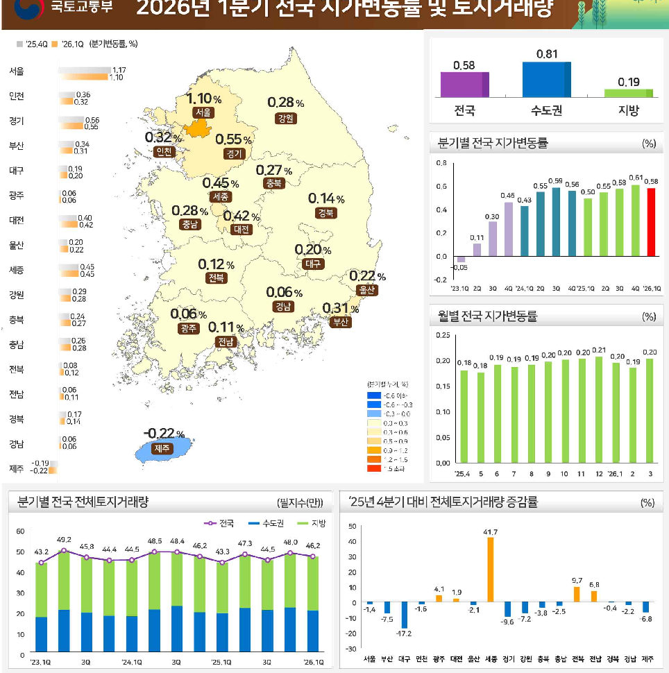
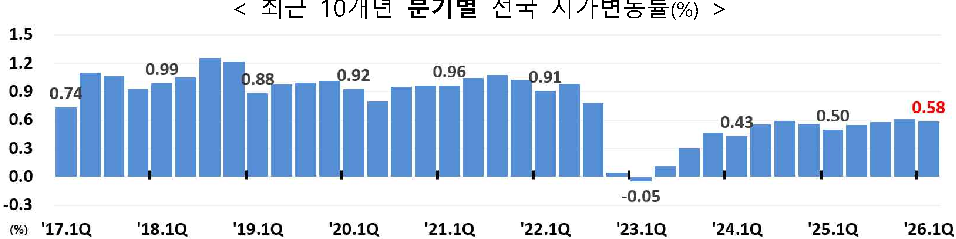
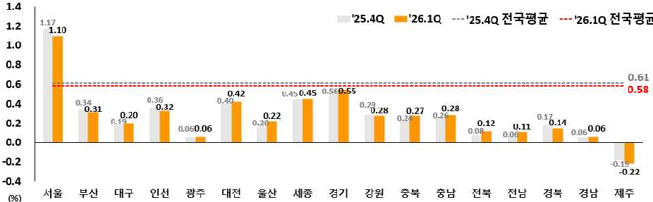
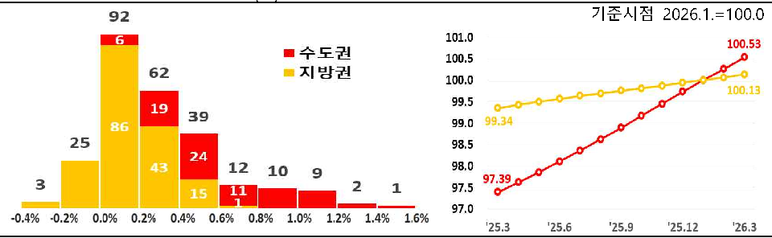
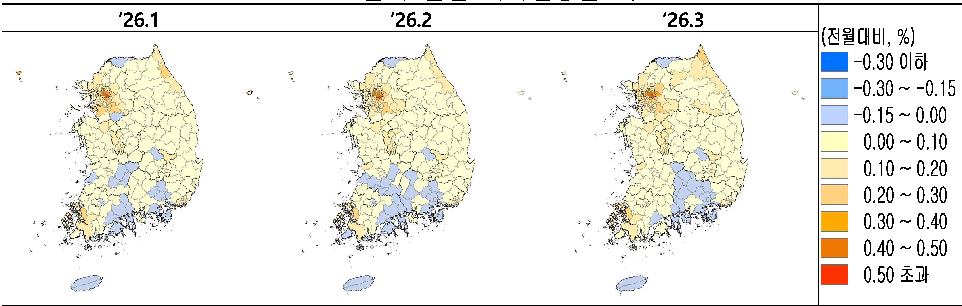
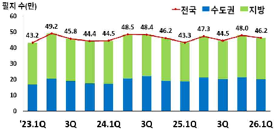
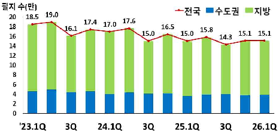
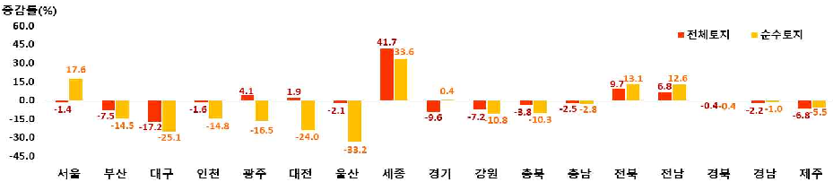

# 전국지가변동률조사, 부동산거래현황

보도자료

보도시점 : 2026. 4. 23.(목) 14:00 이후(4. 24.(금) 조간) / 배포 : 2026. 4. 23.(목)

# '26년 1분기 전국 지가 0.58% 상승

-' 25년 4분기(0.61%) 대비 0.03%p 상승폭 축소

-' 26년 1분기 토지거래량은 ' 25년 4분기 대비 3.6% 감소

'26.10 (221455,%)

0.81

0.58

1.17

0.19

836

10%

0.28

%

43

452

321

0.56

0.55

0.32%

0.55%

(%)

0.34

0.31

0.8

0.27%

0.58 0.610.58

0.45%

0.59

0.56

0.55

0.55

0.6

0.50

0.06

0.14%

0.46

0.06

0.43

0.28%

0.4

0.42%

0.30

0.40

0.42

0.2

0.11

0.20

g4

0.20%

0.22

0.0

0.12%

0.45

40.05

0.22%

0.45

0.2

'23.10 20

30

30

40'25.10

20

40 '26.10

40 '24.10 20

30

0.06%

0.29

32

0.28

0.06%

(%)

0.24

0.27

0.11%

0.25

0.26

44

0.28

0.20 0.20 0.21

0.20

0.19 0.19 0.19 0.20

0.20

0.18 0.18

0,08

0.12

0.15

0.06

0.11

0.10

0.17

0,0

0.14

0.0

0.3

0.22%

0.3

0.6

0.05

0.06

0.6 ~ 0.9

0.06

0.9 ~ 1.2

0.00

12 '26.1

'25.4

11

10

452

50

41.7

49.2

48.5

48.4

48,0

40

47.3

46.2

46.2

45.8

44,4

44.5

43.2

43.3

30

20

40

9.7

6.8

10

30

1.9

41.6

21

-2.5

-2.2

20

49.6 -7.2

6.8

-20

17.2

10

-30

'23.10

30

'25.10

'26.10

'24.10

30

□ 국토교통부(장관 김윤덕)와 한국부동산원(원장 이헌욱)은 ' 26년 1분기 지가 변동률 및 토지거래량을 발표하였다.

# 1.  지가변동률

- ㅇ ' 26년  1분기  전국  지가는  0.58%  상승하였다.  상승폭은 ' 25년  4분기 (0.61%)  대비  0.03%p  축소, ' 25년 1분기(0.50%)  대비  0.08%p  확대된 것으로 나타났다.
- ㅇ ' 26년  3월  지가변동률은  0.20%로, ' 26년  2월(0.19%)  대비  0.01%p, ' 25년 3월(0.18%) 대비 0.02%p 높은 수준으로 나타났다.

# < 최근 10개년 분기별 전국 지가변동률(%) >

1.5

1.2

0.99

0.96

0.92

0.91

0.88

0.9

0.74

0.58

0.50

0.6

0.43

0.3

0.0

-0.05

'19.1Q

'17.1Q

'18.1Q

'20.1Q0

'21.1Q

'22.1Q

'23.1Q

'24.1Q

'25.1Q

'26.1Q

(%)

□ (지역별) ' 26년 1분기 지가변동률은 수도권(0.85% → 0.81%)은 ' 25년 4분기 변동률 대비 낮은 수준, 지방권(0.19% → 0.19%)은 유사한 수준을 보였다.

- ㅇ  (시·도)  17개  시·도 중 서울(1.10%)이 전국 평균(0.58%)을 상회하였다.
- ㅇ  (시·군·구)  서울  강남구 1.50%,  서울 용산구 1.31%,  서울  서초구 1.26%  등 255개 시군구 중 41개 시군구가 전국 평균을 상회하였다.

< 시도별 '26년 1분기 지가변동률(%) >

1.4

'25.40 4382

'26.10 4382

'25.4Q

'26.1Q

117

1.2

1.10

1.0

0.8

0.61

0.6

0.58

0.450.45

0.42

0.36

0.40

0.4

0.34

0.28.28

0.32

0.28

0.31

0.27

0.20

0.22

0.2

0.14

01

0.2

0.19

0.12

0.20

0.11

0.060.06

0.060.06

0.08

0.0

0.0

0.2

0.22

~0.4

#4

271

(96)

ㅇ  또한,  255개  시군구 중 193개 시군구가 0.00% ~ 0.60% 수준을 나타 내었으며, 주로 수도권 지역을 중심으로 상승한 것으로 나타났다.

<'26년 1분기 지가변동률(%) 구간별 현황>

<권역별 지가지수>

기준시점 2026.1.=100.0

92

101.0

100.53

452

100.5

62

100.0

100.13

99.5

19

39

99.0

86

25

98.5

24

98.0

43

12

10

9

97.39

3

97.5

1

11

15

97.0

-0.2%

0.09

0.2%

0.4%

0.6%

1.09

1.2%

1.6%

0.8%

1.4%

'25.3

'25.6

'25.9

'25.12

'26.3

ㅇ (인구감소지역 동향) ' 26년 1분기 인구감소지역 * 의 지가변동률은 0.15%로 비대상지역 0.62% 대비 0.47%p 낮은 수준이다.

 행정안전부장관이 고시한 11개 시도, 89개 시군구(5년 단위 지정, '21.10월 최초 지정)

□ (최근 동향) 전국 지가는 ' 23년 3월(0.008%)  상승전환 이후 37개월 연속 상승하였으며, ' 26년 3월부터 상승폭이 확대되었다.

(1월) 0.195% → (2월) 0.185% → (3월) 0.203%

<'26년 1분기 월별 지가변동률 색인도>

'26.1

'26.2

'26.3

~0.30 ~-0.15

-0.15 ~ 0.00

0.00

0.10

0.10 ~ 0.20

0.20 ~ 0.30

0.30

0.40

0.40

0.50

0.50 z2

□ (용도지역/이용상황별) 상업지역 0.72%, 상업용 0.69% 등이 상승하였다.

(단위: %)

|용도지역별|도시지역| | | |관리지역| | | |농림 지역|자연환경|
|---|---|---|---|---|---|---|---|---|---|---|
| |주거|상업|공업|녹지| | | |보전관리생산관리계획관리관리통합| |보전지역|
|2026년 1분기|0.69|0.72|0.50|0.37|0.20|0.18|0.31|0.28|0.19|0.01|
|2025년 4분기|0.72|0.77|0.53|0.37|0.21|0.19|0.31|0.29|0.18|0.05|
|이용상황별|전| |답| |주거용 상업용| |임야| |공업용 기타| |
|2026년 1분기|0.33| |0.24| |0.66 0.69| |0.26| |0.47 0.26| |
|2025년 4분기|0.33| |0.24 0.67| |0.75| |0.26 0.50| |0.22| |

# 2.  토지  거래량

□  '26년  1분기  전체토지(건축물  부속토지  포함)  거래량은  약  46.2만  필지 (265.4㎢)로  나타났다.  이는  '25년  4분기  대비  3.6%  감소(△1.7만  필지) 했으나, '25년 1분기 대비해서는 6.7% 증가(2.9만 필지)한 수치이다.

ㅇ  건축물  부속토지를  제외한  순수토지  거래량은  약  15.1만  필지(239.4㎢)로, '25년  4분기  대비  0.1%  감소(△88필지)했으나,  '25년  1분기  대비 0.6% 증가(877필지)하였다.

< '26년 1분기 전체토지 및 순수토지 거래량 추이 >

(단위 : 거래 필지 수, 신고·검인물량 기준, 신고일 기준)

| |분기별| | |최근5년 ('21.∼'25.) 1분기평균|증감률(%)| | |
|---|---|---|---|---|---|---|---|
|구 분|'26년 1분기|'25년 4분기 (전분기)|'25년 1분기 (전년동기)| |전분기 대비|전년동기 대비|최근5년 1분기평균대비|
|전체토지|462,364|479,590|433,435|555,037|△3.6|6.7|△16.7|
|순수토지|150,964|151,052|150,087|216,780|△0.1|0.6|△30.4|

< 분기별 전체토지 거래량 >

< 분기별 순수토지 거래량 >

60

49.2

48.5

48.4

48.0

47.3

46.2

45.8

46.2

50

44.5

44.5

44.4

43.2

43.3

40

30

20

10

'23.1Q

24.1Q

25.1Q

26.1Q

~43

452

19.0

20

18.5

17.6

17.4

17.0

18

16.5

16.1

15.8

15.1

15.1

15.0

15.0

16

14.3

'23.1Q

3Q

24.1Q

3Q

25.1Q

30

26.1Q

□ (지역별) '26년 1분기 전체토지 거래량은 '25년 4분기 대비 세종 41.7%, 전북 9.7% 등 5개 시·도에서 증가하고, 12개 시·도에서 감소하였다.

ㅇ  순수토지  거래량은  세종  33.6%,  서울  17.6%  등  5개  시·도에서  증가 하고 12개 시·도에서 감소하였다.

<'25년 4분기 대비 '26년 1분기 전체·순수토지 거래량 증감률>

60.0

45.0

41.7

33

30.0

17.6

9.713.1

12.6

15.0

6.8

1.9

0.0

"0.4-0.4

1.4

1.6

2.1

3.8

"6.85.5

9.6

10.3

-15.0

-45.0

271

#4

89

44

□ (용도지역/지목/건물용도별) '26년 1분기 토지거래량은 '25년 4분기 대비 농림지역 (용도지역) 17.5%, 답(지목) 7.6%, 공 업 용 (건물용도) 6.5% 등 이  증 가 하 였 고 , 용 도 미 지 정 (용도지역) △31.5%, 임야(지목) △8.2%, 기타건물(건물용도) △28.9% 등이 감소하였다. (단위: %)

|용도지역|도시지역| | | | |관리 지역|농림 지역|자연환경 보전지역|용도미지정|
|---|---|---|---|---|---|---|---|---|---|
| |주거|상업|공업|녹지|개발제한| | | | |
|2026년 1분기|△5.1|△7.6|4.4|△0.1|△4.8|△2.1|17.5|8.6|△31.5|
|2025년 4분기|9.8|4.7|25.1|△3.4|0.9|△1.2|23.5|6.6|38.4|
|지목|전| |답 대| |임야| |공장용지| |기타|
|2026년 1분기|1.0| |7.6 △5.3| |△8.2| |4.0| |△3.5|
|2025년 4분기|△0.3| |22.6 10.2| |△4.0| |△2.9| |△6.7|
|건물용도|주거용| |상업업무용| |공업용| |기타건물| |나지|
|2026년 1분기|△5.7| |0.2| |6.5| |△28.9| |△4.3|
|2025년 4분기|13.5| |△10.6| |13.6| |11.4| |4.3|

☞ 지가변동률과 토지거래량에 대한 상세 자료는 'R-ONE 부동산통계정보시스템'(www.reb.or.kr/r-one, 지가변동률 및 토지거래량은 4월 23일 14시 공표 예정) 및 '국토교통 통계누리'(stat.molit.go.kr)에서  확인 할 수 있습니다.

|담당 부서 <총괄>|주택토지실|책임자|과 장|황윤언(044-201-3411)|
|---|---|---|---|---|
| |부동산평가과|담당자|사무관|송현순(044-201-3424)|
|담당 부서|주택토지실|책임자|과 장|한정희(044-201-3398)|
| |토지정책과(토지거래량)|담당자|사무관|이영주(044-201-3402)|
|담당 부서|한국부동산원|책임자|부 장|강자영(053-663-8541)|
| |토지통계부(지가변동률)|담당자|차 장|김소라(053-663-8542)|
|담당 부서|한국부동산원|책임자|부 장|장정완(053-663-8521)|
| |거래분석부(토지거래량)|담당자|과 장|권범준(053-663-8522)|

# 붙임1 지역별 지가변동률 추이

#  분기별 지가변동률 추이

(단위 : 분기, %)

|구분|2022| | | |2023| | | |2024| | | |2025| | | |2026|
|---|---|---|---|---|---|---|---|---|---|---|---|---|---|---|---|---|---|
| |1/4|2/4|3/4|4/4|1/4 2/4|3/4| |4/4|1/4|2/4|3/4|4/4|1/4|2/4 3/4|4/4|1/4| |
|0.91|0.98|0.78|0.04|-0.05|0.11|0.30|0.46|0.43|0.55|0.59|0.56|0.50|0.55|0.58|0.61|0.58|전국|
|1.01|1.10|0.89|0.00|-0.06|0.14|0.39|0.60|0.56|0.70|0.75|0.73|0.66|0.74|0.80|0.85|0.81|수도권|
|0.72|0.78|0.60|0.12|-0.03|0.06|0.14|0.24|0.22|0.30|0.31|0.27|0.22|0.22|0.19|0.19|0.19|지방권|
|1.08|1.20|0.93|-0.18-0.12| |0.11|0.44|0.67|0.54|0.76|0.87|0.90|0.80|0.93|1.07|1.17|1.10|서울|
|0.91|0.99|0.71|0.11|-0.02-0.02| |0.09|0.13|0.15|0.39|0.49|0.45|0.33|0.37|0.38|0.34|0.31|부산|
|0.87|0.83|0.67|0.15|-0.13|0.01|0.19|0.25|0.21|0.29|0.31|0.28|0.26|0.26|0.18|0.19|0.20|대구|
|0.90|0.86|0.69|-0.11-0.03| |0.20|0.26|0.38|0.44|0.51|0.53|0.34|0.24|0.25|0.26|0.36|0.32|인천|
|0.71|0.80|0.62|0.13|-0.03|0.00|0.05|0.43|0.43|0.41|0.40|0.33|0.21|0.14|0.11|0.06|0.06|광주|
|1.01|1.02|0.69|-0.17-0.06| |0.17|0.27|0.42|0.36|0.34|0.27|0.19|0.24|0.30|0.30|0.40|0.42|대전|
|0.69|0.93|0.46|0.03|-0.10-0.06| |0.04|0.14|0.25|0.31|0.27|0.18|0.20|0.25|0.23|0.20|0.22|울산|
|1.31|1.23|0.94|-0.25-0.04| |0.15|0.34|0.70|0.44|0.46|0.44|0.34|0.27|0.32|0.42|0.45|0.45|세종|
|0.96|1.03|0.87|0.22|0.01|0.16|0.36|0.55|0.59|0.67|0.66|0.61|0.57|0.59|0.58|0.56|0.55|경기|
|0.62|0.72|0.62|0.30|0.06|0.12|0.12|0.14|0.21|0.33|0.41|0.37|0.30|0.29|0.25|0.29|0.28|강원|
|0.71|0.76|0.59|0.15|0.01|0.08|0.21|0.47|0.37|0.37|0.40|0.39|0.30|0.31|0.29|0.24|0.27|충북|
|0.64|0.65|0.58|0.16|0.04|0.21|0.21|0.27|0.27|0.28|0.39|0.36|0.29|0.28|0.26|0.26|0.28|충남|
|0.63|0.67|0.55|0.31|-0.05-0.03| |0.09|0.24|0.13|0.14|0.11|0.10|0.13|0.14|0.07|0.08|0.12|전북|
|0.89|0.89|0.72|0.15|-0.03|0.01|0.04|0.30|0.30|0.30|0.23|0.24|0.14|0.00|-0.01|0.06|0.11|전남|
|0.53|0.57|0.46|0.19|-0.02|0.11|0.27|0.34|0.30|0.33|0.27|0.24|0.23|0.23|0.16|0.17|0.14|경북|
|0.50|0.62|0.49|0.14|0.04|0.07|0.05|0.07|0.10|0.29|0.26|0.20|0.14|0.16|0.09|0.06|0.06|경남|
|0.65|0.78|0.58| |-0.13-0.29-0.06| |0.00| | | | |-0.06-0.08-0.14-0.17-0.20-0.21-0.18-0.20-0.19-0.22| | | | | |제주|

#  월별 지가변동률 추이

(단위 : 월별, %)

|구분|연간| | | |2025년| | | | | | | | | |2026년| | |
|---|---|---|---|---|---|---|---|---|---|---|---|---|---|---|---|---|---|
| |'22|'23|'24|'25|3|4|5|6|7|8|9|10|11|12|1|2|3|
|전국|2.73|0.82|2.15|2.25|0.18|0.18|0.18|0.19|0.19|0.19|0.20|0.20|0.20|0.21|0.20|0.19|0.20|
|수도권|3.03|1.08|2.77|3.08|0.23|0.24|0.24|0.26|0.26|0.27|0.28|0.28|0.28|0.28|0.27|0.26|0.28|
|지방권|2.24|0.40|1.10|0.82|0.08|0.08|0.07|0.07|0.07|0.06|0.06|0.06|0.06|0.07|0.06|0.06|0.07|
|서울|3.06|1.11|3.10|4.02|0.29|0.29|0.30|0.34|0.33|0.36|0.37|0.39|0.39|0.39|0.37|0.34|0.38|
|부산|2.75|0.18|1.49|1.43|0.11|0.12|0.13|0.13|0.14|0.12|0.12|0.11|0.11|0.11|0.10|0.10|0.11|
|대구|2.55|0.32|1.09|0.89|0.09|0.09|0.09|0.07|0.07|0.06|0.06|0.06|0.07|0.07|0.06|0.07|0.07|
|인천|2.37|0.82|1.84|1.12|0.08|0.10|0.08|0.08|0.07|0.10|0.10|0.11|0.13|0.13|0.10|0.10|0.12|
|광주|2.27|0.46|1.57|0.51|0.06|0.05|0.04|0.05|0.05|0.03|0.02|0.01|0.01|0.03|0.02|0.02|0.02|
|대전|2.57|0.81|1.17|1.26|0.09|0.10|0.11|0.09|0.11|0.10|0.10|0.12|0.14|0.15|0.14|0.14|0.14|
|울산|2.12|0.02|1.01|0.89|0.08|0.09|0.08|0.09|0.08|0.08|0.07|0.07|0.06|0.07|0.07|0.07|0.08|
|세종|3.25|1.14|1.69|1.47|0.09|0.11|0.10|0.11|0.13|0.14|0.15|0.14|0.15|0.15|0.15|0.15|0.14|
|경기|3.11|1.08|2.55|2.32|0.20|0.20|0.19|0.20|0.20|0.18|0.19|0.19|0.18|0.19|0.18|0.18|0.19|
|강원|2.28|0.44|1.32|1.13|0.11|0.11|0.09|0.09|0.09|0.08|0.08|0.08|0.10|0.11|0.09|0.08|0.10|
|충북|2.23|0.77|1.53|1.15|0.11|0.11|0.10|0.10|0.09|0.09|0.10|0.08|0.08|0.08|0.08|0.08|0.12|
|충남|2.03|0.72|1.29|1.09|0.10|0.11|0.09|0.09|0.09|0.09|0.08|0.08|0.09|0.10|0.09|0.09|0.10|
|전북|2.18|0.25|0.49|0.42|0.07|0.06|0.05|0.03|0.01|0.01|0.05|0.02|0.03|0.03|0.03|0.04|0.05|
|전남|2.67|0.32|1.08|0.19|0.02|0.01|0.00|-0.01|-0.01|-0.01|0.00|0.01|0.02|0.03|0.03|0.04|0.04|
|경북|1.75|0.69|1.14|0.79|0.08|0.09|0.08|0.06|0.06|0.05|0.05|0.05|0.06|0.06|0.05|0.04|0.05|
|경남|1.76|0.23|0.85|0.45|0.05|0.06|0.05|0.05|0.04|0.03|0.02|0.01|0.02|0.03|0.02|0.02|0.02|
|제주|1.89|-0.41|-0.58|-0.77|-0.06| |-0.06|-0.06| | | | |-0.07|-0.06|-0.07|-0.08| |
| | | | | | |-0.06| | |-0.07|-0.06|-0.07|-0.07| | | | |-0.07|

#  용도지역별 및 이용상황별 지가변동률 추이

(단위 : 분기, %)

| | | |2024| | | |2025| | | |2026|
|---|---|---|---|---|---|---|---|---|---|---|---|
| | | |1분기|2분기|3분기|4분기|1분기|2분기|3분기|4분기|1분기|
| |전국|평균|0.43|0.55|0.59|0.56|0.50|0.55|0.58|0.61|0.58|
| |도|주거지역|0.45|0.57|0.64|0.61|0.55|0.62|0.69|0.72|0.69|
| |시|상업지역|0.47|0.62|0.68|0.67|0.55|0.62|0.67|0.77|0.72|
| |지|공업지역|0.45|0.61|0.61|0.58|0.47|0.50|0.50|0.53|0.50|
| |역|녹지지역|0.45|0.53|0.52|0.46|0.42|0.44|0.39|0.37|0.37|
| |비 도 시|보전관리지역|0.22|0.28|0.28|0.25|0.23|0.22|0.19|0.21|0.20|
| | |생산관리지역|0.26|0.30|0.29|0.28|0.24|0.24|0.19|0.19|0.18|
| | |계획관리지역|0.39|0.46|0.44|0.41|0.36|0.37|0.32|0.31|0.31|
| |지|관리통합|0.35|0.42|0.40|0.37|0.33|0.34|0.29|0.29|0.28|
| |역|농림지역|0.28|0.32|0.30|0.29|0.25|0.24|0.18|0.18|0.19|
| | |자연환경보전|0.13|0.21|0.15|0.14|0.09|0.09|0.04|0.05|0.01|
| |전| |0.40|0.45|0.45|0.44|0.38|0.41|0.34|0.33|0.33|
| |답| |0.35|0.42|0.40|0.37|0.33|0.31|0.25|0.24|0.24|
| |주거용| |0.41|0.54|0.59|0.54|0.51|0.60|0.65|0.67|0.66|
|상|상업용| |0.47|0.61|0.66|0.67|0.56|0.59|0.66|0.75|0.69|
| |임야| |0.28|0.34|0.35|0.32|0.30|0.28|0.26|0.26|0.26|
| |공업용| |0.52|0.67|0.66|0.63|0.52|0.57|0.51|0.50|0.47|
| |기타| |0.43|0.42|0.39|0.46|0.18|0.25|0.36|0.22|0.26|

붙임2

# ' 26년 1분기 토지거래량 증감률

#  전체토지 거래량(건축물 부속토지 포함)

(단위 : 거래 필지 수, 신고·검인 포함, 신고일 기준)

|구 분|분기별| | |최근 5년 ( ' 21~ ' 25년) 1분기 평균|증감률(%)| | |
|---|---|---|---|---|---|---|---|
|(분양권 거래량)|' 26년 1분기|' 25년 4분기|' 25년 1분기|거래량|전분기 대비|전년동기 대비|최근 5년 평균 대비|
|전 국|462,364 (68,223)|479,590 (83,253)|433,435 (78,367)|555,037 (113,034)|△3.6 (△18.1)|6.7 (△12.9)|△16.7 (△39.6)|
|수도권|200,871 (36,729)|214,966 (50,283)|189,008 (47,591)|230,490 (62,498)|△6.6 (△27.0)|6.3 (△22.8)|△12.9 (△41.2)|
|서 울|54,969 (7,807)|55,764 (6,564)|51,322 (12,033)|51,074 (14,227)|△1.4 (18.9)|7.1 (△35.1)|7.6 (△45.1)|
|인 천|23,982 (5,885)|24,381 (6,768)|25,013 (8,942)|33,009 (10,700)|△1.6 (△13.0)|△4.1 (△34.2)|△27.3 (△45.0)|
|경 기|121,920 (23,037)|134,821 (36,951)|112,673 (26,616)|146,406 (37,571)|△9.6 (△37.7)|8.2 (△13.4)|△16.7 (△38.7)|
|지 방|261,493 (31,494)|264,624 (32,970)|244,427 (30,776)|324,548 (50,535)|△1.2 (△4.5)|7.0 (2.3)|△19.4 (△37.7)|
|지방광역시|69,522 (15,375)|72,304 (15,433)|59,749 (13,328)|71,975 (17,948)|△3.8 (△0.4)|16.4 (15.4)|△3.4 (△14.3)|
|부 산|23,493 (6,067)|25,389 (6,172)|16,283 (2,937)|22,727 (5,878)|△7.5 (△1.7)|44.3 (106.6)|3.4 (3.2)|
|대 구|13,127 (2,399)|15,860 (3,948)|10,968 (1,999)|14,531 (4,169)|△17.2 (△39.2)|19.7 (20.0)|△9.7 (△42.5)|
|광 주|8,005 (1,105)|7,693 (835)|10,479 (1,656)|10,778 (2,126)|4.1 (32.3)|△23.6 (△33.3)|△25.7 (△48.0)|
|대 전|9,382 (1,479)|9,204 (1,873)|10,944 (4,954)|10,660 (3,355)|1.9 (△21.0)|△14.3 (△70.1)|△12.0 (△55.9)|
|울 산|10,170 (3,276)|10,386 (2,542)|7,872 (1,232)|8,368 (1,426)|△2.1 (28.9)|29.2 (165.9)|21.5 (129.8)|
|세 종|5,345 (1,049)|3,772 (63)|3,203 (550)|4,911 (994)|41.7 (1565.1)|66.9 (90.7)|8.8 (5.6)|
|지방 도|191,971 (16,119)|192,320 (17,537)|184,678 (17,448)|252,573 (32,587)|△0.2 (△8.1)|3.9 (△7.6)|△24.0 (△50.5)|
|강 원|19,142 (1,396)|20,631 (2,253)|19,515 (1,264)|26,267 (2,768)|△7.2 (△38.0)|△1.9 (10.4)|△27.1 (△49.6)|
|충 북|21,857 (3,351)|22,712 (3,349)|19,165 (2,512)|25,624 (3,976)|△3.8 (0.1)|14.0 (33.4)|△14.7 (△15.7)|
|충 남|31,331 (3,165)|32,148 (3,745)|33,267 (5,509)|43,684 (7,215)|△2.5 (△15.5)|△5.8 (△42.5)|△28.3 (△56.1)|
|전 북|23,559 (1,926)|21,482 (1,347)|23,223 (2,890)|29,398 (3,473)|9.7 (43.0)|1.4 (△33.4)|△19.9 (△44.5)|
|전 남|30,230 (1,393)|28,299 (1,429)|28,279 (1,557)|38,491 (3,682)|6.8 (△2.5)|6.9 (△10.5)|△21.5 (△62.2)|
|경 북|29,407 (2,081)|29,515 (2,248)|28,046 (1,378)|42,068 (5,626)|△0.4 (△7.4)|4.9 (51.0)|△30.1 (△63.0)|
|경 남|30,827 (2,289)|31,508 (2,868)|27,940 (1,972)|38,971 (5,042)|△2.2 (△20.2)|10.3 (16.1)|△20.9 (△54.6)|
|제 주|5,618 (518)|6,025 (298)|5,243 (366)|8,069 (805)|△6.8 (73.8)|7.2 (41.5)|△30.4 (△35.7)|

- * 전체토지 : 건축물 부속토지 포함
- ** 분양권거래량 : 공급계약, 전매, 분양권검인 사항

#  순수토지 거래량

(단위 : 거래 필지 수, 신고·검인 포함, 신고일 기준)

|구 분|분기별| | |최근 5년 ( ' 21~ ' 25년) 1분기 평균 거래량|증감률(%)| | |
|---|---|---|---|---|---|---|---|
|(분양권 거래량)|' 26년 1분기|' 25년 4분기|' 25년 1분기| |전분기 대비|전년동기 대비|최근 5년 평균 대비|
|전 국|150,964 (584)|151,052 (746)|150,087 (754)|216,780 (1,819)|△0.1 (△21.7)|0.6 (△22.5)|△30.4 (△67.9)|
|수도권|38,563 (263)|38,133 (300)|36,435 (256)|57,205 (699)|1.1 (△12.3)|5.8 (2.7)|△32.6 (△62.4)|
|서 울|5,305 (25)|4,510 (48)|3,183 (6)|3,477 (33)|17.6 (△47.9)|66.7 (316.7)|52.6 (△25.1)|
|인 천|2,731 (30)|3,204 (35)|2,933 (48)|4,950 (78)|△14.8 (△14.3)|△6.9 (△37.5)|△44.8 (△61.6)|
|경 기|30,527 (208)|30,419 (217)|30,319 (202)|48,778 (587)|0.4 (△4.1)|0.7 (3.0)|△37.4 (△64.6)|
|지 방|112,401 (321)|112,919 (446)|113,652 (498)|159,575 (1,120)|△0.5 (△28.0)|△1.1 (△35.5)|△29.6 (△71.3)|
|지방광역시|8,134 (86)|9,359 (125)|9,515 (100)|13,671 (531)|△13.1 (△31.2)|△14.5 (△14.0)|△40.5 (△83.8)|
|부 산|1,900 (34)|2,221 (80)|1,945 (18)|3,144 (171)|△14.5 (△57.5)|△2.3 (88.9)|△39.6 (△80.1)|
|대 구|1,090 (5)|1,456 (10)|1,561 (19)|2,278 (49)|△25.1 (△50.0)|△30.2 (△73.7)|△52.1 (△89.9)|
|광 주|873 (21)|1,045 (2)|2,312 (9)|2,016 (22)|△16.5 (950.0)|△62.2 (133.3)|△56.7 (△6.2)|
|대 전|769 (2)|1,012 (8)|1,012 (11)|1,428 (15)|△24.0 (△75.0)|△24.0 (△81.8)|△46.2 (△86.7)|
|울 산|1,343 (18)|2,009 (11)|1,714 (15)|2,413 (22)|△33.2 (63.6)|△21.6 (20.0)|△44.3 (△18.2)|
|세 종|2,159 (6)|1,616 (14)|971 (28)|2,392 (251)|33.6 (△57.1)|122.3 (△78.6)|△9.8 (△97.6)|
|지방 도|104,267 (235)|103,560 (321)|104,137 (398)|145,904 (589)|0.7 (△26.8)|0.1 (△41.0)|△28.5 (△60.1)|
|강 원|9,881 (11)|11,083 (5)|11,183 (9)|14,979 (31)|△10.8 (120.0)|△11.6 (22.2)|△34.0 (△64.3)|
|충 북|9,905 (59)|11,047 (52)|9,354 (63)|13,213 (128)|△10.3 (13.5)|5.9 (△6.3)|△25.0 (△53.8)|
|충 남|17,696 (15)|18,204 (32)|18,316 (20)|25,122 (73)|△2.8 (△53.1)|△3.4 (△25.0)|△29.6 (△79.5)|
|전 북|13,237 (29)|11,705 (38)|12,667 (42)|17,492 (64)|13.1 (△23.7)|4.5 (△31.0)|△24.3 (△54.5)|
|전 남|21,206 (29)|18,830 (129)|19,776 (63)|26,782 (86)|12.6 (△77.5)|7.2 (△54.0)|△20.8 (△66.4)|
|경 북|16,633 (51)|16,706 (31)|17,060 (60)|24,656 (90)|△0.4 (64.5)|△2.5 (△15.0)|△32.5 (△43.6)|
|경 남|13,203 (40)|13,332 (34)|13,305 (139)|19,483 (112)|△1.0 (17.6)|△0.8 (△71.2)|△32.2 (△64.2)|
|제 주|2,506 (1)|2,653 (0)|2,476 (2)|4,178 (6)|△5.5 (-)|1.2 (△50.0)|△40.0 (△82.1)|

* 순수토지 : 토지만 거래된 내역

#  용도지역 및 지목별 토지 거래량

(단위 : 거래 필지 수, 신고·검인 포함, 신고일 기준)

| | |분기별| | |최근 5년 ( ' 21~ ' 25년) 1분기 평균 거래량|증감률(%)| | |
|---|---|---|---|---|---|---|---|---|
| |구 분|' 26년 1분기|' 25년 4분기|' 25년 1분기| |전분기 대비|전년동기 대비|최근 5년 평균 대비|
|용도지역별| |462,364|479,590|433,435|555,037|△3.6|6.7|△16.7|
|도 시 지 역|주거지역|262,235|276,404|237,685|273,746|△5.1|10.3|△4.2|
| |상업지역|40,415|43,719|37,066|47,716|△7.6|9.0|△15.3|
| |공업지역|10,679|10,231|9,065|11,960|4.4|17.8|△10.7|
| |녹지지역|25,399|25,414|26,523|39,828|△0.1|△4.2|△36.2|
|개발제한구역| |4,663|4,898|4,556|4,500|△4.8|2.3|3.6|
|비 도 시 지|관리지역|80,087|81,824|79,912|110,493|△2.1|0.2|△27.5|
| |농림지역|30,672|26,103|29,819|38,617|17.5|2.9|△20.6|
| |자연환경 보전지역|1,849|1,702|1,640|2,586|8.6|12.7|△28.5|
|용도미지정| |6,365|9,295|7,169|25,591|△31.5|△11.2|△75.1|
|지목별| |462,364|479,590|433,435|555,037|△3.6|6.7|△16.7|
|전| |35,725|35,360|33,773|52,940|1.0|5.8|△32.5|
|답| |47,530|44,167|47,051|66,104|7.6|1.0|△28.1|
|대| |312,891|330,294|291,587|350,228|△5.3|7.3|△10.7|
|임야| |28,849|31,424|28,010|42,207|△8.2|3.0|△31.6|
|공장용지| |5,245|5,041|5,385|9,115|4.0|△2.6|△42.5|
|기타| |32,124|33,304|27,629|34,443|△3.5|16.3|△6.7|
|건물용도별* (대+공장용지)| |318,136|335,335|296,972|359,343|△5.1|7.1|△11.5|
|주거용| |255,413|270,805|233,744|250,505|△5.7|9.3|2.0|
|상업업무용| |32,493|32,442|32,399|48,792|0.2|0.3|△33.4|
|공업용| |3,926|3,686|4,942|9,657|6.5|△20.6|△59.3|
|기타건물| |2,506|3,523|2,877|4,226|△28.9|△12.9|△40.7|
|나지| |23,798|24,879|23,010|46,163|△4.3|3.4|△48.4|

* 전체토지 거래량 중 지목이 대, 공장용지인 토지에 대해 건물용도별로 집계한 수치임
