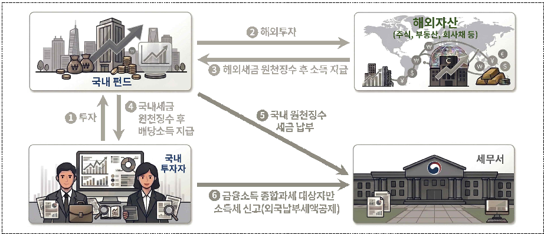
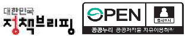
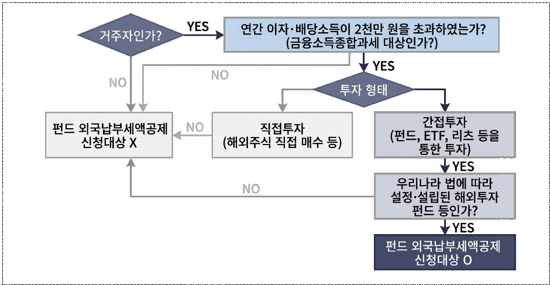
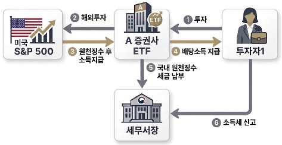
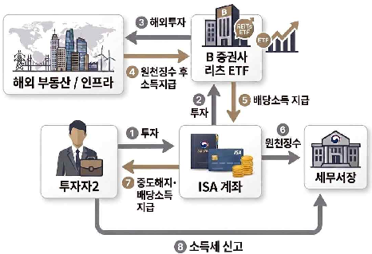
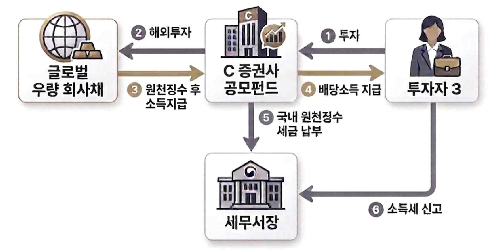
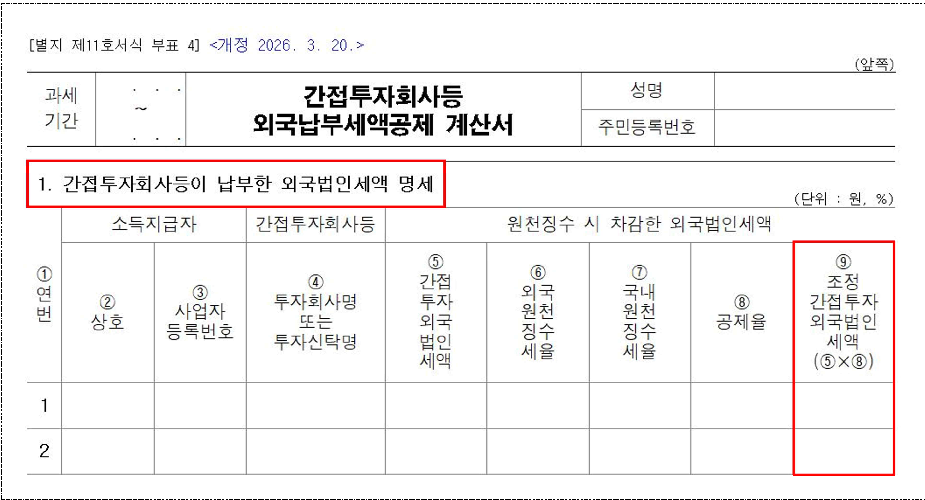
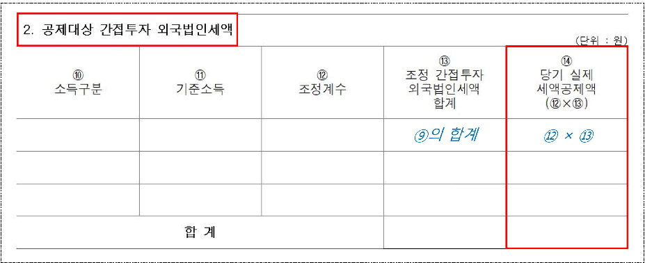

National Tax Service

국세청

# 보도참고자료

보도 시점 2026. 4. 24.(금) 12:00 배포 2026. 4. 24.(금) 10:00

# 펀드 투자로 해외소득 얻은 금융소득종합과세 대상자는 5월 종합소득세 신고 때 펀드가 낸 세금 공제받으세요

­ 금년 5월,  변경된 '펀드 외국납부세액공제 제도' 처음으로 시행

­ 펀드가 해외에 세금 낸 경우 투자자가 세액공제 신청하면 세금 줄일 수 있어

#  제도개요

□ 금융소득종합과세 대상자가 펀드를 통한 해외투자 과정에서 외국에 세금을 납부한 경우 신청을 통해 해당 세액에 대해 세액공제 * 를 받을 수 있다.

국내 펀드를 통해 해외 자산에 투자하여 펀드가 해외에 납부한 세금에 대해 펀드 투자자가 공제를 신청하면 국내에서 낼 세금에서 세액공제 가능(소득세법 제57조의2)

ㅇ 금융소득종합과세 대상자가 아닌 경우 펀드 판매사의 원천징수 과정에서 외국납부세액공제가 완료되므로 별도로 공제를 신청할 필요가 없다.

□ 국세청(청장  임광현)에서는  펀드  투자자가  올해  처음  실시되는  외국납부 세액공제를 쉽게 받을 수 있도록 세액공제 방법을 아래와 같이 안내한다.

# ❙ 펀드 외국납부세액공제 구조 ❙

* 참고 1 : 펀드 외국납부세액공제 카드뉴스

#  펀드 외국납부세액공제의 내용과 방법

□ (제도 변경) 과거에는 '펀드 단계'에서 외국납부세액을 공제하는 제도를 운영했으나, 금년 종합소득세 신고분부터는 공제방식을 합리화하기 위해 '납세자가 직접' 세액공제를 신청하는 방식으로 제도가 변경 * 되었다.

참고 2 : 펀드 외국납부세액공제 제도변경 연혁

□ (신청가능 요건) ❶ 금융소득종합과세 대상자 * 가 ❷ 국내에 설정된 펀드 등 ** 을 통해 해외금융상품 ․ 부동산 등 해외자산에 간접투자하여 소득이 발생하고 ❸ 외국에 납부한 세금이 있는 경우 공제를 신청할 수 있다.

연간 이자소득과 배당소득 합계 금액이 2천만 원을 초과하는 거주자

** 펀드,상장지수펀드(ETF),부동산간접투자기구(REITs),내국법인으로 보는 신탁재산 등(참고 3)

□ (신청 방법) 금년 5월 종합소득세 확정신고 *  시 ｢ 간접투자회사 등 외국 납부세액공제 계산서 ** ｣ 를 첨부서류로 제출해야 한다.

확정신고기한 : 5월 31일까지, 성실신고확인 대상자의 경우 6월 30일까지

** 소득세법 시행규칙 별지 제11호서식 부표4

ㅇ 위 서식에 '공제받을 외국납부세액'을 기재해야 하며, 해당 금액은 펀드 판매사(증권사 등)로부터 제공받은 자료를 바탕으로 손쉽게 작성 * 할 수 있다.

참고 4 : 펀드 외국납부세액공제 신청서 작성방법

□ (공제가능 펀드 예시) 국내 설정 펀드가 대상이며, 구체적으로는 ❶ 국내 상장 S&P 500 또는 나스닥 100 지수 추종 ETF, ❷ 국내상장 해외부동산 리츠 ETF, ❸ 국내에 설정된 해외 채권형 공모펀드 등이 있다.

ㅇ 위  펀드  등에  투자하여  배당소득 * 을  얻은  거주자가  금융소득종합과세 대상자일 경우 외국납부세액공제를 신청할 수 있다 (참고 3) .

국내 설정 펀드로부터 받은 이익은 배당소득으로 분류(소득세법 제17조 제1항 제5호)

□ (신청 효과) 위 공제요건을 충족하여 세액공제를 신청하는 경우 외국에 납부한 세액에 상당하는 금액만큼 소득세를 절감할 수 있다.

#  제도홍보 계획 및 당부말씀

□ 국세청은 펀드 투자자들이 불편 없이 세액공제를 받을 수 있도록 금융기관· 금융투자협회를 대상으로 제도도입 취지, 서식작성 방법 등을 안내 * 하였고, 향후 신고 유의사항을 정리하여 가이드라인을 배포할 예정이다.

금융투자협회 실무자 회의('25.11.19.), 증권사 간담회('25.8.18., '26.2.6., '26.2.27.) 실시

ㅇ 또한 세무대리인 협회에 방문 교육을 실시 * 하고 설명자료를 배부하는 등 납세자들이 편리하게 세무신고를 할 수 있도록 적극 안내할 계획이다.

4월 말 세무대리인 협회 현장 교육 및 안내 실시 예정

□ 변경된 방식의 펀드 외국납부세액공제가 올해 처음으로 실시되는 만큼 펀드 투자로 외국에 납부한 세액이 있는 납세자는 금년 5월 종합소득세 신고 시 공제를 신청하여 세액공제를 꼭 받으시기 바란다.

|담당 부서|국제조세관리관실 국제세원담당관실|책임자|과 장|이임동(044-204-2801)| |
|---|---|---|---|---|---|
| | | | | |이경한(044-204-2812)|
| | |담당자|사무관| | |

# 참고 2

# 펀드 외국납부세액공제 제도변경 연혁

□ ('05년 이전 귀속소득) 펀드를 통한 해외투자 시 외국납부세액공제 미적용

❶ 펀드 차원에서는 펀드 명의로 국내에 납부할 법인세가 발생하지 않아 외국납부세액을 공제받을 수 없었으며, ❷ 투자자는 본인이 직접 외국에

ㅇ 납부한 세액이 없으므로 세액공제 불가

□ ('06∼'24년 귀속소득) 펀드가 외국에서 세금을 납부한 경우 국내 과세당국에서 펀드에게 외국납부세액을 먼저 환급하고, 펀드가 소득을 국내 투자자에게 지급할 때 국내세율로 원천징수하는 방식으로 이중과세 조정(先환급 방식)

ㅇ 하지만, 이러한 先환급 방식은 이중과세가 발생하지 않은 부분에 대해서도 국고로 외국에 납부한 세액을 환급 ․ 지원하는 문제가 발생하여 제도개선이 필요하다는 지적이 제기됨

예를  들어,  ISA·연금계좌  등  절세계좌의  경우  국외원천소득이  국내에서  저율로 과세되므로 그 보다 고율로 과세된 외국납부세액을 국가에서 先환급하면 양국 간 세율 차이에 해당하는 금액만큼 우리나라 국고로 외국납부세액을 보전하는 문제 발생

□ ('25년 귀속소득: 현재 제도) 종전의 先환급 방식을 폐지하고,

ㅇ 펀드  판매사가  펀드  투자자에게  소득  지급  시  '국내  세율을  적용한

원천징수세액에서 외국납부세액을 차감한 금액'만큼 원천징수한 다음,

ㅇ 펀드  투자자가  종합소득세  신고  시  외국납부세액을  계산하여  스스로

공제하는 방식으로 제도 변경

참고 3

# 펀드 외국납부세액공제 대상 및 사례

□ (공제대상자) 연간 이자 ･ 배당소득의 합계액이 2천만 원을 초과하는 거주자가 국내법에 따라 설정된 펀드를 통해 해외자산에 간접투자한 경우

ㅇ 종합소득세 신고 시 펀드 투자자가 외국납부세액공제를 신청하면, 해당 펀드가 해외에서 부담한 세액을 투자자의 소득세에서 공제 가능

# ❙ 펀드 외국납부세액공제 신청대상 여부 판단기준 ❙

YES

YES

NO

NO

NO

YES

NO

YES

□ (적용대상  펀드) 아래와  같은  펀드(간접투자회사)를  통해  해외자산에  투자하는 경우에만 펀드 외국납부세액공제 적용 대상에 해당

# ❙ 외국납부세액공제 적용대상 펀드의 범위 (소득법§57의2) ❙

- 가. ｢ 자본시장과 금융투자업에 관한 법률 ｣ 에 따른 투자회사, 투자목적회사, 투자유한회사, 투자합자회사(같은 법 제9조제19항제1호의 기관전용 사모집합투자기구는 제외), 투자유한책임회사, 투자신탁, 투자합자조합 및 투자익명조합 → 펀드, ETF
- 나. ｢ 부동산투자회사법 ｣ 에 따른 기업구조조정 부동산투자회사 및 위탁관리 부동산 투자회사 → REITs, CR REITs
- 다. ｢ 법인세법 ｣ 제5조제2항에 따라 내국법인으로 보는 신탁재산

□ (사례) 아래에  제시된  투자자는  금융소득종합과세  대상에  해당하므로, 펀드가  외국에  납부한  세액에  대한  이중과세  조정을  위해  종합소득세 신고 시 세액공제를 신청할 수 있음

(사례 ❶ )  S&P 500 지수 추종 상장지수펀드(ETF)에 투자하여 소득을 수령하는 경우

Et

ETF

S&P 500

4513

국내  거주자인  투자자1은  A증권사를 통해 ｢ S&P  500  지수  추종  ETF ｣ 에 투자하여 소득을 얻었으며, 연간 이자· 배당소득이 2천만 원을 초과

⇨ ETF가  외국에  납부한  세액에  대해 외국납부세액공제 신청 가능

(사례 ❷ )  ISA  계좌를 통해 국내상장 해외 부동산 리츠 ETF에 투자하여 배당금을 수령하던 중 ISA 계좌를 중도해지하는 경우

4513

0

국내  거주자인  투자자2는  B증권사에 개설한 ISA 계좌를 통해 ｢ 해외 부동산 리츠 ETF ｣ 에 투자하던 중 ISA 계좌를 중도 해지하여 소득을 지급 받았으며, 연간 이자·배당소득이 2천만 원을 초과

⇨ 리츠 ETF가 외국에 납부한 세액에 대해 외국납부세액공제 신청 가능

(사례 ❸ )  해외 채권형 공모펀드에 투자하여 소득을 수령하는 경우

324

8245

국내  거주자인  투자자3은  C증권사가 판매하는 ｢ 해외  채권형  공모펀드 ｣ 에 투자하여 소득을 얻었으며, 연간 이자· 배당소득이 2천만 원을 초과

⇨ 공모 펀드가 외국에 납부한 세액에 대해 외국납부세액공제 신청 가능

※  사례 ❷ 에서 ISA  계좌를  만기까지 유지하는 경우 최대 400만 원까지 비과세되며 이를 초과한 금액도 저율로 분리과세 되므로 종합소득세 신고 의무 없음(ISA 계좌를 중도에 해지하면 비과세 등 혜택이 사라지며, 연간 금융소득이 2천만 원을 초과하는 경우 종합소득세 신고대상임)

# 참고 4

# 펀드 외국납부세액공제 신청서 작성방법

- □ 펀드 외국납부세액공제를 적용받으려는 개인 투자자는 종합소득세 신고 시 아래 서식(간접투자회사등 외국납부세액공제 계산서)을 작성하여 제출해야 함
- □ 아래 ｢ 1.  간접투자회사등이 납부한 외국법인세액 명세 ｣ 는 펀드 외국납부세액 공제금액 산정을 위한 기초자료를 작성하는 부분으로, 개인 투자자는 ' ⑨ 조정 간접투자 외국법인세액'의 합계액을 바탕으로  ⑭ 실제 세액공제액을 계산하게 됨

20

3

Etgl

%

4

(@x@)

2

- ㅇ ⑨ 조정 간접투자 외국법인세액 * 은 펀드 판매사가 투자자에게 소득 지급 시 '국내원천징수세액에서  차감한  ⑤ 간접투자외국법인세액에  ⑥⑦ 국내 ･ 외 원천징수세율에 따른  ⑧ 공제율(소득령§189의2①)을 곱하여 산출한 값'이며 * ⑨조정 간접투자외국법인세액 = ⑤간접투자외국법인세액 × ⑧공제율
- ㅇ 투자자는 서식의 ②∼⑨란을 작성하는데 필요한 자료를 소득지급자인 펀드 판매사로부터 제공받을 수 있음

자료를 제공받을 수 있는 방법과 시기 등이 펀드 판매사별로 상이하므로 개별 확인 필요(여러 판매사를 통해 투자한 경우에는 각 사로부터 자료를 제공받을 수 있음)

□ 아래 ｢ 2.  공제대상  간접투자  외국법인세액 ｣ 은  ⑪ 기준소득과  ⑬ 조정  간접투자 외국법인세액의 합계액을 바탕으로 펀드에서 발생한 외국납부세액 중 개인 투자자가 종합소득세 산출세액에서  ⑭ 실제 공제받을 금액을 계산하는 부분임

2

4572

71245

(@x@)

x (

@ H

ㅇ ⑪ 기준소득 * 은  종합소득세  과세표준을  기준으로  연금소득  등을  고려해 계산한  금액으로,  투자자는  기준소득만  산출하면  펀드  외국납부세액 공제액을 손쉽게 계산할 수 있음

기준소득  =  종합소득과세표준-2천만  원-(연금소득금액-연금보험료  공제금액-주택 담보노후연금이자비용 공제금액)-그 밖의 차감 금액(소득세법 시행령 제117조의2 제5항)

ㅇ ⑫ 조정계수는 투자자의 종합소득금액에 외국납부세액이 차감된 소득금액이 반영됨에  따라  감소한  국내세액에  맞추어  외국납부세액을  조정하기 위해 적용하는 값이며

투자자는 앞서 산출한 기준소득에 대응하는 값을 ｢ 소득세법 시행령 ｣ 제117조의2 제4항의 조정계수표에서 찾아서  ⑫ 조정계수란에 기재

ㅇ 투자자의 종합소득세 산출세액에서 실제 공제하는  ⑭ 당기 실제 세액공제액 * 은

⑫ 조정계수와  ⑬ 조정 간접투자 외국법인세액의 합계를 곱하여 산출함 * ⑭당기 실제 세액공제액 = ⑫조정계수 × ⑬조정 간접투자외국법인세액 합계

참고 5

# 펀드 외국납부세액공제 관련 FAQ

1

# 투자자가  해외금융상품에  간접투자하는  경우  펀드  등의  종류에 상관없이 펀드 외국납부세액공제 적용을 받을 수 있나요?

펀드 외국납부세액공제가 적용되는 간접투자회사 등은 다음과 같습니다.

- ① ｢ 자본시장과 금융투자업에 관한 법률 ｣ 에  따른  투자회사,  투자목적회사, 투자유한회사, 투자합자회사(같은 법 제9조제19항제1호의 기관전용 사모집합투자 기구는 제외), 투자유한책임회사, 투자신탁, 투자합자조합 및 투자익명조합
- ② ｢ 부동산투자회사법 ｣ 에  따른  기업구조조정  부동산투자회사  및  위탁관리 부동산투자회사
- ③ ｢ 법인세법 ｣ 제5조제2항에 따라 내국법인으로 보는 신탁재산

외국 법률에 의하여 외국에서 설정 ･ 설립된 역외펀드의 경우 펀드 외국납부세액 공제 대상이 아닙니다. ⇨ 해외상장 ETF 등에서 지급받는 배당소득과 관련된 외국납부세액은 ｢ 소득세법 ｣ 제57조에 따른 일반 외국납부세액공제 대상입니다.

2

# ETF를  통한  해외투자에 대해서도 펀드 외국납부세액공제를 적용받을 수 있나요?

국내에서 상장된 ETF는 ｢ 소득세법 ｣ 제57조의2제1항제1호에 열거된 자본시장법상 투자회사 또는 투자신탁에 해당하므로 펀드 외국납부세액공제 적용 대상입니다.

3

# 연금계좌를 통해 해외 ETF에 투자하면 세금을 이중으로 부담하게 되는 건가요?

그렇지 않습니다. 해외 현지에서 납부한 세액은 연금계좌 내에 별도로 적립 ･ 관리되며, 연금계좌에서 소득인출 시 납부해야 할 국내세액에서 해당 외국 납부세액을 차감할 수 있습니다.

다만,  연금계좌에  대한  펀드  외국납부세액공제는  '25. 1. 1.  이후  지급되는 소득에 대하여 '26. 7. 1.  이후  인출하는  분부터  적용되므로  올해  5월  종합 소득세 신고를 통한 정산 대상에는 포함되지 않습니다.

근거 : ｢ 소득세법 ｣ 부칙 <제21221호, 2025.12.23.> 제4조 제1항

4

# 모든 개인 투자자가 종합소득세 신고를 통해 펀드 외국납부세액을 정산해야 하는 건가요?

아닙니다.  이자 ･ 배당소득  합계액이  종합과세  기준금액(2천만  원)을  초과한 거주자의 경우에만 종합소득세 신고를 통한 외국납부세액 정산이 필요합니다.

이자 ･ 배당소득 합계액이 2천만 원 이하인 경우 또는 ISA 계좌를 통해 펀드 투자  후  만기  해지하는  경우에는  원천징수  시  펀드  외국납부세액공제가 완료되므로 별도로 종합소득세 신고를 할 필요가 없습니다.

5

# 종합소득세  신고  시  펀드  외국납부세액공제  신청  절차는  어떻게 되나요?

종합소득세 신고 시 ｢ 간접투자회사등 외국납부세액공제 계산서 ｣ (소득세법 시행규칙 별지 제11호서식 부표 4)를 작성하여 제출해야 합니다.

6

# 종합소득세 신고 대상자입니다. 펀드 외국납부세액공제를 받으려면 어떤 자료가 필요한가요?

▸｢ 간접투자회사등  외국납부세액공제  계산서 ｣ 작성을  위하여  원천징수  시 차감한 외국법인세액 관련 자료(간접투자외국법인세액, 외국원천징수세율, 국내원천 징수세율, 공제율 등) ｣ 가 필요하며, 해당 자료는 펀드 판매사(증권사, 은행 등)로부터 제공받을 수 있습니다.

# 참고 6

# 관련 법령

□ ｢ 소득세법 ｣ 제57조의2【간접투자회사 등이 납부한 외국법인세액공제 특례】

① 거주자의 종합소득금액 또는 퇴직소득금액에 다음 각 호의 요건을 갖춘 소득이 합산되어 있는 경우에는 제2항제2호에 따른 금액을 해당 과세 기간의 종합소득산출세액에서 공제할 수 있다.

다음 각 목의 어느 하나에 해당하는 것(이하 이 조 및 제129조에서 "간접투자회사등"이라 한다)으로부터 지급받은 소득일 것

- 가. 「자본시장과 금융투자업에 관한 법률」에 따른 투자회사, 투자목적 회사, 투자유한회사, 투자합자회사(같은 법 제9조제19항제1호의 기관 전용  사모집합투자기구는  제외한다),  투자유한책임회사,  투자신탁, 투자합자조합 및 투자익명조합
- 나. 「부동산투자회사법」에 따른 기업구조조정 부동산투자회사 및 위탁

관리 부동산투자회사

다. 「법인세법」제5조제2항에 따라 내국법인으로 보는 신탁재산

간접투자회사등이 거주자에게 지급한 소득에 대하여 「법인세법」제57조 제1항 및 제6항에 따른 외국법인세액(간접투자회사등이 다른 간접투자 회사등이 발행하는 증권을 취득하는 구조로 투자한 경우로서 그 다른 간접투자회사등이 납부한 같은 규정에 따른 외국법인세액이 있는 경우 해당 세액을 포함하며, 이하 이 조 및 제129조에서 "간접투자외국법인

세액"이라 한다)을 납부하였을 것

② 제1항을 적용할 때 거주자가 간접투자회사등으로부터 지급받은 소득과 종합소득산출세액에서 공제되는 금액은 다음 각 호의 금액으로 한다.

간접투자회사등으로부터 지급받은 소득:「자본시장과 금융투자업에 관한 법률」제238조제6항에 따른 기준가격(간접투자외국법인세액이 차감된 가격을 말하며, 이하 이 조 및 제129조에서 "세후기준가격"이라 한다)을 기준으로 계산된 금액. 다만, 「자본시장과 금융투자업에 관한 법률」에 따른  증권시장(이하  "증권시장"이라  한다)에  상장된  간접투자회사등의 증권의  매도에  따라  간접투자회사등으로부터  지급받은  소득은  대통령 령으로 정하는 바에 따라 계산한 금액으로 한다.

2. 종합소득산출세액 또는 퇴직소득 산출세액에서 공제하는 금액: 다음 각 목의 금액을 고려하여 대통령령으로 정하는 금액

가. 제1호의 소득에 대하여 제129조제5항에 따라 원천징수세액을 계산 할 때 같은 항 제2호에 따라 계산한 금액의 합계액

④ 제1항 및 제2항에 따른 간접투자회사등으로부터 지급받은 소득의 계산 방법, 그 밖에 세액공제에 필요한 사항은 대통령령으로 정한다.

# □ ｢소득세법｣ 제129조【원천징수세율】

① 원천징수의무자가 제127조제1항 각 호에 따른 소득을 지급하여 소득세를 원천징수할 때 적용하는 세율(이하 "원천징수세율"이라 한다)은 다음 각 호의 구분에 따른다.

## 2. 배당소득에 대해서는 다음에 규정하는 세율

## 나. 그 밖의 배당소득에 대해서는 100분의 14

⑤ 제1항에 따라 원천징수세액을 계산할 때 제57조의2제1항 각 호의 요건을 갖춘 제127조제1항제2호의 소득에 대해서는 제1호의 금액에서 제2호의 금액을 뺀 금액을 원천징수세액으로 한다.

- 1. 간접투자회사등으로부터 지급받은 소득(제57조의2제2항제1호에 따른 금액을 말한다. 이하 이 조에서 같다)에 제1항에 따른 세율을 곱하여 계산한 금액
- 2. 간접투자외국법인세액을 세후기준가격을 고려하여 대통령령으로 정하는

# 바에 따라 계산한 금액

- ⑥ 제5항을 적용할 때 같은 항 제2호의 금액은 제57조의2제1항 각 호의 요건을 갖춘 제127조제1항제2호의 소득에 제1항제2호나목의 세율을 곱하여 계산한 금액(이하 이 조에서 "배당소득공제한도금액"이라 한다)을 한도로 한다.
- ⑦ 제5항을 적용할 때 같은 항 제2호의 금액이 배당소득공제한도금액을 초과하는 경우 그 초과하는 금액은 해당 간접투자외국법인세액을 납부한 날부터 10년이 지난 날이 속하는 연도의 12월 31일까지의 기간 중에 해당 간접투자회사등으로부터 소득을 지급받는 때에 해당 소득에 대한 배당소득공제한도금액 내에서 공제할 수 있다. 다만, 간접투자회사등이

- 13 -

발행한 증권의 전부 환매 또는 전부 양도에 따른 소득에 대한 제5항 제2호의  금액이  배당소득공제한도금액을  초과하는  경우  그  초과하는 금액은 없는 것으로 한다.

⑪ 제5항부터 제10항까지에서 규정한 사항 외에 간접투자회사등으로부터 지급

받은 소득에 대한 원천징수에 관하여 필요한 사항은 대통령령으로 정한다.

# □ ｢ 소득세법 ｣ 부칙 <제19196호, 2022.12.31.>

# 제4조(간접투자회사등으로부터 지급받은 소득에 대한 외국납부세액공제 특례 등에 관한 적용례)

제57조의2(법률  제17757호  소득세법 일부개정법률 제87조의27제1항의 개정 규정에 따라 준용되는 경우를 포함한다), 법률 제18578호 소득세법 일부개정 법률 제129조제4항부터 제8항까지의 개정규정은 2025년 1월 1일 이후 지급

받는 소득에 대하여 과세표준을 신고하거나 원천징수하는 경우부터 적용한다.

□ ｢ 소득세법 ｣ 부칙 <제21221호, 2025.12.23.>

# 제4조(간접투자회사 등이 납부한 외국법인세액공제 특례에 관한 적용례)

① 제57조의2제1항ㆍ제2항(퇴직소득 산출세액의 공제에 관한 부분 및 제2호 나목으로 한정한다)의 개정규정은 2025년 1월 1일 이후 간접투자회사 등으로부터 연금계좌로 지급되고 2026년 7월 1일 이후 연금계좌에서 인출되는 소득에 대하여 종합소득과세표준을 신고하거나 퇴직소득과세

표준을 신고하는 경우부터 적용한다.

② 제57조의2제2항(퇴직소득 산출세액의 공제에 관한 부분 및 제2호나목은 제외한다) 및 제3항의 개정규정은 이 법 시행 이후 종합소득과세표준을 신고하는 경우부터 적용한다.

※  위  「소득세법」의  적용과  관련한 세부사항은 ｢ 소득세법 시행령 ｣ 제117조의2 및 제189조의2를 참조하시기 바랍니다.
