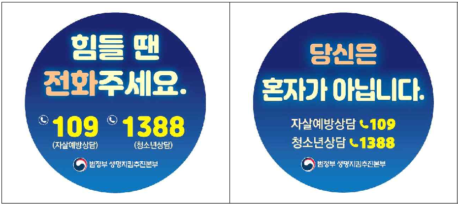
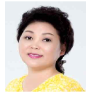
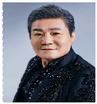
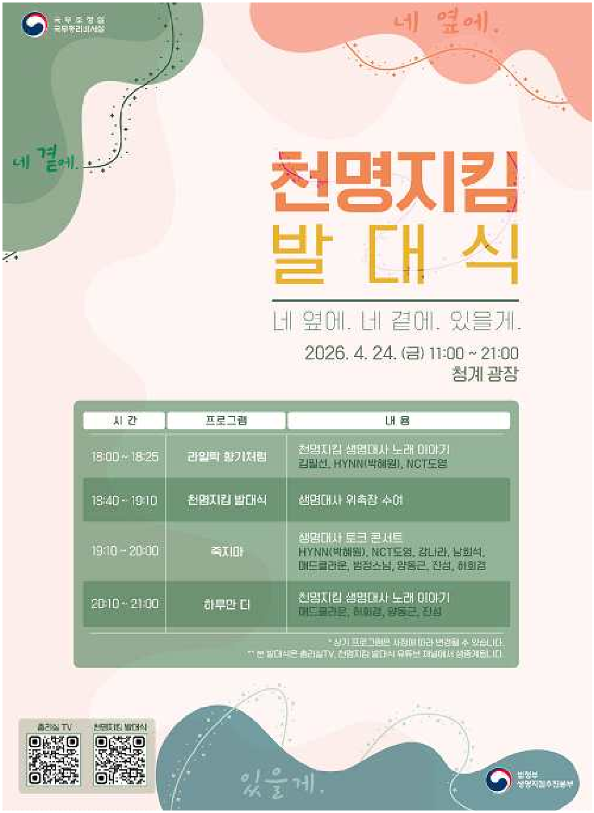
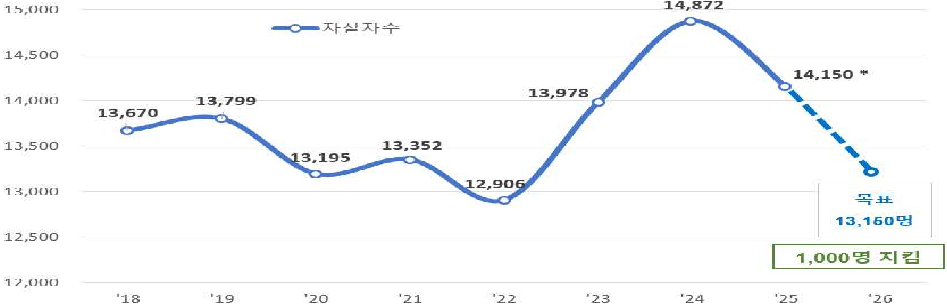
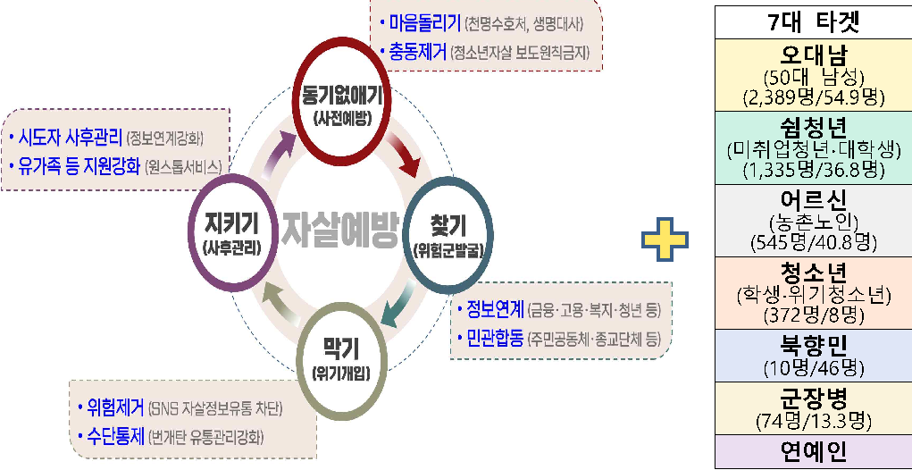

보도시점 2026. 4. 24.(금) 18:30 배포 2026. 4. 23.(목) 15:00

# 국무총리, 생명대사·천명수호처 위촉 자살자 1,000명 감축을 위한 천명지킴 발대식

 4.24(금),  청계광장에서 생명대사 위촉식·토크콘서트·문화공연 진행

 민간의 자살예방활동 확산을 위한 천명수호처(기관) 위촉 및 부스 운영

□ 김민석 국무총리는 4월 24(금), 서울 청계광장에서 범국가적 마음안전망 구축을  위하여  '생명대사'  및  '천명수호처(기관)'를  위촉하는  '천명지킴 발대식'을 개최하였다.

# < 천명지킴 발대식 개요 >

일시/장소 :  '26.4.24.(금)  11:00~21:00  /  서울  청계광장(서울 중구 태평로1가1)

참석자 : ▴

( 정부 )  국무총리(주재), 범정부 생명지킴본부장

▴ ( 생명대사 )  HYNN(박혜원)(가수), NCT도영(가수), 강나라(배우), 김필선(가수), 남희석(방송인),  매드클라운(가수),  범정스님,  양동근(가수),  정승제(강사), 진성(가수), 하이라이트(가수), 허회경(가수)

※  천명수호처(44개 기관) 위촉식(17:00 국무조정실장 주재, 서울청사)은 별도 진행

ㅇ  이번  발대식은  생명대사,  천명수호처와  함께  2026년  자살사망자 1,000명  감축을  목표로  하는  '천명지킴  프로젝트'를  일환으로  마련 되었다.

□  '천명지킴  프로젝트'는  「범정부  생명지킴추진본부(본부장:  송민섭)」가 OECD 국가 중 높은 수준인 우리나라 자살사망률을 낮추기 위해 추진하는 프로젝트로 '2026년 자살사망자 천명 감축'을 목표로 세우고, '정부 정책 지원  중심의  자살예방'에서  '온  국민이  함께하는  자살예방'으로  전환, 민간의  다양한  주체가  자살예방의  실행주체로  참여하는  범국가적  실천 프로젝트이다.

- ㅇ 특히, ‘생명대사’는 자살예방 홍보대사로서 각자의 영역에서 생명존중 메시지를 전파해, ‘혼자’라는 고립감과 소외감에 빠져 있는 국민들에게 우리가 함께임을 알리는 역할을 한다.
- ㅇ ‘천명수호처(기관)’는 각 기관별로 고유의 특성을 살린 맞춤형 자살예방 관련 사업을 직접 기획·운영하며 홍보부터 지원사업까지 전 과정을 자율적으로 추진해 실질적인 생명 존중 문화를 확산시키는 역할을 하게 될 것이다.

□ 김 총리는 이 자리에서 강나라, 김필선, 남희석, NCT도영, 매드클라운, 범정스님, HYNN(박혜원), 양동근, 정승제, 진성, 하이라이트, 허회경 등에게 생명대사로 참여해 주신 것에 대해 깊은 감사의 인사를 전하며 위촉장을 수여하고, 생명존중 메시지 확산을 위한 역할을 당부하였다.

### ㅇ “자살은 혼자일 때 일어난다. 우리와 우리 곁의 사람들이 혼자가 아니 도록 하는 것, 그것이 가장 중요하고 근본적인 자살예방의 길이라고 생각한다”며, “생명대사, 천명수호처의 따뜻하고 조용한 위로와 응원이 더 널리 더 멀리 전해지도록 정부도 온 힘을 다하겠다”고 밝혔다.

□ 생명대사 위촉식 이후 이어진 ‘죽지마’ 토크콘서트에서는 생명대사들이 각자 힘든 순간을 버티고 극복해 온 경험, 전하고 싶은 생명 존중 메시지 등을 공유하며 자살예방 홍보대사로서 첫 활동을 시작하였다.

ㅇ 또한, ‘천명수호처(기관)’는 자살예방활동과 지원체계를 국민들이 보다 쉽게 이해하고 참여할 수 있도록 홍보·전시·체험 부스를 운영하고, 마음이 힘든 순간 도움을 요청할 수 있는 상담·지원 창구를 안내하였다.

□ 한편, 범정부 생명지킴추진본부는 YB(가수), 김영옥(배우), 오은영(의사·방송인), 이순실(방송인), 한로로(가수), 화사(가수) 등도 ‘생명대사’로 참여의사를 표명했지만 개인 일정으로 금일 발대식에 참석하지 못했다고 전하고, 앞으로도 더욱 많은 분들과 기관들이 ‘생명대사’와 ‘천명수호처(기관)’로 참여할 예정이라고 밝혔다.

- 2 -

[붙임] 1. 「천명지킴 발대식」 개요 및 일정

 생명대사 및 천명수호처(기관) 현황

 「천명지킴 발대식」 홍보 포스터

 「2026  천명지킴 프로젝트」 추진계획

※ 우울감이나 극단적인 생각으로 힘들거나, 주변에 이런 어려움을 겪는 사람이 있다면 자살예방 상담 전화 ☏109 , 청소년 상담 전화 ☏1388 을 통해 24시간 언제든 도움을 받을 수 있습니다.

# 842

109

1388

담당 부서

국무조정실 범정부 생명지킴추진본부

책임자

담당자

과  장 조승희(044-200-6366)

사무관 정구영(044-200-6382)

사무관 박진웅(044-200-6381)

# 붙임 1

# 「천명지킴 발대식」개요 및 주요 일정

# □ 발대식 개요

- ㅇ ( 일시 ) '26.4.24( 금 ), 11:00 ~ 21:00
- ㅇ ( 장소 ) 청계 광장 ( 서울 중구 태평로 1 가 1)
- ㅇ ( 내용 ) 생명대사 위촉식 및 공연 , 천명수호처 홍보부스 운영 등

# □ 주요 일정

# <  발대식 >

|청계광장 : 천명지킴 발대식| | |
|---|---|---|
|프로그램명|시간|내용|
|라일락 향기처럼 (생명대사 공연)|18:00 ~ 18:25|ㅇ 천명지킴 생명대사 노래 이야기|
|천명지킴 발대식 (생명대사 위촉식)|18:40 ~ 19:10|ㅇ 개회 선언 : 개회사 및 인사말|
| | |ㅇ 기념촬영 및 마무리|
|죽지마 (생명대사 토크 콘서트)|19:10 ~ 20:00|ㅇ 생명대사 토크콘서트 - 모두에게 전하고 싶은 이야기(생명대사)|
|하루만 더 (생명대사 공연)|20:10 ~ 21:00|ㅇ 천명지킴 생명대사 노래 이야기|

# <  부스운영 >

|구분|시간|내용|
|---|---|---|
|08:00 ~ 11:00|ㅇ 기관별 부스 준비|준비|
|11:00 ~ 20:00|ㅇ 천명수호처 전시·체험|부스 운영|

# 붙임 2

# 생명대사 및 천명수호처(기관) 현황

# □ 생명대사 : 총 20명

|연번|이름|소속/직위|주요경력 및 선정사유|
|---|---|---|---|
|1|HYNN (박혜원)|뉴오더엔터|· ( 대표곡 ) 시든 꽃에 물을 주듯 등|
| | |* '18년 가수 데뷔|· '20.11월 한국생명의전화 홍보대사 등 생명존중 활동 을 이어온 가수|
|2|NCT 도영|SM엔터테인먼트 * '16년아이돌|· ( 대표곡 ) 안녕 우주, 반딧불, 별빛이피면등 · 현역 군인, 자립준비청년 지원 기부 등|
| | |데뷔|대표적 아이돌 기부천사|
|3|YB (윤도현, 박태희, 김지원, 허준)|디컴퍼니|· ( 대표곡 ) 나는 나비, 흰수염고래 등|
| | |* '95년 가수 데뷔|· 국민 록밴드로서 30년간 전 세대에 희망과 위로의 메시지 전파|
|4|강나라|배우|· ( 대표활동 )방송·영화 출현('이만갑', '모란봉클럽' 등), 유튜브(36만) 운영 등 · 실제2014년탈북, 북향민의고충을이해하고.|
| | | |사선을넘어꿈을이룬희망의아이콘|
|5|김영옥|배우|· ( 대표활동 ) 갯마을 차차차, 파친코 등 다수|
| | | |· 오랜기간 친근하고 따뜻한 이미지로 사랑받아 왔으며, 높은 인지도와 신뢰도로 생명존중 메시지 확산에 영향력을 가진 배우|
|6|김필선|CTM|· ( 대표곡 ) MAMA, 봄날, 야수 등|
| | |* '18년가수데뷔|· 'MAMA' 등 서정적이고 호소력 짙은 목소리로 지친 마음을 위로하는 가수|
|7|남희석|보령기획|· ( 대표프로그램 ) 전국노래자랑, 이제 만나러 갑니다 등 메인MC|
| | | |· 전국노래자랑 MC 로서 어르신들과의 깊은 공감대 와 전국적인 인지도|
|8|매드클라운 (조동림)|ES NATION * '08년 가수 데뷔|· ( 대표곡 ) 죽지마, 화, 착해 빠졌어 등|
| | | |· ' 죽지마 ' 등 따뜻한 위로를 건네며 생명존중 활동 을 이어온 가수|

|연번|이름|소속/직위|주요경력 및 선정사유|
|---|---|---|---|
|9|범정스님|조계종 화엄사 홍보국장|· ( 전 )대한불교조계종 해관사 주지 · 실제 군종장교 로 복무, 군장병의현실을 이해하는 상담자이자 조언자|
|10|양동근|조엔터테인먼트 * '87년 배우 데뷔 * '01년 가수 데뷔|· ( 대표곡 ) 골목길, 어깨 등 · ( 대표작 ) 오징어게임, 네 멋대로 해라 등 · 자살예방 노래(어깨) 발표, 자살방지 캠페인 참여 등 자살예방 활동 지속|
|11|양오봉|교육인|·現 전북대학교 총장 ·現 대통령소속 국가교육위원회 위원 ·現 의대 선진화를 위한 총장협의회 공동회장 ·前 한국대학교육협의회 제29대 회장 · 지역사회와 청년층에 대한 깊은 이해를 바탕으로 생명존중 가치 확산에 큰 영향력을 가진 교육계 리더|
|12|오은영|의사 대학교수|· ( 대표활동 )아주대학교 의과대학 정신과 교수, 오산시 어린이정신건강센터 센터장, · TV 예능 프로 '우리 아이가 달라졌어요'에|
| |이순실|방송인 기업인|13 등) 다수 출현, 이순실평양명가 대표, · 9번 시도 끝에 2007년 탈북, 역경을 이겨내고 기업가 및 방송인으로 성공, 탈북민 대상|
|14|정승제|이투스 , 단꿈아이|수학강사로 활동 중 · EBS 수학강사로청소년층접점및파급력이|
|15|진성 (진성철)|토탈셋|· ( 대표곡 ) 태클을 걸지마, 안동역에서 등 · 인생역경 극복, 대중적인 히트곡 (안동역에서 등)이 어르신들에게 큰 위로|
|16|최호종|매니지먼트 낭만|· '24년 무용수 간의 경연 프로그램 Mnet '스테이지 파이터' 최종 우승자 · 무용-대중의 접점을 넓히는 활동으로 또래 청년층에 메시지 전달 파급력, 훈련·버팀 등 무대 경험 바탕으로 자기회복 메시지 전파|
|17|하이라이트 (이기광, 윤두준, 양요섭, 손동운)|어라운드어스 엔터테인먼트 * '09년비스트 데뷔|· ( 대표곡 ) 얼굴 찌푸리지 말아요. 불어온다등 · 역경을 딛고 재도약한 아이돌로 밝고 따뜻한 위로를 담은 음악 활동|

|연번|이름|소속/직위|주요경력 및 선정사유|
|---|---|---|---|
|18|한로로|AUTHENTIC * '22년 가수 데뷔|· ( 대표곡 ) 입춘, 0+0 등/ ( 저서 ) 자몽살구클럽 · 음악과 문학을 통해 청년층에게 따뜻한 생명존중의 메시지 전달|
|19|허회경|문화인 * '21년 가수 데뷔|살아가는 이야기 등 · '그렇게 살아가는 것' 등감성적인노래로 청중에게 깊은 위로의 메시지 전달|
|20|화사|피네이션 * '14년 가수 데뷔|· ( 대표곡 ) Good goodbye, So cute 등 · 그룹 및 솔로 활동을 통해 '스스로를 사랑하자'는 메시지로 긍정적 에너지 전파|

# □ 천명수호처(기관) : 44곳

|연번·구분| |기관명|선정사유|
|---|---|---|---|
|3 4 5 6|오 대 남 (11)|국민건강보험공단|1 위험군을 조기발굴하고, '건강회복'을 위한 전국민 밀착형|
| | |노사발전재단|2 · 퇴직·이직·고용불안 등 위기 상황에 놓인 중장년 대상 재취업·전직 지원 경험 보유하고 있으며 직무·고용 번화 시기 대상자의 심리적 위기 개입 및 예방 연계 추진|
| | |소상공인시장진흥공단|· 휴폐업 등 경제적 위기에 놓은 중장년 대상 직접 지원 및 상담체계 보유하고 있으며 위기 소상공인 대상 심리재기지원 프로그램 운영 및 지원 추진|
| | |하이트진로|· 감사의 간식 차, 유가족 힐링데이 등 소방관 후원 및 서울시 쪽방촌 온기창고 정기 후원, 취약계층 대상 명절 나눔, 사회복지기관 대상 이동차량 지원 등 다양한 사회공헌 활동 추진|
| | |한국불교문화사업단|· 템플스테이 등 체험형 프로그램을 통한 정서 안정 및 심리 회복 지원이 가능하며 종교 기반 공동체를 활용하여 고립감을 완화하고 정서적지지 기능 수행|
| | |한국산림복지진흥원|· 산림치유·휴양 프로그램을 통한 스트레스 완화 및 정서 회복 지원 기능을 보유하고 있으며 현재 산림치유 프로그램, 숲길 기반 힐링 서비스 운영을 통해 중장년 대상 맞춤형 회복 프로그램 연계 제공|
| | |한국생명존중희망재단|7 · 국가 자살예방 정책 수행기관으로서 전문성·총괄 기능 보유하고 있으며 데이터 기반 정책 지원 및 교육·홍보·사업 운영 총괄 역할 수행|

|연번·구분| |기관명|선정사유|
|---|---|---|---|
|오 대 남 (11)|한국자살유족협회|· 자살유족 지원 경험을 바탕으로 사후관리 및 고위험군 돌봄 및 지원을 중심으로 한 당사자 중심 활동을 통해 공감 기반 인식개선 및 회복 지원|8|
| |한국자살예방협회|· 자살 예방 교육 및 민간 네트워크 기반으로 생명지킴이 양성 및 인식개선 활동 수행|9|
| |한마음운동본부(천주교)|· 종교 기반 자살예방기관 운영 및 관련 사업 추진자살위기 대응 및 예방 캠페인, 자살 유가족 애도·회복 프로그램, 종교·복지 네트워크 기반 협력사업 추진|10|
| |한전MCS|· 검침·현장 방문 업무 특성상 지역 내 가구 단위 직접 접촉을 통한 위기 신호 조기 인지가 가능하고 현장 기반 생명지킴 역할 수행 추진|11|
|청 소 년 (7)|GS칼텍스 & (사)대한민국교육봉사단|· 기업의 청소년 대상 정서·심리지원 프로그램(마음 톡톡)과 연계를 통한 민관파트너십 구축·운영을 통한 ESG 가치 창출|12|
| |삼성생명|· 또래 학생 생명지킴이 양성(라이키 프로젝트)과 청소년 SNS 상담채널(라임) 운영을 통해 청소년들의 마음건강을 지키며, 자살예방 및 생명존중 문화 확산에 앞장서고 있음. 향후 20년간 학교·정부와 협력하여 청소년 생명존중사업을 확대하고 학교 안팎의 청소년 마음건강 안전망 구축에 적극 기여할 계획임|13|
| |삼성전기|· 청소년 사이버폭력 예방사업(푸른코끼리)을 시행하고 있으며, 전문적 상담 및 경제적 지원을 통해 사이버 폭력 피해 청소년의 자살 예방에 적극적인 관심을 가지고 사회공헌 활동을 추진하고 있음|14|
| |생명보험사회공헌재단|· 18개 생명보험회사가 출연하여 설립된 공익 법인으로, 한강 교량 위 'SOS생명의전화', 청소년 자살예방 SNS 전문상담 '다들어줄개', 청소년 자살예방 캠페인 '감정가게', 청소년 멘토링 지원 '힐링톡톡' 등 다양한 자살예방 사업을 지속 추진하고 있음|15|
| |㈜마인드풀커넥트|· 청소년·청년 대상 정신건강 전영역(인식개선, 예방, 회복) 활동 수행을 하는 청소년 심리회복·연결 지원 기관으로 생명존중 문화확산에 큰 기여|16|
| |포스코1%나눔재단|· 청소년 진로 캠프, 직업체험, 취약계층 청소년 자립 지원 사회공헌 사업 프로그램 운영 등 기업 사회 공헌사업과 민관파트너십 구축·운영으로 ESG 가치 창출|17|
| |현대차 그룹|· 전국 소외계층 대상(지역아동센터 1,200여 명) 학습 지도 및 정서 지원 활동 지원 사업으로 대학생 교육 봉사단 '현대 점프스쿨' 운영 등 기업의 사회공헌 사업(청소년 특화)과 민관파트너십 구축·운영을 통한 ESG 가치 창출|18|

|연번·구분|기관명|선정사유|
|---|---|---|
|19 장 병|HD현대1%나눔재단|· 임직원 급여 1% 기부를 바탕으로 군 장병을 비롯, 독거노인, 보육시설 아동, 장애인, 저소득 가정 등 다양한 취약계층을 지원하는 사회공헌 사업 추진 중, 앞으로도 취약계층의 정서적 안정, 삶의 질 향상에 실질적 도움 되는 활동 통해 사회적 돌봄이 필요한 이웃들 지속 지원 예정|
|20|LG유플러스|· 군인 자녀 대상 온라인 교육 지원 등 군인 등 공공 안전 지킴이의 자긍심 고취를 위한 활동 시행 중 군 자살예방 위한 정부 홍보활동 지원 위해 IPTV를 통한 광고송출 등도 검토 중으로 생명지킴을 위한 다양한 사회공헌활동 전개 예정|
|21|LIG D&A|· '나라를 지키고 이웃과 함께 성장하는 GIL'이라는 비전 아래 호국, 상생, 성장이라는 3가지 핵심 가치를 중심으로 다양한 사회공헌활동 전개 중 1사1병영후원 및 지역사회 내 장애인 일자리 창출을 위한 '블랑제리GIL' 개소와 더불어, 올해 창립 50주년을 맞아 글로벌 사회공헌 활동으로 한국전(6.25) UN군 참전용사 방문 적극 추진 중|
|군 22|국민은행|· 군 간부 대상 '나라사랑 장기적금' 운용 및 상다미쌤을 운영하여 학교폭력 예방 및 청소년 정신건강 회복에 앞장서는 중으로 청년 취업지원과 자립역량 강화 사업 등 청소년과 청년의 안정적인 사회 안착을 돕는 다양한 사회공헌 활동 추진 중|
|(8) 23|롯데재단|· 격오지 군자녀 교육지원, 희망장학금, 위기탈북민 긴급지원 사업 등 다양한 사회공헌 사업 운영 중, 이를 통해 청소년·청년 교육 기회 확대, 정서적지지 기반 마련 및 사각지대 보완 등으로 지원 대상자의 자살을 예방하고 이들이 건강한 사회 구성원으로 자립 할 수 있도록 지원 중|
|24|신한은행|· 군 간부 대상 '나라사랑 장기적금' 운용 중, '보이스 피싱 제로' 사업으로 피해자의 경제적 부담을 덜고 심리·법률 상담으로 일상회복을 적극 지원 중 주요 피해군 대상 온·오프라인 교육으로 보이스 피싱 예방과 경제적 어려움 해소에 동참 중으로 향후 예방부터 사후 케어까지 아우르는 금융 안전망을 강화하여 사회적 책임을 다할 계획|
|25|하나은행|· 군 간부 대상 '나라사랑 장기적금' 운용하며 군장병 대상 금융사기 예방과 금융피해 대응 등 군생활 중 발생할 수 있는 금융위험 이해를 높이고, 기초 자산 관리 교육을 병행하는 맞춤형 금융교육 프로그램 운영 중. 더불어, 하나금융그룹은 '24년부터 청소년 불법도박 예방 사회공헌사업 추진하며, 관련 예방 교육을 군장병 금융교육에 포함하는 등 군장병 자살 예방을 위한 다양한 사회 공헌활동 진행할 예정 ·|
|26|현대로템|'모두의 지하철' 교통약자 안내표지 개선 사업 및 군 부대·군장병과 국가유공자 대상으로 한 다양한 사회 공헌활동 추진을 통해 나눔의 행복 확대 중|

|연번·구분| |기관명|선정사유|
|---|---|---|---|
|쉼 청 년|IBK기업은행ㆍ행복나눔재단|· `IBK희망나래` 사회공헌 사업을 통해 고립 ‧ 은둔 청년 등을 위한 심리 ‧ 정서 지원, 장학금 지급 등을 수행하고 있으며, 향후 청년들에게 생명 지킴의 메시지 홍보도 병행할 계획|27|
| |넷플릭스 서비시스코리아(유)|· 글로벌 엔터테인먼트 서비스로 자살 등 민감한 주제를 포함하는 콘텐츠와 관련한 온라인 플랫폼(Wanna talk about it)을 운영하고, 관련 정보, 가이드, 긴급지원 연락처 등을 제공 중으로 향후 생명존중 메시지를 효과적으로 전달하는데 노력할 계획|28|
| |대한불교조계종 사회복지재단|· 대학교 인근 사찰에서 청년들에게 무상으로 건강한 한끼를 제공하는 '청년밥心' 사업을 추진하고 있으며, 향후 청년에게 희망을 주는 청년밥심 사업을 확대하며 생명의 소중함을 알리는 홍보 활동을 추진할 계획|(4) 29|
| |삼성전자|· 미취업 청년 대상 SW ‧ AI 전문교육 및 취업지원 서비스 (SSAFY), 자립준비청년의 주거안정과 맞춤형 취업교육 (희망디딤돌) 등 청년 대상 사회공헌 사업을 통해, 사회적 난제인 청년실업 문제와 양극화 해소를 위한 지원을 이어갈 예정으로 청년들에게 희망의 메시지와 함께 생명의 소중함을 전파해 나갈 예정|30|
|어 르|SK하이닉스|· AI 솔루션 기반 독거노인 정서돌봄 및 외로움 경감 및 GPS 배회감지기 보급을 통한 실종예방 등 취약계층 어르신 대상 사회공헌사업을 추진 중으로 생명 소중함에 대한 홍보 지속 추진|31|
| |네이버|· AI 기반 자연스런 대화 방식 안부전화를 통해 독거 노인 대상으로 건강·일상생활 확인, 위험 조기 감지 등 통합 돌봄 사업을 추진 중으로 향후 어르신 자살 예방 홍보 추진|32|
|신 (4)|농가주부모임|· 농가주부가 참여하여 농촌 고령 노인에게 반찬나눔 서비스 등 봉사활동을 통해 자살 고위험군 조기 발굴 및 연계활동 수행|33|
| |농협중앙회|· 전국 단위의 조직망을 통해 농촌 왕진버스, 고령 노인 말벗 전화 및 영양개선 지원, 자살예방 인식 개선 등 현장밀착 사회 공헌사업을 추진 중으로 향후 농촌 어르신들의 생명지킴 홍보 추진|34|
|향|hy(한국야쿠르트)|· '23년부터 통일부와 북향민 안부확인 사업 진행, 위기징후 발견 시 남북하나재단에 즉시 연계 등 북향민 생활안정 지원|35|
| |남북하나재단|· 북향민의 초기정착부터 생활보호, 취업, 교육 지원 등 북향민들의 자립과 사회적 통합 지원 기관|36|
| |대한행정사회|· 독거노인, 고령층 등 취약계층 행정서비스를 지원 하며, 중국거주 가족 한국초청 비자 신청 등 지원|민 37|
| |원불교|· 북향민 대상 최초의 대안학교인 '한겨레 중고등학교 운영, 전국 단위 봉사조직인 '봉공회'를 통해 나눔 활동 전개|38|

|연번·구분| |기관명|선정사유|
|---|---|---|---|
|연 예 인 등 (6)| |OpenAI · 위해 답변 거부, 상담 핫라인 안내 등 사용자 안전을 위한 개입 강화|39|
| |㈜강원랜드|· 산림자원을 활용한 마음치유 프로그램과 희망이음 콘서트 등 다양한 사회공헌 활동 추진|40|
| |그랜드코리아 레저(주)|· 'GKL과 함께하는 서쪽네 시민학교 프로젝트 * ' 등 다양한 사회공헌 활동 추진(*서울역 쪽방촌 주민대상 자살예방 교육 등)|41|
| |대한신경정신 의학회|· 의학적 전문성을 바탕으로 연예인 대상 자살예방 교육과 생명존중 문화 확산|42|
| |생명보험협회|가능하고, 경제적 보호 기능을 통해 위기 완화 기여 가능. 또한, 국회자살예방포럼의 운영을 통해 자살 예방 입법 활동을 지원하고, 자살예방 대상(유공자) 시상식을 개최하여 자살예방과 생명존중에 대한 문화확산에 기여 중|43|
| |주식회사 파라다이스|· '효드림' 등 지역사회와 소외계층을 위한 사회공헌을 꾸준히 실천|44|

#### - 12 -

02 04]

21-00

# 붙임 4 2026'천명지킴'프로젝트 추진계획

# 1 추진목표

# ◈ 2026년 자살사망자 1,000명 감축 ⇒ 자살사망자 감소 추세 굳힘

14,872

14,500

14,150

13,978

13,799

14,000

13,670

13,352

13,500

13,195

8

12,906

13,000

12,500

1,0003

12,000

'22

'23

'25

'26

'18

'19

'20

'21

'24

*  '25년  14,150명 추정 (잠정치 13,900명(26.3월)에 오차율 1.8%(지연신고∙경찰수사결과) 적용)

□ ' 천명지킴 ' 2026 년 추진 필요성 ․ 중요성

ㅇ자살자수 매년 증감 반복 ⇒ 25 년에 이어 26 년 자살자 연속 감소 견인시 자살자 감소추세 전환 가능

-추진목표 13,150 명은 예외적으로 높았던 23 년 및 24 년을 제외한 2018~2022 년 평균 (13,384 명 ) 수준 ⇒ 달성해야 할 최소 목표 수준

☞ 2025년 자살자 감소에 이어, 2026년 자살자 1,000명 감축 을 이끌어 냄으로써 자살 증감 반복이라는 추세를 끊어내고 감소 추세 굳힘

◈ 25 국가자살예방전략의 효과적인 추진에 더해, 추가적으로 현장

∙대증적 대책 중심 자살예방노력 강화

☞ 7대 타겟 설정 및 현장 중심 범국가적 역량을 결집한 '사회안전망'+ '마음안전망' 구축, 2026 자살사망자 줄이기 총력 대응

◈ 자살예방4단계 x 7대 타겟 ⇒ 천명지킴 정책매트릭스 (사회안전망∙마음안전망) 수립

=> 현장 중심 생명지킴핫라인 (전국 자살예방센터, 지자체) 활용 ,  매 월 추진상황 및 매트릭스정책 효과성 등 집중관리

# 7대 타겟

오대남

(50대 남성) (2,389명/54.9명)

쉼청년 (미취업청년∙대학생) (1,335명/36.8명)

어르신 (농촌노인) (545명/40.8명)

#71

청소년 (학생∙위기청소년) (372명/8명)

북향민 (10명/46명)

군장병 (74명/13.3명)

연예인

# < 천명지킴 프로젝트 정책매트릭스·모듈 >

|오대남| |쉼청년|어르신|청소년|북향민|군장병|연예인|
|---|---|---|---|---|---|---|---|
|마음돌리기|마음돌리기|마음돌리기|자살보도 금지|심리적 연결망|자살예방 교육|심리상담|동기 없애기|
|금융정보 연계|청년미래 센터|주민공동체|선별검사 내실화|안부확인 사업|자가점검 체계|SNS 모니터링|찾기|
|번개탄|고립·소외|고립·소외|SNS 자살정보|고립·소외|고립·소외|언론보도|막기|
|복지연결|시도자지원|시도자지원|유가족 원스톱|복지연결|시도자지원|자조활동|지키기|

# □ 7대 타겟 설정

◈ 자살사망자 수 또는 자살률(인구 10만명당 자살자수)이 높거나,  사회적 파급효과가 큰 집단을 자살예방 타겟으로 설정

- ㅇ 자살사망자 수가 많은 ① 50 대 남성 ('24. 전체 14,872 명 中 2,389 명 (16.1%)), ② 미취업 청년 (1,335 명 (9.0%)), 지속 증가중인 ③ 청소년 ('21. 338 → '24. 372 명 )
- ㅇ 자살률이 높은 ④ 북향민 ( 전체국민 1.7 배 ), ⑤ 농촌노인 ( 전체국민 1.4 배 ), 폐쇄환경 속 특수한 어려움을 겪는 ⑥ 군장병 ('24. 74 명 )
- ㅇ 사회적 파장 야기하는 ' 베르테르효과 ' 심각한 ⑦ 연예인 * 등

□ 7대 타겟별 사회안전망 구축∙강화(정책적 대응)

◈ 17개 시∙도 자살예방센터 및 지자체∙소방∙경찰-생명지킴추진본부 공동, 7대 타겟∙4대 단계별 현장중심 자살예방대책(총72개 과제) 마련∙추진 (26.1월~)

⇒ 매월 자살예방센터 - 생명지킴추진본부 핫라인 회의 를 통해 추진상황 관리 및 정책효과성, 현장 애로사항 등 집중 관리

# ① 오대남(50대 남성)

ㅇ 경제적 위기 , 이혼 · 사별 등 가족해체에 따른 사회적 고립 및 외로움

⇒ 복지 · 고용 · 금융 · 정신건강 정보연계를 통한 고위험군 발굴 , 장기 연체자 채무조정 , 중장년 고용네트워크 일자리 지원 , 정서 · 심리 서비스 연계 강화

② 쉼청년(미취업 청년 + 대학생)

ㅇ 고립 ․ 은둔 ․ 고위험청년 발굴 어려움 , 상담 및 지원 등 개입 부족

⇒ 청년미래센터 등 유관기관 협업을 통한 고위험군 발굴 , 일상회복 및 취업의욕 고취를 위한 심리 ․ 정서 지원 확대 및 취업역량 강화 지원

③ 어르신(농촌노인)

# ㅇ 도시에 비해 의료 인프라 부족, 홀로 남겨진 노인의 외로움·소외감

# ⇒ 찾아가는 왕진버스 등 농촌지역 의료서비스 확대, ‘농가주부모임 (전국 6.2만명 규모)’ 등 주민공동체 활용한 고립 노인 발굴

④ 청소년(학생+학교밖청소년)

# ㅇ 자살 원인의 절반 이상이 정서적 문제이나 발견·개입 어려움

⇒ ai활용 sns내 자살정보 유통․확산 근절, 고위험군 선별검사 내실화,

청소년자살언론보도금지, 유관기관(학교․지자체․상담센터등) 연계사례관리강화

# ⑤ 북향민

# ㅇ 탈북 시 생명의 위협, 우울·불안, 경제적 어려움, 사회적 연결망 부족

⇒ 북향민 특수성 반영한 관리지표 개발, 북향민 안부확인사업 확대,

밀집거주 지역(서울양천·노원구, 인천남동구등) 관리·지원 강화

# ⑥ 군장병

# ㅇ 높은 간부 자살률, 낙인 우려로 위험군 식별 한계, 치료 인프라 부족

# ⇒ 모바일기반 자가점검체계 도입 및 간부 집단상담 확대, 정신 건강의학과 협력병원 신규 지정, 병영생활전문상담관 확대

# ⑦ 연예인

# ㅇ 연예인 자살 시 일반인 자살 건수가 급증하는 경향, 악성댓글,

# 사생활 노출, 인기 하락에 대한 불안감 등으로 높은 스트레스 및 우울증 ⇒ 연예인 1:1 비공개 심리상담 및 심리검사, SNS 게재글 모니터링을

# 통한 고위험군 지원, 언론·기자단 보도준칙 준수 협조 요청

# □ 온 국민이 함께하는 마음안전망 구축∙활용(심리적 대응)

◈ 자살에서 공통으로 나타나는 “혼자(고립∙소외)”를 깨뜨리기 위한 범국가적

# 역량 결집∙활용

# ⇒ 민간기업, 종교단체, 민간단체 등과 함께 천명수호처 및 생명대사 위촉∙운영, “혼자”를 깨뜨리는 범국가적 자살예방 메시지∙인식 확산

# ㅇ 7대 타겟별 “천명수호처” 및 “생명대사” 위촉․운영

# - 자살예방의 실제 주체를 범국가 차원으로 확대, 다양한 민간

## 부문(종교․기업․시민단체 등)이 “천명수호처”로 참여*

* 각 기관별로 고유의 특성을 살린 맞춤형 자살예방사업을 직접 기획, 홍보 부터 지원사업까지 전 과정을 자율적으로 추진

- 사회적 영향력이 큰 연예인, 인플루언서 등을 천명지킴 메시지

# 전파를 위한 “생명대사”로 위촉․활용*

* 특히 매드클라운, 범정스님 등 이미 자살예방을 위해 큰 역할을 해온 유명인사 등 생명대사 위촉, 생명지킴 메시지 확산∙전파

ㅇ “천명지킴 발대식” : 4월 24일(금)/청계천 광장

- 우리 사회 전체가 천명지킴을 위한 노력을 함께 하고 있음을 널리 알리는 의미 => 가능한 많은 사람들에게 메시지 전달 추진

* 생명대사 영상메시지, 현장메시지 등을 현장∙유튜브 등 통해 송출, 생명 지킴에 대한 강력한 범국가적 관심∙의지 표출

- 천명수호처, 생명대사, 한국자살유족협회, 한국생명존중희망재단 등

# 천명지킴 관련 단체, 기구 등 부스 설치․운영
