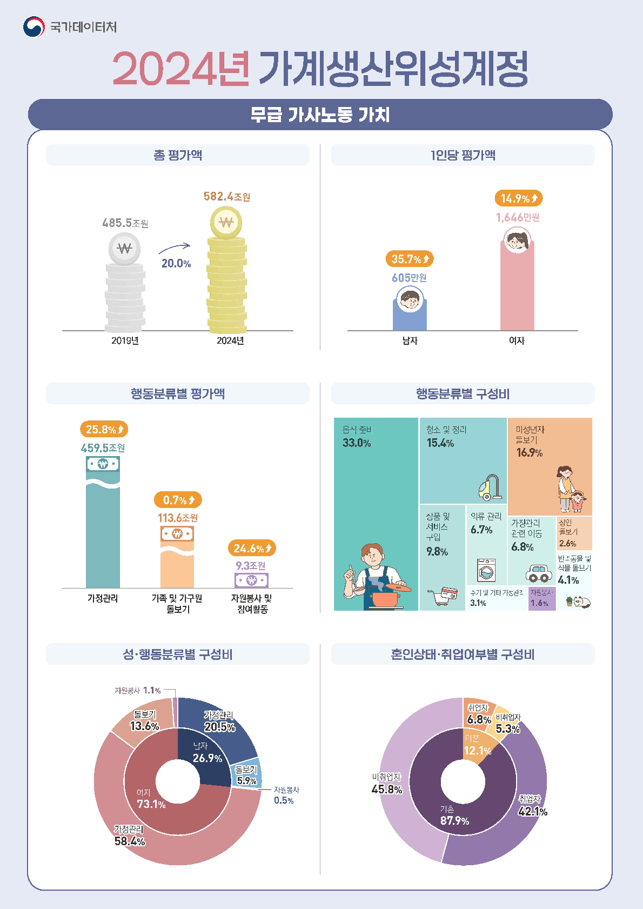

보도자료

보도시점 2026. 4. 29.(수) 12:00 배포 2026. 4. 29.(수) 08:30

# 2024년 가계생산위성계정 (무급 가사노동 가치 평가)

|담당 부서|경제통계국|책임자|과 장|임경은(042-481-2181)|
|---|---|---|---|---|
| |경제통계기획과|담당자|사무관|오정화(042-481-3638)|

# 일 러 두 기

- □ 이 자료는 생활시간조사의 전체 평균시간을 이용하여 무급 가사 노동 가치를 평가하였습니다.
- □ 무급 가사노동 가치, 고정자본소모 및 중간소비 추계액은 명목 기준입니다.

통계표의 증감률은 5년 전 대비 변동률입니다.

비교에 사용된 2024년 국민계정(GDP, GNI)은 잠정 자료입니다.

□ 통계표의 숫자는 반올림되었으므로, 상위분류 값이 하위분류 합과 일치하지 않을 수 있습니다.

통계표에 ' 0.0 ' 은 ' 단위미만 ' 을, ' -' 는 ' 해당숫자 없음 ' 을 의미합니다.

□ 무급 가사노동 가치의 연령별 배분에 관한 통계인 국민시간이전 계정은 2026년 6월 23일(화)에 공표될 예정입니다.

가계생산위성계정은 국민시간이전계정과 정합성을 위하여 직종별 임금을 적용하였으며, ' 이동 ' 을 각 행동분류로 세분화하였습니다.

연령대별 무급 가사노동 가치는 국민시간이전계정에서 작성될 예정 입니다.

□ 본문에 수록된 자료는 국가데이터처 홈페이지(http://mods.go.kr) 및 국가통계포털(http://kosis.kr)을 통해 이용하실 수 있습니다.

국가통계포털에 수록된 ' 2019년 통계표 ' 수치는 작성방법 및 분류가 개선됨에 따라 변경됨을 알려드립니다.

1999년, 2004년, 2009년, 2014년 자료는 개선된 방법으로 소급 작성하여 2026년 12월 국가통계포털에 게시될 예정입니다.

# 목  차

|□|가계생산위성계정 개요· · · · · · · · · · · · · · · · · · · · · · · · · · · · · · · · · · · · · · · · · · · · · · · · · · · ·|·1|
|---|---|---|
|□|2024년 가계생산위성계정 결과(요약)· · · · · · · · · · · · · · · · · · · · · · · · · ·|·3|
|□|2024년 가계생산위성계정 결과· · · · · · · · · · · · · · · · · · · · · · · · · · · · · · · · · · · · ·|·4|
|1. 가계생산위성계정· · · · · · · · · · · · · · · · · · · · · · · · · · · · · · · · · · · · · · · · · · · · · · · · · · · · · · · · · · · · · · · · ·| |· ·4|
|2. 무급 가사노동 가치 · · · · · · · · · · · · · · · · · · · · · · · · · · · · · · · · · · · · · · · · · · · · · · · · · · · · · · · · · ·| |· · ·5|
|2-1. 무급 가사노동 가치 · · · · · · · · · · · · · · · · · · · · · · · · · · · · · · · · · · · · · · · · · · · · · · · · · · · · · · · · · · · · 2-2. 행동분류별 무급 가사노동 가치· · · · · · · · · · · · · · · · · · · · · · · · · · · · · · · · · · · · ·| |·5|
|· · · ·6 2-3. 성별 무급 가사노동 가치 · · · · · · · · · · · · · · · · · · · · · · · · · · · · · · · · · · · · · · · · · · · · · · · · · ·|2-4. 가구원수별 무급 가사노동 가치 · · · · · · · · · · · · · · · · · · · · · · · · · · · · · · · · · ·|·7 · · · · ·8|
|2-5. 취업여부별 무급 가사노동 가치 · · · · · · · · · · · · · · · · · · · · · · · · · · · · · · · · · · · · · ·| |·9|
|2-6. 혼인상태별 무급 가사노동 가치 · · · · · · · · · · · · · · · · · · · · · · · · · · · · · · · · · · · ·10 2-7. 혼인상태·취업여부별 무급 가사노동 가치· · · · · · · · · · · · · · · · · · · · · · · · · ·12| |·11|
|2-8. 지역별 무급 가사노동 가치· · · · · · · · · · · · · · · · · · · · · · · · · · · · · · · · · · · · · 통계표· · · · · · · · · · · · · · · · · · · · · · · · · · · · · · · · · · · · · · · · · · · · · · · · · · · · · · · · · · · · · · · · · · · · · · · · ·| |·14|
|□|· · · · · · ·| |
|1. 가계생산위성계정 작성 개요· · · · · · · · · · · · · · · · · · · · · · · · · · · · · · · · · · · · · · · ·|· ·|· · ·29|
|2. 행동분류 연계표· · · · · · · · · · · · · · · · · · · · · · · · · · · · · · · · · · · · · · · · · · · · · · · · · · · · · · · · · · · · · · · · ·| |· ·30|
|3. 무급 가사노동 가치 평가 방법· · · · · · · · · · · · · · · · · · · · · · · · · · · · · · · · · · · · · · · ·| |·31|
|4. 가계생산위성계정 관련 용어· · · · · · · · · · · · · · · · · · · · · · · · · · · · · · · · · · · · · · · · · · · ·| |·32|

## - 5 -

# 가계생산위성계정 개요

# 1.  개념 및 목적

□ 가계생산위성계정(HPSA: Household Production Satellite Account)은 국민계정(SNA, System of National Accounts)에 포함되지 않는 가계 내 생산활동의 경제적 가치를 평가하는 통계

소득통계(GDP)에 포함되지 않는 무급 가사노동(음식 준비, 청소, 돌보기 등)을 화폐가치로 평가함으로써, 국가 경제활동의 실질 규모를 보다 정확히 파악할 수 있도록 소득통계를 보완

# 2.  작성 범위

□ 국민계정의 생산범위에 포함되지 않고 가계에서 생산하는 가사 및 개인서비스, 자원봉사를 대상으로 선정

제3자에 의해 수행될 수 없는 개인유지 활동(식사, 수면, 운동 등), 일(유급노동), 학습 및 사적 여가활동 등은 제외

가정관리, 가족 및 가구원 돌보기, 자원봉사 및 참여활동을 대상으로 작성

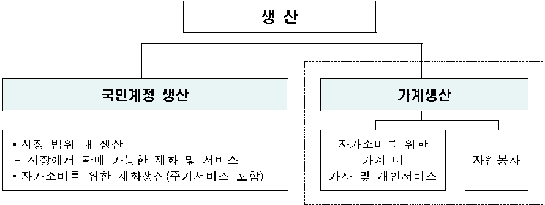

생 산

국민계정 생산

가계생산

시장 범위 내 생산

자가소비를 위한

시장에서 판매 가능한 재화 및 서비스

가계 내

자원봉사

자가소비를 위한 재화생산(주거서비스 포함)

가사 및 개인서비스

# 3.  작성 사항 *  가계생산위성계정의 계정항목

□ 총산출, 중간소비, 부가가치, 피용자보수(무급 가사노동 가치), 고정 자본소모

총산출은 중간소비, 부가가치(피용자보수+고정자본소모)의 합

# 4.  작성 방법

□ 무급 가사노동 가치 추계

가사노동 가치 = ①가사노동 시간 × ②가사노동 인구 × ③대체임금

(가사노동 시간) 가계생산 대상 행동분류에 따른 시간 산정

생활시간조사 중 가사노동 행동분류(5개 대분류, 61개 소분류) 선정

가사노동 행동분류별 1인 1일 평균시간 산정

(가사노동 인구) 만 15세 이상 일반가구원 *

 집단가구원(기숙사, 노인요양시설, 보육원 등 거주) 제외

(대체임금) 행동분류별 대체 직종의 시장임금 적용

 가사노동 시간(1인 1일): ('19) 137분 → ('24) 132분 (-5분, -3.8%)

 가사노동 인구: ('19) 42,378천명 → ('24) 43,460천명 (+1,082천명, +2.6%)

 무급 가사노동 시간당 가치: ('19) 13,737원 → ('24) 16,698원 (+2,961원, +21.6%)

# □ 고정자본소모 추계

가계자본재로 사용되는 내구재 (냉장고,  세탁기  등 )의 소비지출을 고정 자본으로 간주하여 추계

# □ 중간소비 추계

가계생산에 투입되는 항목 (쌀,  청소용  세제,  식료품,  주거  및  수도광열비, 가정용품 및 가사서비스, 운송기구 연료비 및 유지수리비 등) 의 지출금액을

이용하여 추계

# 5.  정책적 활용

□ 무급 가사노동의 구조 및 규모 파악을 통해 돌봄 정책, 일·가정 양립 지원, 고령화 대응 등 관련 정책의 수립과 평가에 활용

무급 돌봄노동의 경력 인정, 조부모 육아수당 도입 등과 관련된 정책 개발시 근거자료로 활용 가능

# 2024년 가계생산위성계정 결과(요약)

□ 무급 가사노동의 총산출은 809.4조원이며, 중간소비는 그 중 23.5%인 190.3조원, 부가가치는 76.5%인 619.1조원임

무급 가사노동 가치인 피용자보수는 5년 전보다 20.0% 증가한 582.4조원 이고, 명목GDP 대비 22.8% 수준으로 5년 전에 비해 1.0%p 감소

< 가계생산위성계정 >

(단위: 10억원, %, %p)

| |평가액| | | |구성비| | |
|---|---|---|---|---|---|---|---|
| |2019년|2024년|증감|증감률|2019년|2024년|증감|
|총산출|651,199|809,405|158,206|24.3|100.0|100.0|0.0|
|중간소비|139,772|190,340|50,568|36.2|21.5|23.5|2.1|
|부가가치(가계생산)|511,427|619,065|107,638|21.0|78.5|76.5|-2.1|
|피용자보수(무급가사노동가치)|485,466|582,394|96,927|20.0|74.5|72.0|-2.6|
|고정자본소모|25,961|36,671|10,711|41.3|4.0|4.5|0.5|
|명목GDP|2,040,594|2,556,857|516,263|25.3| | |-|
|명목GDP+가계생산|2,552,021|3,175,922|623,901|24.4| | |-|
|명목GDP 대비무급가사노동가치|23.8|22.8|-1.0|-| | |-|

□ 무급 가사노동 가치는 가정관리 459.5조원, 가족 및 가구원 돌보기 113.6조원, 자원봉사 및 참여활동 9.3조원 순임

(성별) 여자의 무급 가사노동 가치는 425.8조원으로 남자(156.6조원) 보다 많으나, 증감률은 남자가 여자보다 높음

(취업) 비취업자의 무급 가사노동 가치는 297.4조원으로 취업자(284.9조원) 보다 많으나, 증감률은 취업자가 비취업자보다 높음

(혼인) 기혼의 무급 가사노동 가치는 511.8조원으로 미혼(70.6조원)보다 많으나, 증감률은 미혼이 기혼보다 높음

< 특성별 무급 가사노동 가치 >

(단위: 10억원, %, %p)

| | |평가액| | | |구성비| | |
|---|---|---|---|---|---|---|---|---|
| | |2019년|2024년|증감|증감률|2019년|2024년|증감|
|무급|가사노동 가치(전체)|485,466|582,394|96,927|20.0|100.0|100.0|0.0|
|행동 분류|가정관리|365,202|459,467|94,265|25.8|75.2|78.9|3.7|
| |가족및가구원돌보기|112,799|113,627|828|0.7|23.2|19.5|-3.7|
| |자원봉사 및 참여활동|7,465|9,299|1,835|24.6|1.5|1.6|0.1|
|성별|남자|115,733|156,562|40,829|35.3|23.8|26.9|3.0|
| |여자|369,733|425,832|56,099|15.2|76.2|73.1|-3.0|
|취업|취업자|227,151|284,946|57,795|25.4|46.8|48.9|2.1|
|여부|비취업자|258,316|297,448|39,132|15.1|53.2|51.1|-2.1|
|혼인|미혼|45,271|70,611|25,340|56.0|9.3|12.1|2.8|
|상태|기혼(=유배우+사별+이혼)|440,195|511,782|71,587|16.3|90.7|87.9|-2.8|

# 2024년 가계생산위성계정 결과

# 1.  가계생산위성계정

총산출(809.4조원) 중 중간소비는 190.3조원이며, 피용자보수(무급 가사노동 가치)는 582.4조원, 고정자본소모는 36.7조원임

□ 가계 내 생산활동에 대한 총산출은 809.4조원으로 5년 전에 비해 158.2조원(24.3%) 증가

그 중 가계생산은 619.1조원으로 5년 전에 비해 21.0% 증가하고, 중간 소비는 190.3조원으로 36.2% 증가

□ 가계생산 중 피용자보수(무급 가사노동 가치)는 582.4조원으로 5년 전에 비해 20.0% 증가

고정자본소모는 36.7조원으로 5년 전에 비해 41.3% 증가

< 가계생산위성계정 >

(단위: 10억원, %, %p)

| |평가액| | | |구성비| | |
|---|---|---|---|---|---|---|---|
| |2019년|2024년|증감|증감률|2019년|2024년|증감|
|총산출|651,199|809,405|158,206|24.3|100.0|100.0|0.0|
|중간소비|139,772|190,340|50,568|36.2|21.5|23.5|2.1|
|부가가치(가계생산)|511,427|619,065|107,638|21.0|78.5|76.5|-2.1|
|피용자보수 (무급 가사노동 가치)|485,466|582,394|96,927|20.0|74.5|72.0|-2.6|
|고정자본소모|25,961|36,671|10,711|41.3|4.0|4.5|0.5|

# < 가계 총산출 >

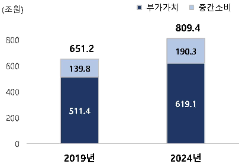

#t|

800

651.2

190.3

600

139.8

400

619.1

511.4

200

20194

20244

# < 가계 부가가치(가계생산) >

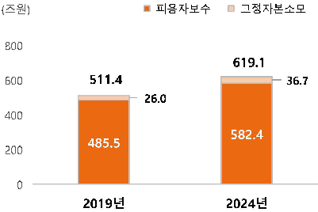

(42)

800

619.1

511.4

600

36.7

26.0

400

582.4

485.5

200

20194

20244

# 2.  무급 가사노동 가치

# 2-1.  무급 가사노동 가치

# 무급 가사노동의 가치는 582.4조원(명목GDP 대비 22.8%)이고, 1인당 무급 가사노동 가치는 여자가 남자의 2.7배임

□ 무급 가사노동 가치는 582.4조원으로 5년 전에 비해 20.0% 증가하고, 명목GDP 대비 22.8%로 5년 전에 비해 1.0%p 감소

< 무급 가사노동 가치 >

(단위: 10억원, %, %p)

| |평가액| | | |
|---|---|---|---|---|
| |2019년|2024년|증감|증감률|
|무급 가사노동 가치(전체)|485,466|582,394|96,927|20.0|
|명목GDP|2,040,594|2,556,857|516,263|25.3|
|명목GDP 대비 무급 가사노동 가치|23.8|22.8|-1.0|-|

□ 1인당 무급 가사노동 가치는 1,125만원으로 5년 전보다 20.0% 증가

남자는 605만원으로 5년 전에 비해 35.7% 증가하고, 여자는 1,646만원 으로 14.9% 증가

< 1인당 무급 가사노동 가치 >

(단위: 천원, %, 배, 배p)

| |평가액| | | |
|---|---|---|---|---|
| |2019년|2024년|증감|증감률|
|1인당 무급 가사노동 가치 *|9,378|11,254|1,875|20.0|
|남자|4,460|6,050|1,590|35.7|
|여자|14,322|16,458|2,136|14.9|
|여자/남자|3.2|2.7|-0.5|-|
|1인당 국민총소득(GNI, 명목)|39,741|50,120|10,379|26.1|

 무급 가사노동 가치/장래추계인구(국가데이터처)

< 명목GDP 대비 무급 가사노동 가치 >

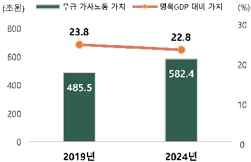

(%)

30

800

23.8

22.8

600

20

582.4

400

485.5

10

200

20194

20244

< 1인당 무급 가사노동 가치 >

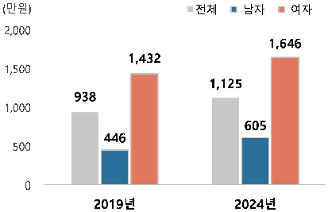

2,000

1,646

1,432

1,500

1,125

938

1,000

605

446

500

20244

20194

# 2-2.  행동분류별 무급 가사노동 가치

가정관리의  무급  가사노동  가치는  459.5조원,  가족  및  가구원  돌보기는 113.6조원이며, 자원봉사 및 참여활동 9.3조원임

□ 행동분류별 무급 가사노동 가치는 5년 전에 비해 가정관리 25.8%, 자원봉사 및 참여활동 24.6%, 가족 및 가구원 돌보기 0.7% 순으로 증가

가정관리에서는 반려동물 및 식물 돌보기(60.4%), 청소 및 정리(30.2%) 음식 준비(27.0%) 순으로 증가율이 높음

가족 및 가구원 돌보기에서는 미성년자 돌보기가 1.8% 감소하고, 성인 돌보기는 20.8% 증가

□ 행동분류별 구성을 보면, 가정관리 78.9%, 가족 및 가구원 돌보기 19.5%, 자원봉사 및 참여활동은 1.6% 순임

가정관리는 음식 준비 33.0%, 청소 및 정리 15.4%, 상품 및 서비스 구입 9.8%, 가정관리 관련 이동 6.8%, 의류 관리 6.7% 등으로 구성

가족 및 가구원 돌보기는 미성년자 돌보기 16.9%와 성인 돌보기 2.6%로 구성

# < 행동분류별 무급 가사노동 가치 >

(단위: 10억원, %, %p)

| |평가액| | | |구성비| | |
|---|---|---|---|---|---|---|---|
| |2019년|2024년|증감|증감률|2019년|2024년|증감|
|무급 가사노동(전체)|485,466|582,394|96,927|20.0|100.0|100.0|0.0|
|가정관리|365,202|459,467|94,265|25.8|75.2|78.9|3.7|
|음식 준비|151,288|192,138|40,849|27.0|31.2|33.0|1.8|
|의류 관리|33,825|39,017|5,191|15.3|7.0|6.7|-0.3|
|청소 및 정리|68,873|89,638|20,765|30.2|14.2|15.4|1.2|
|반려동물 및 식물 돌보기|15,066|24,163|9,098|60.4|3.1|4.1|1.0|
|상품 및 서비스 구입|48,100|57,199|9,099|18.9|9.9|9.8|-0.1|
|주거 및 기타 가정관리|15,756|17,838|2,082|13.2|3.2|3.1|-0.2|
|가정관리 관련 이동|32,294|39,475|7,180|22.2|6.7|6.8|0.1|
|가족 및 가구원 돌보기|112,799|113,627|828|0.7|23.2|19.5|-3.7|
|미성년자 돌보기|100,220|98,435|-1,785|-1.8|20.6|16.9|-3.7|
|성인 돌보기|12,579|15,192|2,613|20.8|2.6|2.6|0.0|
|자원봉사 및 참여활동|7,465|9,299|1,835|24.6|1.5|1.6|0.1|

# 2-3.  성별 무급 가사노동 가치

# 여자의 무급 가사노동 가치는 425.8조원, 남자는 156.6조원이며, 무급 가사노동 가치 중 남자 비중이 3.0%p 증가

□ 남자의 무급 가사노동 가치는 5년 전에 비해 35.3% 증가하고, 여자는 15.2% 증가

남자는 가정관리에서 43.6%, 가족 및 가구원 돌보기에서 13.9% 증가

여자는 가정관리에서 20.6% 증가, 가족 및 가구원 돌보기에서 4.0% 감소

□ 성별 구성을 보면, 여자가 73.1%로 남자 26.9%보다 높음

남자는 가정관리 비중이 3.4%p 증가하고, 여자는 0.3%p로 강보합

여자는 가족 및 가구원 돌보기 비중이 3.4%p 감소하고, 남자는 -0.3%p로 약보합

< 성별 무급 가사노동 가치 >

(단위: 10억원, %, %p)

| | |평가액| | | |구성비| | |
|---|---|---|---|---|---|---|---|---|
| | |2019년|2024년|증감|증감률|2019년|2024년|증감|
|무급 가사노동(전체)| |485,466|582,394|96,927|20.0|100.0|100.0|0.0|
|남자| |115,733|156,562|40,829|35.3|23.8|26.9|3.0|
| |가정관리|83,053|119,239|36,186|43.6|17.1|20.5|3.4|
| |가족및가구원돌보기|30,011|34,189|4,178|13.9|6.2|5.9|-0.3|
| |자원봉사및참여활동|2,669|3,134|465|17.4|0.5|0.5|0.0|
|여자| |369,733|425,832|56,099|15.2|76.2|73.1|-3.0|
| |가정관리|282,149|340,228|58,078|20.6|58.1|58.4|0.3|
| |가족및가구원돌보기|82,788|79,438|-3,350|-4.0|17.1|13.6|-3.4|
| |자원봉사및참여활동|4,796|6,166|1,370|28.6|1.0|1.1|0.1|

< 무급 가사노동 가치 >

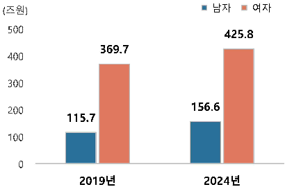

500

425.8

369.7

400

300

156.6

200

115.7

100

# < 무급 가사노동 가치 구성비 >

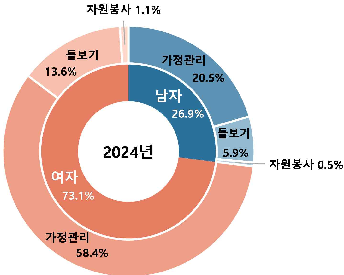

13.69

20.59

26.9%

5471

20244

5.99

73.1%

58.4%

- 2-4.  가구원수별 무급 가사노동 가치
- 3인 가구의 무급 가사노동 가치는 166.1조원, 4인 가구 147.4조원이며, 2인 가구는 136.7조원임

□ 1인 가구의 무급 가사노동 가치는 5년 전에 비해 66.2%, 2인 가구는 40.9%, 3인 가구는 22.2%, 4인 가구는 1.6% 증가

5인 이상 가구의 무급 가사노동 가치는 5년 전에 비해 11.3% 감소

[가구 내 가사노동 인구 증감률] 1인(33.9%), 2인(17.0%), 3인(1.9%), 4인(-12.0%), 5인 이상(-26.8%)

□ 가구원수별 구성을 보면, 3인 가구 28.5%, 4인 가구 25.3%, 2인 가구 23.5%, 1인 가구 13.6%, 5인 이상 가구 9.1%임

1인 가구와 2인 가구의 비중은 각각 3.8%p, 3.5%p 증가하고, 4인 가구와 5인 이상 가구의 비중은 각각 4.6%p, 3.2%p 감소

5년 전에는 4인 가구의 비중이 가장 높았으나, 2024년에는 3인 가구의 비중이 가장 높음

< 가구원수별 무급 가사노동 가치 >

(단위: 10억원, %, %p)

| |평가액| | | |구성비| | |
|---|---|---|---|---|---|---|---|
| |2019년|2024년|증감|증감률|2019년|2024년|증감|
|무급 가사노동(전체)|485,466|582,394|96,927|20.0|100.0|100.0|0.0|
|1인 가구|47,511|78,945|31,434|66.2|9.8|13.6|3.8|
|2인 가구|96,992|136,657|39,665|40.9|20.0|23.5|3.5|
|3인 가구|135,859|166,082|30,222|22.2|28.0|28.5|0.5|
|4인 가구|145,071|147,439|2,368|1.6|29.9|25.3|-4.6|
|5인 이상 가구|60,033|53,271|-6,762|-11.3|12.4|9.1|-3.2|

< 무급 가사노동 가치 >

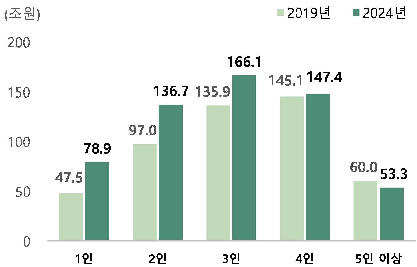

20194

20244

200

166.1

145.1 147.4

136.7 135.9

150

97.0

100

78.9

60.0

53.3

47.5

50

19

59! 014

# < 무급 가사노동 가치 구성비 >

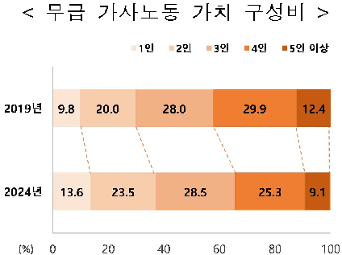

19!

20194

20.0

28.0

29.9

9.8

12.4

20244

13.6

23.5

28.5

25.3

9.1

(%)

20

40

60

80

100

# 2-5.  취업여부별 무급 가사노동 가치

비취업자의 무급 가사노동 가치는 297.4조원, 취업자는 284.9조원이며, 무급 가사노동 가치 중 취업자 비중이 2.1%p 증가

□ 취업자의 무급 가사노동 가치는 5년 전에 비해 25.4% 증가하고, 비취업자는 15.1% 증가

취업 남자는 5년 전에 비해 32.7%, 여자는 21.7% 증가

비취업 남자는 5년 전에 비해 40.6%, 여자는 10.8% 증가

[무급 가사노동 가치 증감률(취업자, 비취업자)] 가정관리(30.0%, 22.1%), 가족 및 가구원 돌보기(9.3%, -6.9%)

□ 취업여부별 구성을 보면, 비취업자 비중이 51.1%로 취업자 48.9% 보다 높음

취업 남자의 비중(17.7%)은 1.7%p, 여자(31.2%)는 0.4%p 증가

비취업 남자의 비중(9.1%)은 1.3%p 증가하고, 여자(41.9%)는 3.5%p 감소

< 취업여부별 무급 가사노동 가치 >

(단위: 10억원, %, %p)

| |평가액| | | |구성비| | |
|---|---|---|---|---|---|---|---|
| |2019년|2024년|증감|증감률|2019년|2024년|증감|
|무급 가사노동(전체)|485,466|582,394|96,927|20.0|100.0|100.0|0.0|
|취업자|227,151|284,946|57,795|25.4|46.8|48.9|2.1|
|남자|77,857|103,324|25,468|32.7|16.0|17.7|1.7|
|여자|149,294|181,621|32,327|21.7|30.8|31.2|0.4|
|비취업자|258,316|297,448|39,132|15.1|53.2|51.1|-2.1|
|남자|37,877|53,238|15,361|40.6|7.8|9.1|1.3|
|여자|220,439|244,210|23,771|10.8|45.4|41.9|-3.5|

# < 무급 가사노동 가치 >

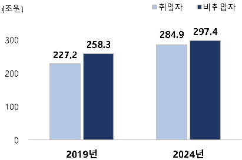

(Æ2)

297.4

284.9

300

258.3

227.2

200

100

# < 무급 가사노동 가치 구성비 >

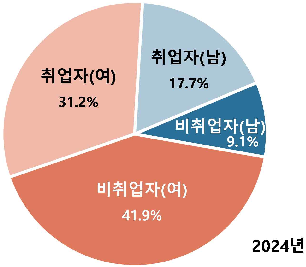

17.79

31.29

9.1%

41.9%

20244

# 2-6.  혼인상태별 무급 가사노동 가치

# 기혼의 무급 가사노동 가치는 511.8조원, 미혼은 70.6조원이며, 무급 가사노동 가치 중 미혼 비중이 2.8%p 증가

□ 미혼의 무급 가사노동 가치는 5년 전에 비해 56.0% 증가하고, 기혼은 16.3% 증가

미혼 남자는 5년 전에 비해 68.7%, 여자는 47.2% 증가

기혼 남자는 5년 전에 비해 28.9%, 여자는 12.7% 증가

[무급 가사노동 가치 증감률(미혼, 기혼)] 가정관리(59.0%, 21.5%), 가족 및 가구원 돌보기(46.0%, 0.1%)

□ 혼인상태별 구성을 보면, 기혼 비중이 87.9%로 미혼 12.1%보다 높음

미혼 남자의 비중(5.3%)은 1.5%p, 여자(6.8%)는 1.3%p 증가

기혼 남자의 비중(21.5%)은 1.5%p 증가하고, 여자(66.3%)는 4.3%p 감소

< 혼인상태별 무급 가사노동 가치 >

(단위: 10억원, %, %p)

| |평가액| | | |구성비| | |
|---|---|---|---|---|---|---|---|
| |2019년|2024년|증감|증감률|2019년|2024년|증감|
|무급 가사노동(전체)|485,466|582,394|96,927|20.0|100.0|100.0|0.0|
|미혼|45,271|70,611|25,340|56.0|9.3|12.1|2.8|
|남자|18,451|31,124|12,673|68.7|3.8|5.3|1.5|
|여자|26,821|39,487|12,667|47.2|5.5|6.8|1.3|
|기혼 *|440,195|511,782|71,587|16.3|90.7|87.9|-2.8|
|남자|97,283|125,438|28,155|28.9|20.0|21.5|1.5|
|여자|342,912|386,344|43,432|12.7|70.6|66.3|-4.3|

* 기혼은 배우자 있음, 사별, 이혼을 포함

< 무급 가사노동 가치 >

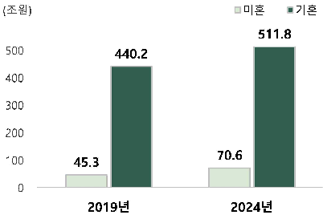

(Æ2)

511.8

500

440.2

400

300

200

70.6

100

45.3

# < 무급 가사노동 가치 구성비 >

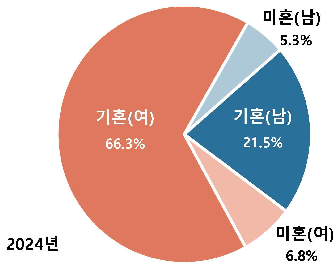

5.3%

712(4)

21.5%

66.3%

20244

6.89

# 2-7.  혼인상태·취업여부별 무급 가사노동 가치

# 기혼 ․ 비취업자는 266.5조원, 기혼 ․ 취업자는 245.3조원이며, 무급 가사노동 가치 중 기혼 ․ 비취업자 비중이 3.0%p 감소

□ 미혼 ․ 취업자의 무급 가사노동 가치는 5년 전에 비해 67.0%, 미혼 ․ 비취업자는 43.8% 증가

기혼 ․ 취업자의 무급 가사노동 가치는 20.6%, 기혼 ․ 비취업자는 12.5% 증가

□ 혼인상태 ․ 취업여부별 구성을 보면, 기혼 ․ 비취업자(45.8%), 기혼 ․ 취업자 (42.1%), 미혼 ․ 취업자(6.8%), 미혼 ․ 비취업자(5.3%) 순임

미혼 ․ 비취업 남자의 비중(2.3%)은 0.4%p, 여자(3.0%)는 0.5%p 증가

기혼 ․ 비취업 남자의 비중(6.8%)은 1.0%p 증가하고, 여자(38.9%)는 4.0%p 감소 < 혼인상태·취업여부별 무급 가사노동 가치 >

(단위: 10억원, %, %p)

| |평가액| | | |구성비| | |
|---|---|---|---|---|---|---|---|
| |2019년|2024년|증감|증감률|2019년|2024년|증감|
|무급 가사노동(전체)|485,466|582,394|96,927|20.0|100.0|100.0|0.0|
|미혼|45,271|70,611|25,340|56.0|9.3|12.1|2.8|
|취업자|23,774|39,692|15,918|67.0|4.9|6.8|1.9|
|남자|8,997|17,574|8,577|95.3|1.9|3.0|1.2|
|여자|14,776|22,118|7,341|49.7|3.0|3.8|0.8|
|비취업자|21,497|30,919|9,422|43.8|4.4|5.3|0.9|
|남자|9,453|13,550|4,096|43.3|1.9|2.3|0.4|
|여자|12,044|17,369|5,325|44.2|2.5|3.0|0.5|
|기혼|440,195|511,782|71,587|16.3|90.7|87.9|-2.8|
|취업자|203,377|245,254|41,877|20.6|41.9|42.1|0.2|
|남자|68,859|85,750|16,891|24.5|14.2|14.7|0.5|
|여자|134,518|159,503|24,986|18.6|27.7|27.4|-0.3|
|비취업자|236,818|266,529|29,710|12.5|48.8|45.8|-3.0|
|남자|28,424|39,688|11,264|39.6|5.9|6.8|1.0|
|여자|208,395|226,841|18,446|8.9|42.9|38.9|-4.0|

* 기혼은 배우자 있음, 사별, 이혼을 포함

# < 무급 가사노동 가치 >

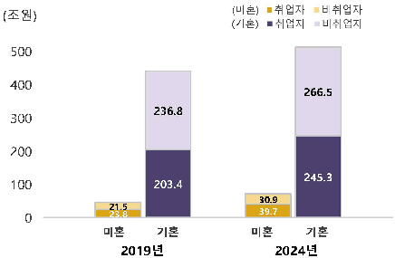

(012)

500

400

266.5

236.8

300

200

245.3

100

203.4

30.9

21.5

712

712

# < 무급 가사노동 가치 구성비 >

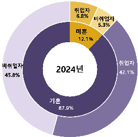

6.8%

5.3%

12.19

20244

42.1%

45.89

87.9%

# 2-8.  지역별 무급 가사노동 가치

경기의 무급 가사노동 가치는 160.2조원, 서울 102.2조원, 부산 38.0조원이며, 무급 가사노동 가치 중 경기 비중이 1.3%p 증가

- □ 지역별 무급 가사노동 가치는 5년 전에 비해 세종 42.3%, 제주 28.9%, 충남 27.8% 순으로 증가
- □ 지역별 구성을 보면, 경기 27.5%, 서울 17.5%, 부산 6.5% 순으로 많고, 세종 0.8%, 제주 1.3%, 울산 2.2% 순으로 적음

< 지역별 무급 가사노동 가치 >

(단위: 10억원, %, %p)

| |평가액| | | |구성비| | |
|---|---|---|---|---|---|---|---|
| |2019년|2024년|증감|증감률|2019년|2024년|증감|
|무급가사노동(전국)|485,466|582,394|96,927|20.0|100.0|100.0|0.0|
|서울|90,706|102,165|11,459|12.6|18.7|17.5|-1.1|
|부산|31,249|38,009|6,761|21.6|6.4|6.5|0.1|
|대구|22,753|27,752|4,999|22.0|4.7|4.8|0.1|
|인천|27,400|32,636|5,237|19.1|5.6|5.6|0.0|
|광주|13,002|15,009|2,006|15.4|2.7|2.6|-0.1|
|대전|14,294|16,068|1,774|12.4|2.9|2.8|-0.2|
|울산|10,634|13,069|2,435|22.9|2.2|2.2|0.1|
|세종|3,471|4,939|1,468|42.3|0.7|0.8|0.1|
|경기|127,260|160,211|32,951|25.9|26.2|27.5|1.3|
|강원|14,602|17,475|2,873|19.7|3.0|3.0|0.0|
|충북|14,634|15,917|1,283|8.8|3.0|2.7|-0.3|
|충남|19,303|24,675|5,372|27.8|4.0|4.2|0.3|
|전북|16,991|19,852|2,862|16.8|3.5|3.4|-0.1|
|전남|16,271|18,574|2,303|14.2|3.4|3.2|-0.2|
|경북|25,124|31,141|6,017|24.0|5.2|5.3|0.2|
|경남|31,823|37,234|5,410|17.0|6.6|6.4|-0.2|
|제주|5,949|7,667|1,718|28.9|1.2|1.3|0.1|

< 무급 가사노동 가치 >

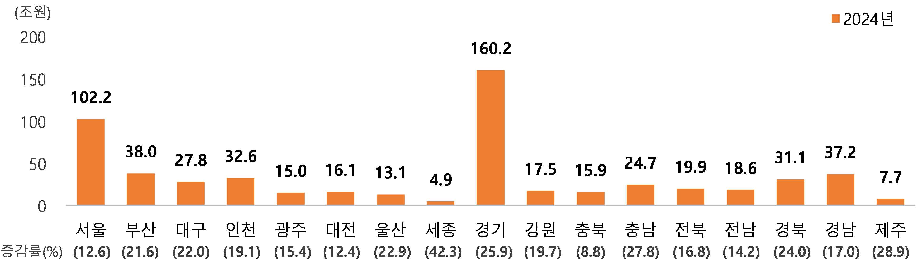

20244

200

160.2

150

102.2

100

38.0

37.2

32.6

31.1

27.8

24.7

50

19.9

18.6

16.1

17.5

15.0

15.9

13.1

7.7

4.9

ch7

84

84

34

44

44

34

34

(12.6)

(21.6)

(22.0)

(12.4)

(19.7)

(16.8)

(14.2)

(24.0)

(17.0)

(15.4)

(22.9)

(42.3)

(25.9)

(8.8)

(27.8)

(28.9)

# 통 계 표

- 1. 가계생산위성계정 ·········································································· 15
- 2. 고정자본소모와 중간소비 ······························································15
- 3. 행동분류별 무급 가사노동 가치 ···················································16
- 4. 성·행동분류별 무급 가사노동 가치 ···········································17
- 5. 가구원수·행동분류별 무급 가사노동 가치 ·······························18
- 6. 취업여부·행동분류별 무급 가사노동 가치 ·······························19
- 7. 혼인상태·행동분류별 무급 가사노동 가치 ·······························20
- 8. 지역·행동분류별 무급 가사노동 가치 ·······································21
- 9. 지역·성별 무급 가사노동 가치 ···················································23
- 10. 취업여부·성·행동분류별 무급 가사노동 가치 ·····················25
- 11. 혼인상태·성·행동분류별 무급 가사노동 가치 ·····················26
- 12. 혼인상태·성·취업여부별 무급 가사노동 가치 ·····················27

- 14 -

# 1. 가계생산위성계정

(단위: 10억원, %, %p)

| |평가액| | | |구성비| | |
|---|---|---|---|---|---|---|---|
| |2019년|2024년|증감|증감률|2019년|2024년|증감|
|총산출|651,199|809,405|158,206|24.3|100.0|100.0|0.0|
|중간소비|139,772|190,340|50,568|36.2|21.5|23.5|2.1|
|부가가치(가계생산)|511,427|619,065|107,638|21.0|78.5|76.5|-2.1|
|피용자보수(무급 가사노동 가치)|485,466|582,394|96,927|20.0|74.5|72.0|-2.6|
|고정자본소모|25,961|36,671|10,711|41.3|4.0|4.5|0.5|
|명목GDP|2,040,594|2,556,857|516,263|25.3| | |-|
|명목GDP 대비 무급 가사노동 가치 *|23.8|22.8|-1.0|-| | |-|
|명목GDP 대비 가계생산 **|25.1|24.2|-0.9|-| | |-|

- * 명목GDP 대비 무급 가사노동 가치 = 무급 가사노동 가치/명목GDP×100
- ** 명목GDP 대비 가계생산 = 가계생산/명목GDP×100

# 2. 고정자본소모와 중간소비

(단위: 10억원, %)

| |피용자보수(무급| |가사노동|가치)|고정자본소모| | | |
|---|---|---|---|---|---|---|---|---|
| |2019년|2024년|증감|증감률|2019년|2024년|증감|증감률|
|전체|485,466|582,394|96,927|20.0|25,961|36,671|10,711|41.3|
|가정관리|365,202|459,467|94,265|25.8|19,586|28,394|8,808|45.0|
|가족 및 가구원 돌보기|112,799|113,627|828|0.7|5,869|7,759|1,889|32.2|
|자원봉사 및 참여활동|7,465|9,299|1,835|24.6|505|519|14|2.7|
| |중간소비| | | |총산출| | | |
| |2019년|2024년|증감|증감률|2019년|2024년|증감|증감률|
|전체|139,772|190,340|50,568|36.2|651,199|809,405|158,206|24.3|
|가정관리|136,787|187,098|50,311|36.8|521,575|674,959|153,383|29.4|
|가족 및 가구원 돌보기|2,832|3,112|281|9.9|121,500|124,498|2,998|2.5|
|자원봉사 및 참여활동|154|130|-24|-15.6|8,124|9,948|1,824|22.5|

# 3. 행동분류별 무급 가사노동 가치

(단위: 10억원, %, %p)

| | |평가액| | | |구성비| | |
|---|---|---|---|---|---|---|---|---|
| | |2019년|2024년|증감|증감률|2019년|2024년|증감|
|무급|가사노동(전체)|485,466|582,394|96,927|20.0|100.0|100.0|0.0|
| |가정관리|365,202|459,467|94,265|25.8|75.2|78.9|3.7|
| |음식 준비|151,288|192,138|40,849|27.0|31.2|33.0|1.8|
| |의류 관리|33,825|39,017|5,191|15.3|7.0|6.7|-0.3|
| |청소 및 정리|68,873|89,638|20,765|30.2|14.2|15.4|1.2|
| |반려동물 및 식물 돌보기|15,066|24,163|9,098|60.4|3.1|4.1|1.0|
| |상품 및 서비스 구입|48,100|57,199|9,099|18.9|9.9|9.8|-0.1|
| |주거 및 기타 가정관리|15,756|17,838|2,082|13.2|3.2|3.1|-0.2|
| |가정관리 관련 이동|32,294|39,475|7,180|22.2|6.7|6.8|0.1|
|가족 및|가구원 돌보기|112,799|113,627|828|0.7|23.2|19.5|-3.7|
| |미성년자 돌보기|100,220|98,435|-1,785|-1.8|20.6|16.9|-3.7|
| |미성년자 돌보기(이동 제외)|85,577|83,594|-1,982|-2.3|17.6|14.4|-3.3|
| |미성년자 돌보기 관련 이동|14,643|14,841|198|1.4|3.0|2.5|-0.5|
| |성인 돌보기|12,579|15,192|2,613|20.8|2.6|2.6|0.0|
| |성인 돌보기(이동 제외)|7,516|8,626|1,110|14.8|1.5|1.5|-0.1|
| |성인 돌보기 관련 이동|5,064|6,567|1,503|29.7|1.0|1.1|0.1|
|자원봉사|및 참여활동|7,465|9,299|1,835|24.6|1.5|1.6|0.1|
|자원봉사및참여활동(이동|제외)|5,784|7,905|2,121|36.7|1.2|1.4|0.2|
| |자원봉사및참여활동관련이동|1,681|1,395|-286|-17.0|0.3|0.2|-0.1|
|무급 가사노동 관련 이동 *| |53,682|62,277|8,595|16.0|11.1|10.7|-0.4|

* 가정관리, 미성년자 돌보기, 성인 돌보기, 자원봉사 및 참여활동 관련 이동을 모두 포함

# 4. 성·행동분류별 무급 가사노동 가치

(단위: 10억원, %, %p)

| |평가액| | | |구성비 (전체=100.0)| | |
|---|---|---|---|---|---|---|---|
| |2019년|2024년|증감|증감률|2019년|2024년|증감|
|무급 가사노동|115,733|156,562|40,829|35.3|23.8|26.9|3.0|
|가정관리|83,053|119,239|36,186|43.6|17.1|20.5|3.4|
|음식 준비|23,315|37,783|14,468|62.1|4.8|6.5|1.7|
|의류 관리|4,221|6,584|2,363|56.0|0.9|1.1|0.3|
|청소 및 정리|17,981|25,380|7,399|41.1|3.7|4.4|0.7|
|반려동물 및 식물 돌보기|5,497|8,221|2,725|49.6|1.1|1.4|0.3|
|상품 및 서비스 구입|13,359|17,542|4,183|31.3|2.8|3.0|0.3|
|주거 및 기타 가정관리|8,456|10,264|1,809|21.4|1.7|1.8|0.0|
|가정관리 관련 이동|10,224|13,465|3,240|31.7|2.1|2.3|0.2|
|가족 및 가구원 돌보기|30,011|34,189|4,178|13.9|6.2|5.9|-0.3|
|미성년자 돌보기|24,728|27,616|2,888|11.7|5.1|4.7|-0.4|
|성인 돌보기|5,284|6,573|1,290|24.4|1.1|1.1|0.0|
|자원봉사 및 참여활동|2,669|3,134|465|17.4|0.5|0.5|0.0|
|무급 가사노동|369,733|425,832|56,099|15.2|76.2|73.1|-3.0|
|가정관리|282,149|340,228|58,078|20.6|58.1|58.4|0.3|
|음식 준비|127,973|154,355|26,382|20.6|26.4|26.5|0.1|
|의류 관리|29,605|32,433|2,828|9.6|6.1|5.6|-0.5|
|청소 및 정리|50,891|64,258|13,367|26.3|10.5|11.0|0.6|
|반려동물 및 식물 돌보기|9,569|15,942|6,373|66.6|2.0|2.7|0.8|
|상품 및 서비스 구입|34,742|39,657|4,916|14.1|7.2|6.8|-0.3|
|주거 및 기타 가정관리|7,300|7,573|273|3.7|1.5|1.3|-0.2|
|가정관리 관련 이동|22,070|26,010|3,940|17.9|4.5|4.5|-0.1|
|가족 및 가구원 돌보기|82,788|79,438|-3,350|-4.0|17.1|13.6|-3.4|
|미성년자 돌보기|75,492|70,819|-4,673|-6.2|15.6|12.2|-3.4|
|성인 돌보기|7,296|8,619|1,323|18.1|1.5|1.5|0.0|
|자원봉사 및 참여활동|4,796|6,166|1,370|28.6|1.0|1.1|0.1|

# 5. 가구원수·행동분류별 무급 가사노동 가치

(단위: 10억원, %, %p)

| |평가액| | | |구성비 (전체=100.0)| | |
|---|---|---|---|---|---|---|---|
| |2019년|2024년|증감|증감률|2019년|2024년|증감|
|무급 가사노동|47,511|78,945|31,434|66.2|9.8|13.6|3.8|
| |45,079|75,226|30,147|66.9|9.3|12.9|3.6|
|가구|1,431|1,947|516|36.1|0.3|0.3|0.0|
| |1,001|1,772|772|77.1|0.2|0.3|0.1|
|무급 가사노동|96,992|136,657|39,665|40.9|20.0|23.5|3.5|
|가정관리|86,830|123,394|36,564|42.1|17.9|21.2|3.3|
|가구|7,945|10,398|2,453|30.9|1.6|1.8|0.1|
|자원봉사 및 참여활동|2,217|2,865|648|29.2|0.5|0.5|0.0|
|무급 가사노동|135,859|166,082|30,222|22.2|28.0|28.5|0.5|
| |96,589|120,019|23,429|24.3|19.9|20.6|0.7|
|가구|37,332|44,040|6,708|18.0|7.7|7.6|-0.1|
|자원봉사 및 참여활동|1,938|2,023|85|4.4|0.4|0.3|-0.1|
|무급 가사노동|145,071|147,439|2,368|1.6|29.9|25.3|-4.6|
|가정관리|98,512|105,137|6,625|6.7|20.3|18.1|-2.2|
|가구|45,220|40,324|-4,895|-10.8|9.3|6.9|-2.4|
|자원봉사 및 참여활동|1,339|1,978|639|47.7|0.3|0.3|0.1|
|무급 가사노동|60,033|53,271|-6,762|-11.3|12.4|9.1|-3.2|
| |38,192|35,691|-2,501|-6.5|7.9|6.1|-1.7|
|5인 이상 가구|20,872|16,918|-3,953|-18.9|4.3|2.9|-1.4|
|자원봉사 및 참여활동|970|662|-308|-31.8|0.2|0.1|-0.1|

# 6. 취업여부·행동분류별 무급 가사노동 가치

(단위: 10억원, %, %p)

| |평가액| | | |구성비 (전체=100.0)| | |
|---|---|---|---|---|---|---|---|
| |2019년|2024년|증감|증감률|2019년|2024년|증감|
|무급 가사노동|227,151|284,946|57,795|25.4|46.8|48.9|2.1|
|가정관리|170,996|222,329|51,333|30.0|35.2|38.2|3.0|
|음식 준비|67,470|88,539|21,069|31.2|13.9|15.2|1.3|
|의류 관리|15,192|18,850|3,658|24.1|3.1|3.2|0.1|
|청소 및 정리|33,087|44,464|11,377|34.4|6.8|7.6|0.8|
|반려동물 및 식물 돌보기|7,324|12,150|4,826|65.9|1.5|2.1|0.6|
|상품 및 서비스 구입|24,673|29,862|5,189|21.0|5.1|5.1|0.0|
|주거 및 기타 가정관리|7,586|9,514|1,928|25.4|1.6|1.6|0.1|
|가정관리 관련 이동|15,662|18,950|3,287|21.0|3.2|3.3|0.0|
|가족 및 가구원 돌보기|53,240|58,200|4,960|9.3|11.0|10.0|-1.0|
|미성년자 돌보기|47,432|50,799|3,367|7.1|9.8|8.7|-1.0|
|성인 돌보기|5,808|7,401|1,593|27.4|1.2|1.3|0.1|
|자원봉사 및 참여활동|2,915|4,417|1,502|51.5|0.6|0.8|0.2|
|무급 가사노동|258,316|297,448|39,132|15.1|53.2|51.1|-2.1|
|가정관리|194,207|237,138|42,931|22.1|40.0|40.7|0.7|
|음식 준비|83,818|103,599|19,781|23.6|17.3|17.8|0.5|
|의류 관리|18,633|20,166|1,533|8.2|3.8|3.5|-0.4|
|청소 및 정리|35,785|45,173|9,388|26.2|7.4|7.8|0.4|
|반려동물 및 식물 돌보기|7,741|12,013|4,272|55.2|1.6|2.1|0.5|
|상품 및 서비스 구입|23,428|27,338|3,910|16.7|4.8|4.7|-0.1|
|주거 및 기타 가정관리|8,169|8,324|154|1.9|1.7|1.4|-0.3|
|가정관리 관련 이동|16,632|20,525|3,893|23.4|3.4|3.5|0.1|
|가족 및 가구원 돌보기|59,559|55,427|-4,132|-6.9|12.3|9.5|-2.8|
|미성년자 돌보기|52,788|47,636|-5,152|-9.8|10.9|8.2|-2.7|
|성인 돌보기|6,771|7,791|1,020|15.1|1.4|1.3|-0.1|
|자원봉사 및 참여활동|4,550|4,883|333|7.3|0.9|0.8|-0.1|

# 7. 혼인상태·행동분류별 무급 가사노동 가치

(단위: 10억원, %, %p)

| | | | | |구성비 (전체=100.0)| | |
|---|---|---|---|---|---|---|---|
| |2019년|2024년|증감|증감률|2019년|2024년|증감|
|무급 가사노동|45,271|70,611|25,340|56.0|9.3|12.1|2.8|
|가정관리|41,824|66,497|24,672|59.0|8.6|11.4|2.8|
|음식 준비|11,507|19,838|8,330|72.4|2.4|3.4|1.0|
|의류 관리|2,824|4,687|1,863|66.0|0.6|0.8|0.2|
|청소 및 정리|7,446|13,328|5,881|79.0|1.5|2.3|0.8|
|반려동물 및 식물 돌보기|3,327|5,965|2,638|79.3|0.7|1.0|0.3|
|상품 및 서비스 구입|9,597|13,029|3,433|35.8|2.0|2.2|0.3|
|주거 및 기타 가정관리|2,166|2,920|755|34.8|0.4|0.5|0.1|
|가정관리 관련 이동|4,957|6,729|1,773|35.8|1.0|1.2|0.1|
|가족 및 가구원 돌보기|1,580|2,307|727|46.0|0.3|0.4|0.1|
|미성년자 돌보기|335|408|74|22.0|0.1|0.1|0.0|
|성인 돌보기|1,246|1,899|653|52.4|0.3|0.3|0.1|
|자원봉사 및 참여활동|1,866|1,808|-59|-3.2|0.4|0.3|-0.1|
|무급 가사노동|440,195|511,782|71,587|16.3|90.7|87.9|-2.8|
|가정관리|323,378|392,970|69,592|21.5|66.6|67.5|0.9|
|음식 준비|139,781|172,300|32,519|23.3|28.8|29.6|0.8|
|의류 관리|31,001|34,329|3,328|10.7|6.4|5.9|-0.5|
|청소 및 정리|61,426|76,310|14,884|24.2|12.7|13.1|0.4|
|반려동물 및 식물 돌보기|11,738|18,198|6,460|55.0|2.4|3.1|0.7|
|상품 및 서비스 구입|38,504|44,170|5,666|14.7|7.9|7.6|-0.3|
|주거 및 기타 가정관리|13,590|14,918|1,327|9.8|2.8|2.6|-0.2|
|가정관리 관련 이동|27,337|32,745|5,408|19.8|5.6|5.6|0.0|
|가족 및 가구원 돌보기|111,219|111,320|101|0.1|22.9|19.1|-3.8|
|미성년자 돌보기|99,885|98,027|-1,859|-1.9|20.6|16.8|-3.7|
|성인 돌보기|11,334|13,294|1,960|17.3|2.3|2.3|-0.1|
|자원봉사 및 참여활동|5,598|7,492|1,894|33.8|1.2|1.3|0.1|

* 기혼은 배우자 있음, 사별, 이혼을 포함

# 8. 지역·행동분류별 무급 가사노동 가치

(단위: 10억원, %, %p)

| |평가액| | | |구성비| | |
|---|---|---|---|---|---|---|---|
| |2019년|2024년|증감|증감률|2019년|2024년|증감|
|무급 가사노동|485,466|582,394|96,927|20.0|100.0|100.0|0.0|
|가정관리|365,202|459,467|94,265|25.8|75.2|78.9|3.7|
|가족 및 가구원 돌보기|112,799|113,627|828|0.7|23.2|19.5|-3.7|
|자원봉사 및 참여활동|7,465|9,299|1,835|24.6|1.5|1.6|0.1|
|무급 가사노동|90,706|102,165|11,459|12.6|18.7|17.5|-1.1|
|가정관리|66,453|79,322|12,869|19.4|13.7|13.6|-0.1|
|가족 및 가구원 돌보기|22,732|21,602|-1,130|-5.0|4.7|3.7|-1.0|
|자원봉사 및 참여활동|1,521|1,242|-280|-18.4|0.3|0.2|-0.1|
|무급 가사노동|31,249|38,009|6,761|21.6|6.4|6.5|0.1|
|가정관리|24,857|30,831|5,974|24.0|5.1|5.3|0.2|
|가족 및 가구원 돌보기|6,199|6,711|512|8.3|1.3|1.2|-0.1|
|자원봉사 및 참여활동|192|467|275|143.1|0.0|0.1|0.0|
|무급 가사노동|22,753|27,752|4,999|22.0|4.7|4.8|0.1|
|가정관리|17,727|21,744|4,017|22.7|3.7|3.7|0.1|
|가족 및 가구원 돌보기|4,686|5,570|884|18.9|1.0|1.0|0.0|
|자원봉사 및 참여활동|340|438|98|28.7|0.1|0.1|0.0|
|무급 가사노동|27,400|32,636|5,237|19.1|5.6|5.6|0.0|
|가정관리|20,355|25,903|5,548|27.3|4.2|4.4|0.3|
|가족 및 가구원 돌보기|6,725|6,044|-681|-10.1|1.4|1.0|-0.3|
|자원봉사 및 참여활동|320|689|370|115.6|0.1|0.1|0.1|
|무급 가사노동|13,002|15,009|2,006|15.4|2.7|2.6|-0.1|
|가정관리|9,878|11,893|2,015|20.4|2.0|2.0|0.0|
|가족 및 가구원 돌보기|2,822|2,971|150|5.3|0.6|0.5|-0.1|
|자원봉사 및 참여활동|303|144|-159|-52.4|0.1|0.0|0.0|
|무급 가사노동|14,294|16,068|1,774|12.4|2.9|2.8|-0.2|
|가정관리|10,926|12,661|1,735|15.9|2.3|2.2|-0.1|
|가족 및 가구원 돌보기|3,211|3,152|-59|-1.8|0.7|0.5|-0.1|
|자원봉사 및 참여활동|157|255|98|62.0|0.0|0.0|0.0|
|무급 가사노동|10,634|13,069|2,435|22.9|2.2|2.2|0.1|
|가정관리|8,062|10,356|2,294|28.5|1.7|1.8|0.1|
|가족 및 가구원 돌보기|2,427|2,473|46|1.9|0.5|0.4|-0.1|
|자원봉사 및 참여활동|145|240|95|65.1|0.0|0.0|0.0|
|무급 가사노동|3,471|4,939|1,468|42.3|0.7|0.8|0.1|
|가정관리|2,319|3,412|1,094|47.2|0.5|0.6|0.1|
|가족 및 가구원 돌보기|1,089|1,444|356|32.7|0.2|0.2|0.0|
|자원봉사 및 참여활동|64|83|18|28.8|0.0|0.0|0.0|

# 8. 지역·행동분류별 무급 가사노동 가치(계속)

(단위: 10억원, %, %p)

| |평가액| | | |구성비| | |
|---|---|---|---|---|---|---|---|
| |2019년|2024년|증감|증감률|2019년|2024년|증감|
|무급 가사노동|127,260|160,211|32,951|25.9|26.2|27.5|1.3|
|가정관리|92,637|124,975|32,338|34.9|19.1|21.5|2.4|
|가족 및 가구원 돌보기|33,131|33,100|-31|-0.1|6.8|5.7|-1.1|
|자원봉사 및 참여활동|1,492|2,136|644|43.2|0.3|0.4|0.1|
|무급 가사노동|14,602|17,475|2,873|19.7|3.0|3.0|0.0|
|가정관리|11,050|14,573|3,523|31.9|2.3|2.5|0.2|
|가족 및 가구원 돌보기|3,128|2,726|-402|-12.9|0.6|0.5|-0.2|
|자원봉사 및 참여활동|423|176|-248|-58.5|0.1|0.0|-0.1|
|무급 가사노동|14,634|15,917|1,283|8.8|3.0|2.7|-0.3|
|가정관리|11,444|13,361|1,917|16.8|2.4|2.3|-0.1|
|가족 및 가구원 돌보기|2,928|2,322|-606|-20.7|0.6|0.4|-0.2|
|자원봉사 및 참여활동|262|234|-28|-10.6|0.1|0.0|0.0|
|무급 가사노동|19,303|24,675|5,372|27.8|4.0|4.2|0.3|
|가정관리|14,610|19,786|5,177|35.4|3.0|3.4|0.4|
|가족 및 가구원 돌보기|4,396|4,595|199|4.5|0.9|0.8|-0.1|
|자원봉사 및 참여활동|297|293|-4|-1.4|0.1|0.1|0.0|
|무급 가사노동|16,991|19,852|2,862|16.8|3.5|3.4|-0.1|
|가정관리|13,305|16,555|3,250|24.4|2.7|2.8|0.1|
|가족 및 가구원 돌보기|3,311|3,024|-287|-8.7|0.7|0.5|-0.2|
|자원봉사 및 참여활동|375|274|-101|-27.0|0.1|0.0|0.0|
|무급 가사노동|16,271|18,574|2,303|14.2|3.4|3.2|-0.2|
|가정관리|12,821|15,298|2,477|19.3|2.6|2.6|0.0|
|가족 및 가구원 돌보기|3,129|2,588|-541|-17.3|0.6|0.4|-0.2|
|자원봉사 및 참여활동|321|688|367|114.2|0.1|0.1|0.1|
|무급 가사노동|25,124|31,141|6,017|24.0|5.2|5.3|0.2|
|가정관리|20,099|24,375|4,276|21.3|4.1|4.2|0.0|
|가족 및 가구원 돌보기|4,354|5,832|1,478|33.9|0.9|1.0|0.1|
|자원봉사 및 참여활동|671|934|263|39.3|0.1|0.2|0.0|
|무급 가사노동|31,823|37,234|5,410|17.0|6.6|6.4|-0.2|
|가정관리|24,362|28,858|4,497|18.5|5.0|5.0|-0.1|
|가족 및 가구원 돌보기|7,109|7,482|373|5.2|1.5|1.3|-0.2|
|자원봉사 및 참여활동|352|893|541|153.5|0.1|0.2|0.1|
|무급 가사노동|5,949|7,667|1,718|28.9|1.2|1.3|0.1|
|가정관리|4,298|5,562|1,264|29.4|0.9|1.0|0.1|
|가족 및 가구원 돌보기|1,422|1,991|569|40.0|0.3|0.3|0.0|
|자원봉사 및 참여활동|229|114|-114|-50.0|0.0|0.0|0.0|

# 9. 지역·성별 무급가사 노동 가치

(단위: 10억원, %, %p)

| | |평가액| | | |구성비| | |
|---|---|---|---|---|---|---|---|---|
| | |2019년|2024년|증감|증감률|2019년|2024년|증감|
|무급 가사노동| |485,466|582,394|96,927|20.0|100.0|100.0|0.0|
| |남자|115,733|156,562|40,829|35.3|23.8|26.9|3.0|
| |여자|369,733|425,832|56,099|15.2|76.2|73.1|-3.0|
|무급 가사노동| |90,706|102,165|11,459|12.6|18.7|17.5|-1.1|
| |남자|21,597|26,316|4,719|21.9|4.4|4.5|0.1|
| |여자|69,109|75,849|6,740|9.8|14.2|13.0|-1.2|
|무급 가사노동| |31,249|38,009|6,761|21.6|6.4|6.5|0.1|
| |남자|7,854|9,829|1,975|25.1|1.6|1.7|0.1|
| |여자|23,395|28,181|4,786|20.5|4.8|4.8|0.0|
|무급 가사노동| |22,753|27,752|4,999|22.0|4.7|4.8|0.1|
| |남자|5,344|7,422|2,078|38.9|1.1|1.3|0.2|
| |여자|17,409|20,330|2,921|16.8|3.6|3.5|-0.1|
|무급 가사노동| |27,400|32,636|5,237|19.1|5.6|5.6|0.0|
| |남자|6,031|8,466|2,436|40.4|1.2|1.5|0.2|
| |여자|21,369|24,170|2,801|13.1|4.4|4.2|-0.3|
|무급 가사노동| |13,002|15,009|2,006|15.4|2.7|2.6|-0.1|
| |남자|2,928|4,119|1,191|40.7|0.6|0.7|0.1|
| |여자|10,074|10,889|815|8.1|2.1|1.9|-0.2|
|무급 가사노동| |14,294|16,068|1,774|12.4|2.9|2.8|-0.2|
|남자| |3,441|4,757|1,316|38.2|0.7|0.8|0.1|
|여자| |10,853|11,311|458|4.2|2.2|1.9|-0.3|
|무급 가사노동| |10,634|13,069|2,435|22.9|2.2|2.2|0.1|
|남자| |2,304|3,451|1,148|49.8|0.5|0.6|0.1|
|여자| |8,331|9,618|1,287|15.5|1.7|1.7|-0.1|
|무급 가사노동| |3,471|4,939|1,468|42.3|0.7|0.8|0.1|
|남자| |839|1,562|723|86.2|0.2|0.3|0.1|
|여자| |2,632|3,377|744|28.3|0.5|0.6|0.0|

# 9. 지역·성별 무급가사 노동 가치(계속)

(단위: 10억원, %, %p)

| | |평가액| | | |구성비| | |
|---|---|---|---|---|---|---|---|---|
| | |2019년|2024년|증감|증감률|2019년|2024년|증감|
| |무급 가사노동|127,260|160,211|32,951|25.9|26.2|27.5|1.3|
| |남자|29,725|42,826|13,101|44.1|6.1|7.4|1.2|
| |여자|97,535|117,385|19,850|20.4|20.1|20.2|0.1|
|무급 가사노동| |14,602|17,475|2,873|19.7|3.0|3.0|0.0|
| |남자|3,903|5,333|1,429|36.6|0.8|0.9|0.1|
| |여자|10,699|12,142|1,443|13.5|2.2|2.1|-0.1|
|무급 가사노동| |14,634|15,917|1,283|8.8|3.0|2.7|-0.3|
| |남자|3,638|4,180|542|14.9|0.7|0.7|0.0|
| |여자|10,995|11,737|741|6.7|2.3|2.0|-0.2|
|무급 가사노동| |19,303|24,675|5,372|27.8|4.0|4.2|0.3|
| |남자|4,747|7,502|2,754|58.0|1.0|1.3|0.3|
| |여자|14,556|17,173|2,618|18.0|3.0|2.9|0.0|
|무급 가사노동| |16,991|19,852|2,862|16.8|3.5|3.4|-0.1|
| |남자|4,558|5,762|1,204|26.4|0.9|1.0|0.1|
| |여자|12,432|14,090|1,658|13.3|2.6|2.4|-0.1|
|무급 가사노동| |16,271|18,574|2,303|14.2|3.4|3.2|-0.2|
| |남자|4,015|5,519|1,504|37.5|0.8|0.9|0.1|
| |여자|12,257|13,056|799|6.5|2.5|2.2|-0.3|
|무급 가사노동| |25,124|31,141|6,017|24.0|5.2|5.3|0.2|
|남자| |5,609|8,083|2,473|44.1|1.2|1.4|0.2|
|여자| |19,514|23,059|3,544|18.2|4.0|4.0|-0.1|
|무급 가사노동| |31,823|37,234|5,410|17.0|6.6|6.4|-0.2|
|남자| |7,366|9,342|1,976|26.8|1.5|1.6|0.1|
|여자| |24,457|27,892|3,434|14.0|5.0|4.8|-0.2|
|무급 가사노동| |5,949|7,667|1,718|28.9|1.2|1.3|0.1|
| | |1,834|2,094|260|14.2|0.4|0.4|0.0|
|남자| | | | | | | |0.1|
|여자| |4,114|5,573|1,459|35.5|0.8|1.0| |

# 10. 취업여부·성·행동분류별 무급 가사노동 가치

(단위: 10억원, %, %p)

| | |평가액| | | |구성비 (전체=100.0)| | |
|---|---|---|---|---|---|---|---|---|
| | |2019년|2024년|증감|증감률|2019년|2024년|증감|
|무급 가사노동| |227,151|284,946|57,795|25.4|46.8|48.9|2.1|
| |가정관리|170,996|222,329|51,333|30.0|35.2|38.2|3.0|
| |가족및가구원돌보기|53,240|58,200|4,960|9.3|11.0|10.0|-1.0|
| |자원봉사및참여활동|2,915|4,417|1,502|51.5|0.6|0.8|0.2|
|무급 가사노동| |77,857|103,324|25,468|32.7|16.0|17.7|1.7|
| |가정관리|51,966|73,348|21,382|41.1|10.7|12.6|1.9|
| |가족및가구원돌보기|24,460|28,344|3,885|15.9|5.0|4.9|-0.2|
| |자원봉사및참여활동|1,431|1,632|202|14.1|0.3|0.3|0.0|
|무급 가사노동| |149,294|181,621|32,327|21.7|30.8|31.2|0.4|
| |가정관리|119,029|148,981|29,952|25.2|24.5|25.6|1.1|
|가족및가구원돌보기| |28,780|29,856|1,076|3.7|5.9|5.1|-0.8|
|자원봉사및참여활동| |1,485|2,784|1,300|87.6|0.3|0.5|0.2|
|무급 가사노동| |258,316|297,448|39,132|15.1|53.2|51.1|-2.1|
|가정관리| |194,207|237,138|42,931|22.1|40.0|40.7|0.7|
|전체|가족및가구원돌보기|59,559|55,427|-4,132|-6.9|12.3|9.5|-2.8|
|자원봉사및참여활동| |4,550|4,883|333|7.3|0.9|0.8|-0.1|
|무급 가사노동| |37,877|53,238|15,361|40.6|7.8|9.1|1.3|
| |가정관리|31,087|45,892|14,804|47.6|6.4|7.9|1.5|
|가족및가구원돌보기| |5,551|5,845|293|5.3|1.1|1.0|-0.1|
|자원봉사및참여활동| |1,238|1,501|263|21.2|0.3|0.3|0.0|
| |무급 가사노동|220,439|244,210|23,771|10.8|45.4|41.9|-3.5|
|가정관리| |163,120|191,246|28,127|17.2|33.6|32.8|-0.8|
|여자|가족및가구원돌보기|54,008|49,582|-4,426|-8.2|11.1|8.5|-2.6|
| |자원봉사및참여활동|3,311|3,381|70|2.1|0.7|0.6|-0.1|

# 11. 혼인상태·성·행동분류별 무급 가사노동 가치

(단위: 10억원, %, %p)

| | |평가액| | | |구성비 (전체=100.0)| | |
|---|---|---|---|---|---|---|---|---|
| | |2019년|2024년|증감|증감률|2019년|2024년|증감|
| |무급 가사노동|45,271|70,611|25,340|56.0|9.3|12.1|2.8|
|전체|가정관리|41,824|66,497|24,672|59.0|8.6|11.4|2.8|
| |가족 및 가구원 돌보기|1,580|2,307|727|46.0|0.3|0.4|0.1|
| |자원봉사 및 참여활동|1,866|1,808|-59|-3.2|0.4|0.3|-0.1|
| |무급 가사노동|18,451|31,124|12,673|68.7|3.8|5.3|1.5|
| |가정관리|16,787|29,211|12,425|74.0|3.5|5.0|1.6|
|남자|가족 및 가구원 돌보기|787|1,105|317|40.3|0.2|0.2|0.0|
| |자원봉사 및 참여활동|877|808|-69|-7.8|0.2|0.1|0.0|
| |무급 가사노동|26,821|39,487|12,667|47.2|5.5|6.8|1.3|
|여자|가정관리|25,038|37,286|12,248|48.9|5.2|6.4|1.2|
| |가족 및 가구원 돌보기|793|1,202|409|51.6|0.2|0.2|0.0|
| |자원봉사 및 참여활동|990|1,000|10|1.0|0.2|0.2|0.0|
|무급|가사노동|440,195|511,782|71,587|16.3|90.7|87.9|-2.8|
|전체|가정관리|323,378|392,970|69,592|21.5|66.6|67.5|0.9|
| |가족 및 가구원 돌보기|111,219|111,320|101|0.1|22.9|19.1|-3.8|
| |자원봉사 및 참여활동|5,598|7,492|1,894|33.8|1.2|1.3|0.1|
| |무급 가사노동|97,283|125,438|28,155|28.9|20.0|21.5|1.5|
| |가정관리|66,267|90,028|23,761|35.9|13.7|15.5|1.8|
|남자|가족 및 가구원 돌보기|29,224|33,084|3,861|13.2|6.0|5.7|-0.3|
| |자원봉사 및 참여활동|1,792|2,326|533|29.8|0.4|0.4|0.0|
| |무급 가사노동|342,912|386,344|43,432|12.7|70.6|66.3|-4.3|
| |가정관리|257,111|302,942|45,831|17.8|53.0|52.0|-0.9|
|여자|가족 및 가구원 돌보기|81,995|78,236|-3,759|-4.6|16.9|13.4|-3.5|
| |자원봉사 및 참여활동|3,806|5,166|1,360|35.7|0.8|0.9|0.1|

# 12. 혼인상태·성·취업여부별 무급 가사노동 가치

(단위: 10억원, %, %p)

| | | | |평가액| | | |구성비 (전체=100.0)| | |
|---|---|---|---|---|---|---|---|---|---|---|
| | | | |2019년|2024년|증감|증감률|2019년|2024년|증감|
| |전체|무급 가사노동| |45,271|70,611|25,340|56.0|9.3|12.1|2.8|
| | | |취업자|23,774|39,692|15,918|67.0|4.9|6.8|1.9|
| | | |비취업자|21,497|30,919|9,422|43.8|4.4|5.3|0.9|
| |남자|무급 가사노동| |18,451|31,124|12,673|68.7|3.8|5.3|1.5|
|미혼| | |취업자|8,997|17,574|8,577|95.3|1.9|3.0|1.2|
| | | |비취업자|9,453|13,550|4,096|43.3|1.9|2.3|0.4|
| |여자|무급 가사노동| |26,821|39,487|12,667|47.2|5.5|6.8|1.3|
| | | |취업자|14,776|22,118|7,341|49.7|3.0|3.8|0.8|
| | | |비취업자|12,044|17,369|5,325|44.2|2.5|3.0|0.5|
| |전체|무급 가사노동| |440,195|511,782|71,587|16.3|90.7|87.9|-2.8|
| | | |취업자|203,377|245,254|41,877|20.6|41.9|42.1|0.2|
| | | |비취업자|236,818|266,529|29,710|12.5|48.8|45.8|-3.0|
| |남자|무급 가사노동| |97,283|125,438|28,155|28.9|20.0|21.5|1.5|
|기혼 *| | |취업자|68,859|85,750|16,891|24.5|14.2|14.7|0.5|
| | | |비취업자|28,424|39,688|11,264|39.6|5.9|6.8|1.0|
| | |무급 가사노동| |342,912|386,344|43,432|12.7|70.6|66.3|-4.3|
| | | |취업자|134,518|159,503|24,986|18.6|27.7|27.4|-0.3|
| | | |비취업자|208,395|226,841|18,446|8.9|42.9|38.9|-4.0|

# 부 록

- 1. 가계생산위성계정 작성 개요 ··························································29
- 2. 행동분류 연계표 ··············································································30
- 3. 무급 가사노동 가치 평가 방법 ····················································31
- 4. 가계생산위성계정 관련 용어 ························································32

- 28 -

# 부록 1  가계생산위성계정 작성 개요

- □ 통계명: 가계생산위성계정(Household Production Satellite Account)
- □ 통계종류: 일반통계, 가공통계
- □ 법적근거

통계법 제18조 및 동법 시행령 제26조

승인번호 제101086호(승인일자: 2018. 8. 23.)

# □ 작성주기, 작성대상 기간

작성주기: 5년

작성대상 기간: 생활시간조사 기준년도(4, 9자년)의 1월 1일 ~ 12월 31일

# □ 결과공표

공표주기: 5년

공표시기: 생활시간조사 공표 후 익년도 4월

공표방법: 언론(보도자료)과 전산망(국가통계포털(KOSIS))

작성분류: 행동분류, 성별, 가구원수, 취업여부, 혼인상태, 지역

공표항목: 피용자보수(무급 가사노동 가치), 고정자본소모, 중간소비, 총산출

# □ 주요 개선사항

2026년 6월에 공표될 국민시간이전계정과의 정합성 제고 및 유엔 국민시간이전계정 매뉴얼을 반영하여 직종별 임금 적용(기존 성·직종별 임금 적용)

국민시간이전계정과 분류를 일치시키기 위하여 ' 이동 ' 을 각 행동분류로 세분화

통계간 중복을 방지하기 위하여 연령대별 무급 가사노동 가치에 관한 통계표는 국민시간이전계정에서 제공

' 임금 ' 은 ' 24년 고용형태별 근로실태조사 ' 기준 변경 * 에 맞춰 재연계

(한국표준직업분류) 제6차 → 제7차 적용, (직업 대분류 2,4,5) 중분류 → 소분류 공표

# □ 기초자료

|통계명|활용 항목|작성기관|작성주기|
|---|---|---|---|
|생활시간조사|무급 가사노동 1인 1일 평균시간|국가데이터처|5년|
|고용형태별 근로실태조사|직종별 대체임금|고용노동부|1년|
|인구총조사(등록센서스)|인구|국가데이터처|5년(1년)|
|장래인구추계|인구|국가데이터처|2, 3년|
|가계동향조사(가계지출부문)|가계소비지출액|국가데이터처|분기|
|장래가구추계|가구수|국가데이터처|2, 3년|

# 부록 2  행동분류 연계표

|행동분류명 (행동분류코드)|2024년 생활시간조사 행동분류 (5개 대분류, 19개 중분류, 61개 소분류)|
|---|---|
|무급 가사노동| |
|가정관리| |
|음식 준비(41)|․식사준비, 간식·비일상적 음식만들기, 설거지·식후정리|
|의류 관리(42)|․세탁하기, 세탁물 건조, 다림질 및 옷정리, 의류 수선 및 손질|
|청소 및 정리(43)|․청소, 정리, 쓰레기 분리 및 버리기|
|반려동물및식물돌보기(46)|․반려동물 돌보기, 식물 돌보기, 반려동물및식물서비스받기|
|상품 및 서비스 구입(47)|․상품 매장 쇼핑, 상품 온라인 쇼핑, 서비스 현장 구입, 서비스 온라인 구입, 기타 쇼핑 관련 행동|
|주거 및 기타 가정관리 (44, 45, 49)|․주거 관리, 가정용품 관리 등 ․차량 관리하기, 차량 관련 서비스 받기 ․가계 예산, 가정 계획 수립 활동, 금융기관 이용 등|
|가정관리 관련 이동(94)|․가정관리 관련 이동|
|가족 및 가구원 돌보기| |
|미성년자 돌보기 (51, 52, 951, 952)|․만 10세 미만 아이의 신체적 돌보기, 간호하기, 훈육 및 공부 가르치기(봐주기), 책읽어주기, 대화하기 등 ․만 10세 이상 미성년자의 신체적 돌보기, 간호하기, 훈육 및 공부 가르치기(봐주기), 책읽어주기, 대화하기 등 ․만 10세 미만 아이 돌보기 관련 이동 ․만 10세 이상 미성년자 돌보기 관련 이동|
|성인 돌보기 (53, 54, 953, 954)|․장기 돌봄 필요 성인의 신체적 돌봄 및 일상 업무 돕기, 간호 하기, 기타 돌보기 ․독립적인 성인의 신체 돌보기(일시적인 질병 등), 기타 돌보기 ․장기 돌봄 필요 성인 돌보기 관련 이동 ․독립적인 성인 돌보기 관련 이동|
|자원봉사 및 참여활동 (61, 62, 722, 96, 97)|․가족이 아닌 다른 가구의 가사활동 돕기, 미성년자 및 성인 돌보기(가족 및 가구원 제외, 비조직기반) 등 비조직기반 (직접) 자원봉사 및 관련 이동 ․국가·지역 행사 관련 자원봉사, 소외계층 및 재해주민 관련 자원봉사 등 조직 및 공동체 기반의 자원봉사 및 관련 이동 ․자녀교육 관련 참여활동 및 관련 이동 < 제외 > ․소득 관련 활동 돕기(가족 및 가구원 제외, 비조직 기반) 및 관련 이동 ․무급연수 및 관련 이동 ․교제활동, 의무적 참여활동, 종교활동, 의례활동 및 관련 이동 등|

# 부록 3  무급 가사노동 가치 평가 방법

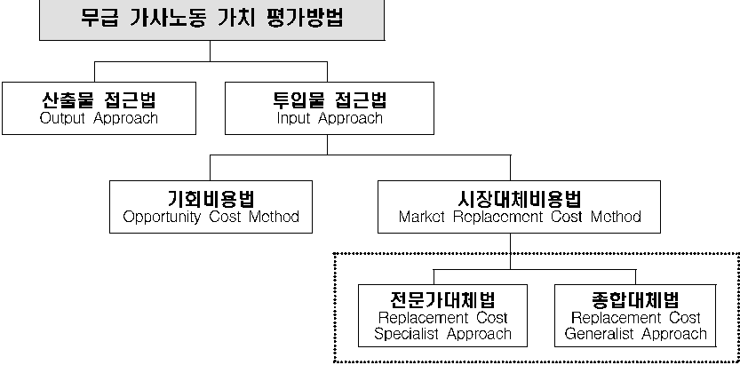

# 무급 가사노동 가치 평가방법

산출물 접근법

투입물 접근법

Output Approach

Input Approach

기회비용법

시장대체비용법

Opportunity Cost M

e

tho

d

Mar

ke

t

Re

p

l

ac

eme

nt Cost M

e

tho

d

전문가대체법

종합대체법

Re

p

l

ac

eme

nt

Cost

Re

p

l

ac

eme

nt Cost

S

p

e

cia

l

ist Approach

G

e

n

e

ra

l

ist Approach

- □ (산출물 접근법) 생산된 가사서비스의 양을 직접 측정
- □ (투입물 접근법) 가사노동 시간에 시장 평균 임금을 적용해 평가

(기회비용법) 가사노동 대신 시장노동에 참여했다면 벌어들일 수 있는 잠재소득

(시장대체비용법) 무급 가사노동에 소비된 시간을 시장 부문에서 유사한 활동에 종사 하는 개인의 시간당 임금으로 평가하는 방법

(전문가대체법) 가사노동 활동별로 유사한 직종의 시장 평균 임금으로 평가

(종합대체법) 가사노동을 하나의 직업으로 간주해 단일 직종(예. 가사도우미) 평균 임금으로 평가

UN 가사서비스 평가 지침(Guide on Valuing Household Service Work, 2017)은 무급 가사노동 가치를 평가할 때 시장대체비용법을 권고, 대한민국, 프랑스, 핀란드 등은 전문가대체법 선택

# < 작성방법별 무급 가사노동 가치 >

( 단위 : 10 억원 , %)

| | |평가액| | | |
|---|---|---|---|---|---|
| | |2019년|명목GDP 대비|2024년|명목GDP 대비|
|시장대체비용법 *|전문가대체법|485,466|23.8|582,394|22.8|
| |종 합 대체법|437,722|21.5|544,298|21.3|
|명목GDP| |2,040,594|-|2,556,857|-|

*  전문가대체법은  2024년  가계생산위성계정  작성에 적용된 방법이며, 종합대체법은 가사·음식 및 판매 관련 단순 노무직 임금을 적용

# 부록 4  가계생산위성계정 관련 용어

UN 가사서비스 평가 지침(Guide on Valuing Unpaid Household Service Work, 2017) 및 국민계정체계(System of National Accounts, 2008)의 용어 정의를 준용

|무급 가사노동 ( U npai d hous e ho ld s e r v ic e w or k )|∘ 가계구성원에 의해 생산된 가사 및 개인서비스 생산으로, 시장거래 없 이 자신의 가계구성원 또 는 다른 가계 구성원 들에 의해 소비 되 는 가사노동 - 무급 가사노동은 자가 소비를 위해 생산된 가사서비스 와 다른 가계를 위해 무급으로 봉사한 자원봉사로 구성|
|---|---|
|가계 ( H ous e ho ld )|∘ 같 은 숙박 시설을공유하고, 소득 과 재산의일부 또 는전체를 공동 계산하 며 , 주로 주 택 이 나 음식 등의 재화 나 서비스를 공동으로 소비하는 개인의 집합|
|자가-사용 서비스 생산 (O w n-us e pro d uction w or k o f s e r v ic e s)|∘ 금전거래 없 이가계에의해자가-사용을위해생산하는서비스 - (예) 집안 내 어른 및 아이 돌보기, 식사준비, 옷정리 등 ∘ 가계는 내구성이 있는 소비재, 내구성이 없 는 소비재 투 입 및 노동 투 입을 통해 서비스를 생산함|
|자가-사용 서비스 생산을 위한 노동 투 입 ( L a b our input to o w n-us e pro d uction w or k o f s e r v ic e s)|∘ 가계 구성원이 자가-사용 서비스를 생산하기 위해 소비한 노동시간|
|자원봉사 ( V o l unt ee r w or k )|∘ 무보수 비 강제노동. 즉 , 개인이 돈 을 지 불 받지 않 고 직접 또 는 조직을 통하여 자신 가계 이외의 다른 사 람 들을 위해 수행해 주는 시간|
|생산적 행동 (Pro d ucti ve acti v ity)|∘ 재화 나 서비스를제공하는행동이제3자의기준에 따 라다른 사 람 에게 위임 할 수있고교 환할 수있는경우이를생산적 행동으로 봄|
|부가가치 ( V a l u e a dded )|∘ 부가가치는 생산 과 정에서 노동 과 자본의 기여 도 - 산출액에서 중간소비액을 차감한 것|
|피용자보수 (Co m p e nsation o f em p l oy ee s)|∘ 회 계기간 동 안 피고용자가 수행한 업무의 대가로 기업이 피고용자에게 지급하는 현금 또 는 현물 보상 총액|
|고정자본소모 (Consu m ption o f f i xed capita l )|∘ 일정 기간 동 안 생산에 사용 됨 으로 써 발 생하는 물리적인 감모, 진 부화 및 일상적인 손실 등에 따 른 가치의 감모분|
|중간소비 (Int e r med iat e consu m ption)|∘ 회 계기간 중 생산자가 재화 및 서비스를 생산하기 위하여 생산 과 정에서 투 입물로 소비된 재화 및 서비스의 금액 - 고정자본소모로 계상 되 는 고정자산의 소비는 중간소비에 포함 되 지 않 음|

|비시장 산출물 (Non- m ar ke t output)|∘ 가계봉사비 영 리 단 체/정부가 생산하여 다른 제 도단 위 나 공동체 전체에게 무상 또 는 경제적으로 의미 없 는 가 격 으로 공급하는 재화 및 서비스|
|---|---|
|시장 산출물 (Mar ke t output)|∘ 경제적으로 의미 있는 가 격 에 판매 할 목적으로 생산된 산출물|
|가계 최 종소비지출 ( H ous e ho ld f ina l consu m ption ex p e n d itur e )|∘ 거주자 가계의 개별 소비용 재화 및 서비스에 대한 지출 (간접적으로 측 정된 지출액 포함) - 경제적으로 의미 없 는 가 격 으로 판매 되 는 것 포함 - 해외에서 취득한 재화 및 서비스에 대한 지출 포함|
|시장가 격 (Mar ke t pric e s)|∘ 구매의사가 있는 구매자가 판매의사가 있는 판매자로부터 재화 나 서비스를 얻 기 위해 지 불 하는 화 폐 금액 - 독립된 당사자들간 객 관적 관 점 에서(at ar m' s le n g th) 상업적 기준에 의해 이 루 어지는 교 환 을 위한 교 환 가 격|
|기 회 비용 (Opportunity cost)|∘ 가계가 자신이 사용하는 서비스를 생산하기 위해 포기하는 행동의 비용 - (예) 자가-사용(소비)을 위해 가정관리 및 돌보기 행동을 하는 경우 포기 되 는 금전적 가치. 즉 , 그 시간만 큼 유급 노동을 한다 면 얻 을 수 있 었던 금액|
|생산 측면 의 국내총생산(GDP) (Pro d uction me asur e o f GDP)|∘ 산출액에서 중간소비를 차감하고 산출물 평가시 포함 되 지 않 은 순 생산물세를 더 하여 도 출|
|생산 범위 (Pro d uction b oun d ary)|∘ 아래의 활동들이 생산 범위에 포함 ① 생산자가아닌다른 단 위에게공급하거 나또 는 그럴 의 도 로 공급하는 모 든 재화 와 서비스의 생산 - 동 재화 및 서비스의 생산 과 정에서 사용하는 재화 및 서비스의 생산 도 포함 ② 생산자가 자가 최 종소비 나 자가총자본형성을 위해 보유 하는 모 든 재화의 자가계정(o w n-account) 생산 ③ 생산자가 자가 최 종소비 나 자가총자본형성을 위해 보유 하는 지식 집약 생산물의 자가계정 생산 - 단 , 관례적으로 가계가 자가소비를 위해 생산한 생산물은 제외 ④ 자가거주자에 의한 주거서비스의 자가계정 생산 ⑤ 유급 가족종사자에 의한 가사 및 개인 서비스의 생산|
